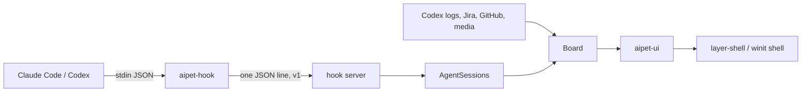

# Migrate AiPet from .NET to Rust

## Goal & Context
<!-- scope: business -->

AiPet is a desktop pet that shows what the user's AI coding agents (Claude Code, Codex) are doing. It is built from four
.NET 10 parts:

- a tiny hook program that Claude Code and Codex run on every event;
- a core that receives those events and works out each chat's state, and also watches Codex's own logs, Jira and GitHub;
- an Avalonia UI;
- xunit tests.

Release 0.1.0 shipped on 2026-09-26. An iced 0.14 front-end spike on branch `spike/iced` showed that Rust gives the pet
what Avalonia can't on Hyprland: exact click-through, placement and always-on-top without window rules. It also has a
pixel- and bit-exact port of the pet's sprite and animation.

The user has decided to migrate the whole app to Rust: hook, core, UI, packaging, release and tests. This reverses the
earlier recommendation to stay on .NET.

The migration must keep the app shippable at every step. It must also keep every existing install working: its data,
settings, saved tokens, hook registrations and Codex hook trust. And it must not break the rule that the hook never
disturbs an agent.

Who is affected:
- **End users:** the pet should look and behave the same. On layer-shell compositors click-through becomes exact.
  Installs and updates stay where they are.
- **The developer:** a Rust toolchain replaces the .NET SDK. The one exception is Velopack's `vpk` packaging tool, which
  needs the .NET SDK at pack time only.
- **Release and CI:** cargo builds replace `dotnet publish`/NativeAOT and Microsoft's cross-build containers.

## Architecture & Data Models
<!-- scope: technical -->

One cargo workspace holds everything. The existing spike crates become product crates, and new crates join them:

- **aipet-ipc:** the wire contract shared by the hook and the pet: protocol constants, the envelope, endpoint naming,
  data paths, and connecting with deadlines.
- **aipet-hook:** the `aipet-hook` binary. It covers the hook event path, `--install`/`--uninstall`, `--doctor` and
  `--print-plugin-hooks`. It is synchronous and uses no async runtime.
- **aipet-core:**
  - the hook server;
  - the chat store and its event ordering (AgentSessions);
  - the Codex log watcher;
  - the Board, which merges the sources into bubbles;
  - the Jira and GitHub watchers and presets;
  - secrets, config, logs, the uninstall cleanup and update status.

  It uses plain threads and channels, like the C# design, which never depends on a thread pool.
- **aipet-sprite:** already done (pet and avatars).
- **aipet-ui:** the shared view, fed by the Board instead of the demo script.
- **aipet-wayland:** the layer-shell shell.
- **aipet-desktop:** the winit shell plus native code.
- **The pet binary:** it keeps the name `AiPet` / `AiPet.exe`, which is Velopack's main exe, the desktop entry and
  `StartupWMClass`. It picks a shell at run time.



During the migration each side of the wire can be either runtime: a Rust hook with a .NET pet, or a .NET hook with a
Rust pet. The wire contract is the seam. It doesn't change until .NET is gone, and not after either.

## API Contracts
<!-- scope: technical -->

These are frozen and must be reproduced exactly:

- **Hook CLI:** `aipet-hook [--agent claude|codex]` (event path, default `claude`),
  `aipet-hook --install|--uninstall claude|codex`, `aipet-hook --doctor claude|codex [--probe]`,
  `aipet-hook --print-plugin-hooks claude|codex`. The usage texts and exit codes are those of the C# program.
- **Wire protocol v1:** one JSON line each way.
  - The envelope has `v`, `type` (`event`|`ping`), `agent`, `at` (Unix seconds taken when the hook starts), `pid`,
    `env` (Claude only: `CLAUDE_CODE_ENTRYPOINT`, `CLAUDE_CODE_HOST_SESSION_ID`) and `payload`. `sent` is appended
    after connecting.
  - Limits: request 4 MiB, strings 256 KiB, depth 128, connect 2.5 s, reply 2 s, stdin 2 s, total budget 4.5 s. A
    request that is too big keeps only `tool_input`'s `file_path`, `notebook_path`, `skill` and `command`.
  - The reply outcomes and the ping reply (the last 30 log lines) are those of the C#.
- **Endpoints:** the same pipe name (Windows) and socket path (Unix) as today, including the `AIPET_PIPE` override.
- **Data and config:**
  - The same data folder: `%LOCALAPPDATA%\AiPet`, or `~/.local/share/AiPet` on Linux; `AIPET_DATA_DIR` overrides it.
  - The files in it: `config.json` (fields `Left`, `Top`, `Pills`, legacy `Toolbar`, `OnTop`, `Avatar`, `Music`,
    `WindowHeight`), `jira.json`, `github.json`, `aipet.log`, `hook-events.log` and `avatars/`, with their formats and
    rotation.
  - The same install folders.
- **Secrets:** the keys `AiPet:Jira` and `AiPet:GitHub`.
  - Windows: Credential Manager generic credentials with target name = the key.
  - Linux: Secret Service items with the attributes `service=aipet` and `key=<key>`.
  - Fallback: a `secrets.json` at 0600.
- **Registration:** Claude's 17 hook events (Stop synchronous) and their entries. Codex's OS-dependent event lists and
  command strings, including the PowerShell forms and 8.3 short paths. The block markers in `config.toml`. Plugin hook
  files byte-identical to what `--print-plugin-hooks` prints.
- **Names:** the `aipet` plugin and marketplace (`aipet@aipet` is part of every Codex trust key); Velopack packId
  `AiPetApp`.
- **Single instance:**
  - Windows: the named mutex `Local\AiPetApp`.
  - Linux: an exclusive, non-blocking `flock` on the lock file next to the socket: the socket's path with `.lock` in
    place of `.sock`. It is chosen by the same rule as the socket, whatever the launch environment:
    `/run/user/<uid>` first, then `$XDG_RUNTIME_DIR`, then the data folder. With the `AIPET_PIPE` override it is
    `<AIPET_PIPE>.lock`. It is opened 0600 without following symlinks, and held for the whole run.
  - Both runtimes take it before anything else. The milestone 1 .NET pet gains the Linux lock, so every .NET pet that
    can meet a Rust pet already honours it.

## Edge Cases & Constraints
<!-- scope: technical -->

- **The hook never disturbs an agent.** No stdout or stderr on the event path; exit 0 on every path, including a panic,
  a timeout, bad input and a missing, busy or foreign pet. It writes nothing and creates no files when no pet answers.
- **The trust boundary doesn't move.**
  - Unix: the socket is 0600 before `listen`, and the peer's uid is checked. A peer that can't be identified is
    refused.
  - Windows: the pipe's owner is the current user, network access is denied, and it is opened as the first instance.
    Not "current user only", which breaks between elevated and normal processes of the same user.
  - The trace log refuses symlinks, other owners and wrong modes.
- **Linux hooks stay within glibc 2.27, for x64 and arm64.** The plugin launcher only checks for the glibc loader, so a
  hook that needs a newer glibc fails silently on older distributions.
- **Codex trust:** if the registered command and definitions don't change, Codex doesn't ask again. If AiPet's hook
  entries move, other tools' hooks shift position and lose their trust.
- **Rollback:** a newer build must not write data an older release can't read. `System.Text.Json` ignores unknown
  fields, so adding fields is safe; changing a field's type or meaning is not.
- **Mixed pets:** a .NET pet and a Rust pet never run at the same time, even when started at the same moment. The
  atomic arbiter is the single-instance lock (see API Contracts). The live-server check and the other-session probe
  stay as further guards.
- **Config writes:** the pet writes `config.json` only after a real change: a setting, a finished drag, or Reset
  position. Starting and quitting never write it, so a corrupt file survives until the user changes something.
- **Position across shells:** the saved position means the full window's top-left corner in desktop pixels, whichever
  shell saved it. The layer-shell and X11 shells convert it through the output's position and scale. A position that
  lands off every screen resets to the default, as today. Behaviour with several monitors stays as it is today; it
  isn't redesigned.
- **Windows:** new unsigned binaries can trip antivirus, and that fails silently (the launcher exits 0). Noto Sans isn't
  installed on Windows.
- **GPU:** transparency needs wgpu. On Linux the defaults are GL and low power: Vulkan listing wakes an NVIDIA dGPU, and
  its surfaces washed out colours.

## Quick commands

```bash
cd rust && cargo test --workspace && cargo clippy --workspace --all-targets && cargo fmt --all -- --check
dotnet test AiPet.slnx   # the C# suite, until the cutover (with AIPET_TEST_HOOK=<rust hook> for the black-box classes)
```

## Boundaries
<!-- scope: business -->

- No new features. The next-meeting bubble is planned in Rust after the cutover.
- macOS isn't a release target. Its code keeps compiling (`cargo check` in CI), but there are no macOS artifacts or
  support, as today.
- No code signing. Antivirus false positives are handled by reporting them, as the handoff already notes.
- No autostart. The hook never starts the pet.
- No renamed plugin, marketplace, packId, data folder or binaries. No changed plugin hook definitions.
- The GTK4/GirCore route and a Rust front end over a C# core are not pursued.
- No redesign of multi-monitor placement.
- No preview channel for the Rust pet before milestone 2. It runs from source until parity.
- The demo script is a development-only cargo feature. It is not a runtime option and isn't in release builds.

## Decision Context
<!-- scope: both -->

- **Why this order.** The hook goes first because its whole contract is visible from outside. The C# black-box suites
  (hook contract, end-to-end, no-pet, Unix socket, launcher, plugin hooks, installer) can run against a Rust hook
  unchanged. It ships alone with the .NET pet at milestone 1, because the wire protocol is the seam. The core and the UI
  ship together at milestone 2: a Rust core can't feed the Avalonia UI without a bridge.
- **The UI tasks run side by side** (the user's decision, 2026-09-30). Task 15 lays the groundwork they share: the
  `Platform` trait, the Settings skeleton and the actions it emits, `main.rs`'s extension points, the config store's
  API, and the crates they need. Tasks 16–21 then each own files of their own and wait only for task 15 (and 11 or
  14 where they read those), instead of running one after another. The Linux and Windows hands-on passes (tasks 22
  and 27) no longer wait for each other: they own separate files, and the shared desktop shell file goes to whichever
  needs it while the other isn't running.
- **Parity is proven against the C#, not re-imagined.** Small .NET golden generators turn fixture inputs into expected
  outputs, and Rust tests replay them byte for byte (or bit for bit). This is how the sprite was ported: 202 cases and
  3,914 frames. It covers registration (`settings.json`, `config.toml`, `hooks.json`, printed plugin hooks) and the
  ordering and Board logic (envelope sequences → snapshots, including seeded random sequences). The C# white-box tests
  become fixtures; the black-box ones keep running against the Rust binaries until the cutover.
- **The Codex `config.toml` editor ports the C#'s line-based algorithm.** Output must match byte for byte, and
  re-serialising would reformat other tables and cost trust. A format-preserving TOML crate may parse, but it doesn't
  write.
- **Where parity is deliberately bent, the spec says so:**
  - The trace log also checks the file's owner through the handle, opens without following symlinks, and rotates only
    a file it verified. This is hardening that R2 asks for.
  - The Codex editor fails without writing when `config.toml` keeps changing under it. The C# overwrites on its third
    attempt, which can lose Codex's own changes and trust state. Uncontended edits stay byte-identical.
  - The config drops unknown fields, as the C# does.
  - No Stop button (the user's decision, 2026-09-30). The C#'s Stop focuses the agent's app and sends it Escape
    (`keybd_event` on Windows, `xdotool` or `wmctrl` on Linux). The Rust pet doesn't drive another app's window with
    simulated keys, so it has no Stop button and no send-Escape service. A working chat keeps its Open button, which
    opens the chat or brings its app forward.
- **Secrets use the C#'s exact schema.** The keyring crate's default naming differs on both Windows and Linux. The
  platform APIs are used directly, or the crate's low-level attribute API, whichever reproduces the schema.
- **Velopack stays.** Its official Rust SDK covers startup hooks and updates. Packing a Rust exe with `vpk` needs the
  .NET SDK in CI only. Whether a .NET-packed install updates in place to a Rust-packed release isn't documented, so it
  is proven first.
- Rejected:
  - an FFI bridge from a Rust core into Avalonia: two runtimes in one process, and throwaway work;
  - a big-bang rewrite: nothing ships for months;
  - tokio in the hook or the server: startup cost, and the C# design deliberately avoids a thread pool;
  - static musl hooks: allocator costs, and the glibc 2.27 gate already solves compatibility.
- **Effort** (one developer with agents, rough). Parallel agents shorten the calendar time, not the work.

  | Phases | Tasks | Estimate | Ends with |
  |---|---|---|---|
  | Foundations and hook | 1–6 | 2–3 weeks | milestone 1 |
  | Core | 7–12 | 3–4 weeks | |
  | UI and platform | 13–22, 27, 28 | 6–8 weeks | |
  | Rust pet release | 23 | 1–2 weeks | milestone 2 |
  | Tests, cutover and docs | 24–26 | 2–3 weeks | milestone 3 |

  Total: about 14–20 weeks. Rewrites of this kind tend to stall around 80 % on undocumented edge paths. The parity
  ledger (R16) is the guard against that.

## Acceptance Criteria
<!-- scope: both -->

- **R1:** The Rust `aipet-hook` event path is a drop-in replacement: same CLI, envelope, limits and timing budget as the
  C# hook, verified by the C#'s black-box hook suites run against it. Errors are all silent with exit 0 and no stdout or
  stderr:
  - stdin that doesn't arrive in 2 s, is empty or isn't JSON;
  - a payload with lone UTF-16 surrogates (mended to U+FFFD);
  - a request over the limit (`tool_input` trimmed to the four keys), or too deep;
  - a missing, slow, busy or foreign pet;
  - a panic anywhere in the hook.

  With no pet, nothing is written.
- **R2:** The hook's trace log is written only after the pet was reached: per-user, 0600, in the temp folder, rotated at
  64 KB.
  - It is opened without following symlinks. Through the open handle it must be a regular file owned by the effective
    user, with mode 0600.
  - Rotation deletes only the file it verified.
  - Errors, each meaning nothing is written: a symlink, another owner, another mode, and a path swapped during the
    checks.
- **R3:** Release gates for the hook binaries:
  - Linux x64 and arm64 need no `GLIBC_` symbol version newer than 2.27; a newer one fails the release.
  - The Windows `aipet-hook.exe` carries the icon and a version resource that names the release version; a wrong one
    fails the release.
  - Median start-to-exit time on the event path is no slower than the NativeAOT hook's on the same machine, plus 10 %.
- **R4:** Registration matches the C# byte for byte for a fixture corpus.
  - Covered: `--install`/`--uninstall` for both agents, including plugin detection (enabled plugin → direct hooks
    removed), backups (newest 3), a symlinked `settings.json` written through, atomic writes keeping the file mode, and
    Windows 8.3 paths.
  - Codex trust entries are dropped only for definitions that changed. A user registered by the .NET hook sees no Codex
    trust prompt after upgrading, as long as the path is unchanged.
  - `--print-plugin-hooks` output is byte-identical to the committed plugin hook files.
  - Errors: a config that can't be parsed → refuse and write nothing; inline Codex hooks → refuse with the C#'s
    message; not run as `aipet-hook` → refuse.
  - When `config.toml` changes under the edit, it re-reads and re-edits, up to 3 attempts. If it changed again on the
    last attempt, nothing is written: the message says `config.toml` kept changing and to close Codex and retry, and
    the exit code is 1. This is an intentional correction; the C# writes anyway.
- **R5:** `--doctor` reports the same checks and verdicts as the C# for Claude and Codex, including org-managed
  settings and `codex app-server` hook trust (falling back to reading files when `codex` is missing). `--probe` runs the
  hook and looks for the probe event in the pet's recent list. Errors: no pet → reported, not a crash; `codex app-server`
  missing or failing → file fallback; timeouts → reported.
- **R6:** The Rust hook server keeps the endpoint and trust boundary of the C# one.
  - Unix: 0600 before `listen`; the peer uid must match, and an unidentifiable peer is refused. Windows: owner-only
    DACL, network denied, first pipe instance.
  - At most 64 connections, a silent-client timeout, the ping reply, and `hook-events.log` rotation.
  - Answers keep arriving while the UI thread is busy.
  - Errors: garbage, too long, too deep, a wrong version or an unknown type → the C#'s refusals; a live pet already
    answering → refuse to start; a stale socket file → replaced.
- **R7:** Mixed runtimes work: a Rust hook with a .NET pet, and a .NET hook with a Rust pet, both tested in CI until the
  cutover.
  - A .NET pet and a Rust pet never run together, in either start order or started at the same moment. This holds
    even when they were launched with different `XDG_RUNTIME_DIR` values, or with none (snap, SSH).
  - Both take the single-instance lock first: the `Local\AiPetApp` mutex on Windows, the per-user `flock` on Linux,
    which the milestone 1 .NET pet gains.
  - The live-server check and the other-session probe follow.
  - Errors: the losing pet quits quietly; a crashed pet's stale socket doesn't block the next start; a lock left by a
    crashed process is released by the kernel.
- **R8:** The Rust AgentSessions produces the same snapshots and outcomes as the C# for every ordering test case and for
  a generated corpus of envelope sequences. The sequences cover Claude and Codex, sub-agents, a late UserPromptSubmit,
  denied-then-rerun calls, `/compact`, a clock set back, tombstones and titles from transcripts. Errors: missing or
  oversized transcript files, and malformed payloads → the C#'s outcomes.
- **R9:** Parity for the Board and the watchers:
  - The Board: merge by turn, then time; sections, dismissal (a bubble comes back when it changes), error bubbles, the
    reviews cap and deep links, for the Board test cases plus generated cases.
  - The Codex log watcher reads the same files.
  - Jira and GitHub: the same endpoints, auth, minimum intervals and new-review alerts.
  - Presets: the same validation. A preset that moves Jira or GitHub to another site forgets the saved token.
  - Errors: offline, 401/403, rate limits and timeouts → the same error bubbles and texts; invalid preset files → the
    C#'s messages.
- **R10:** Existing data stays usable in both directions.
  - The Rust pet reads and writes the same data folder and files. `config.json` keeps its field names and casing, still
    accepts the legacy `Toolbar` field, and like the C# drops unknown fields.
  - The .NET release reads every file the Rust pet writes.
  - The pet writes `config.json` only after a real change (see Edge Cases).
  - Tokens saved by the .NET app are read by the Rust app, and the other way round, on Windows and on Linux (Secret
    Service or the 0600 file).
  - Errors: a missing or corrupt file → defaults, no crash, and no write until the user changes something; no Secret
    Service → the 0600 file.
- **R11:** The pet opens where the user left it, whichever shell saved the position (see Edge Cases), with the same
  off-screen reset. "Reset position" puts it at the default corner. Errors: an unknown output or scale → the default
  placement.
- **R12:** Every C# pet-window and Settings feature works in Rust, except the Stop button (see Decision Context).
  - Real bubbles for chats, reviews and music. Open, pull request and media buttons.
  - Deep links, and error bubbles that open their Settings page.
  - Hover, poke and drag. The menu: Show bubbles, Always on top, Avatars…, Settings…, Quit.
  - Settings:
    - General: switches, Reset position, Open data folder, Import defaults…, updates.
    - Avatars: pick, Reload, Open folder.
    - Jira and GitHub: fields, Test, Save and Forget.
  - Single instance.
  - Errors: a failed Test → the C#'s message; a bad preset file → its message; a missing folder → created before
    opening.
- **R13:** The pet window behaves right on every supported platform.
  - On layer-shell compositors: a layer surface with an exact input region, visible on every workspace, with no window
    decorations.
  - On X11: the input shape. On Windows: a window region, topmost, and out of Alt+Tab and the taskbar.
  - Fallbacks: the winit shell when layer-shell is missing (GNOME), and the inline menu when popups fail.
  - The packaged Hyprland rules match the pet's layer namespace (`no_anim`) and the Settings title.
  - Errors: no usable GPU adapter → one clear line and exit, not a panic.
- **R14:** Updates and uninstall on Windows.
  - Velopack packId `AiPetApp`: check, download, install on quit, restart, and the status texts as today.
  - An installed .NET 0.1.x updates in place to the Rust release, keeping its data, tokens and hook registrations. If
    that proof fails, a documented one-time reinstall replaces it; the choice is made in task 14.
  - Uninstall removes the hooks registered for this install.
  - Errors: offline or rate limited → the status text; a failed apply → the old version keeps running.
- **R15:** Releases carry the same artifacts, built with cargo.
  - Artifacts: Setup, the update feed and nupkg, a portable zip, Linux x64/arm64 tarballs with the installer, desktop
    entry, icons and Hyprland rules, and `SHA256SUMS`.
  - The plugin repository gets the hook binaries and a tag, and the marketplace files are pinned.
  - `install.sh`, `install.ps1` and `install-from-source` (sh and ps1) install and uninstall the Rust builds.
  - CI runs fmt, clippy and tests on Windows and Linux, and `cargo check` for macOS.
  - Errors: a failed gate (glibc, resources, plugin files, checksums) stops the release before anything is published.
- **R16:** A parity ledger maps every C# test (141 attributes, about 234 cases) to a Rust test with the same cases, to a
  black-box run against the Rust binaries, or to a stated reason it no longer applies. No test touches the user's real
  config, data, pet or agents. Tests for other platforms report as skipped (no error surface beyond an entry marked
  missing, which fails the ledger check).
- **R17:** Each milestone is releasable, and a rollback to the previous release loses nothing.
  - Milestone 1: the Rust hook with the .NET pet.
  - Milestone 2: the Rust pet.
  - Milestone 3: .NET removed.
  - Errors: a release that fails its gates publishes nothing; rolling back from milestone 2 to milestone 1 keeps the
    config, tokens and hook registrations (R10).
- **R18:** Measured with a scripted, repeatable benchmark on the same machine, on Linux and on Windows:
  - calm CPU: the Rust pet's median ≤ the C# pet's median + 0.5 percentage points;
  - resident memory: the Rust pet's ≤ 1.5 × the C#'s.

  The method: release builds; a fixed workload replayed through the hook; a 60 s settle; 5 paired, alternating 30 s
  samples; medians. It refuses to run on a loaded machine. No error surface beyond a failed budget, which blocks
  milestone 2.
- **R19:** At the cutover the .NET projects, solution, SDK steps and generators are removed. The docs describe the Rust
  build and code: README, architecture, handoff (recording that this decision supersedes "stay on .NET"), CHANGELOG,
  the plugin and Windows packaging READMEs. Third-party notices are generated from the crate tree, with every licence
  text required. The spike's documents are folded in or retired (no error surface).

## Early proof point

Task fn-1-migrate-aipet-from-net-to-rust.2 proves the core approach: the Rust hook passes the C#'s black-box hook suites against the .NET pet. If it
fails, rethink the shared-contract strangler before going further.

Tasks fn-1-migrate-aipet-from-net-to-rust.13 (Windows transparency and click-through) and fn-1-migrate-aipet-from-net-to-rust.14 (a Velopack update from .NET to Rust) prove the UI
and update halves. They don't depend on anything, so they can run early. If either fails, choose the fallback its task
names before tasks fn-1-migrate-aipet-from-net-to-rust.15 onwards.

## Parked unknowns

- The default shell on Hyprland: layer-shell (planned) or XWayland. Resolved by the hands-on pass in task fn-1-migrate-aipet-from-net-to-rust.22 and
  the user's call.
- The version numbers for milestones 1, 2 and 3: suggested 0.2.0, 0.3.0 and 1.0.0. The user decides.
- ~~The update path from .NET to Rust on Windows: in place, or a one-time reinstall.~~ Resolved by task
  fn-1-migrate-aipet-from-net-to-rust.14 (2026-09-29): in place, by full package and by delta, with the data folder
  unchanged ([rust/proofs/velopack.md](../../rust/proofs/velopack.md)). No one-time reinstall.
- The Windows transparency route if the plain wgpu window isn't transparent: a layered window fed by a CPU renderer, or
  another wgpu surface mode. Resolved by task fn-1-migrate-aipet-from-net-to-rust.13.

## Requirement coverage

| Req | Description | Task(s) | Gap justification |
|-----|-------------|---------|-------------------|
| R1 | Hook event path, drop-in | fn-1-migrate-aipet-from-net-to-rust.1, fn-1-migrate-aipet-from-net-to-rust.2 | — |
| R2 | Trace log security | fn-1-migrate-aipet-from-net-to-rust.2 | — |
| R3 | Hook build gates and startup | fn-1-migrate-aipet-from-net-to-rust.6 | — |
| R4 | Registration byte parity | fn-1-migrate-aipet-from-net-to-rust.3, fn-1-migrate-aipet-from-net-to-rust.4 | — |
| R5 | Doctor parity | fn-1-migrate-aipet-from-net-to-rust.5 | — |
| R6 | Hook server contract and trust | fn-1-migrate-aipet-from-net-to-rust.9 | — |
| R7 | Mixed runtimes and single instance | fn-1-migrate-aipet-from-net-to-rust.2, fn-1-migrate-aipet-from-net-to-rust.6, fn-1-migrate-aipet-from-net-to-rust.9, fn-1-migrate-aipet-from-net-to-rust.15 | — |
| R8 | Event ordering parity | fn-1-migrate-aipet-from-net-to-rust.7, fn-1-migrate-aipet-from-net-to-rust.8 | — |
| R9 | Board and watchers parity | fn-1-migrate-aipet-from-net-to-rust.11, fn-1-migrate-aipet-from-net-to-rust.12 | — |
| R10 | Data and secrets compatibility | fn-1-migrate-aipet-from-net-to-rust.10, fn-1-migrate-aipet-from-net-to-rust.16 | — |
| R11 | Placement across shells | fn-1-migrate-aipet-from-net-to-rust.16 | — |
| R12 | UI and Settings feature parity | fn-1-migrate-aipet-from-net-to-rust.15, fn-1-migrate-aipet-from-net-to-rust.17, fn-1-migrate-aipet-from-net-to-rust.18, fn-1-migrate-aipet-from-net-to-rust.19, fn-1-migrate-aipet-from-net-to-rust.20 | — |
| R13 | Window behaviour per platform | fn-1-migrate-aipet-from-net-to-rust.13, fn-1-migrate-aipet-from-net-to-rust.22, fn-1-migrate-aipet-from-net-to-rust.27 | — |
| R14 | Updates and uninstall | fn-1-migrate-aipet-from-net-to-rust.14, fn-1-migrate-aipet-from-net-to-rust.21 | — |
| R15 | Release artifacts and installers | fn-1-migrate-aipet-from-net-to-rust.6, fn-1-migrate-aipet-from-net-to-rust.23 | — |
| R16 | Parity ledger and test hygiene | fn-1-migrate-aipet-from-net-to-rust.24 | — |
| R17 | Shippable milestones and rollback | fn-1-migrate-aipet-from-net-to-rust.6, fn-1-migrate-aipet-from-net-to-rust.23, fn-1-migrate-aipet-from-net-to-rust.25 | — |
| R18 | Performance budgets | fn-1-migrate-aipet-from-net-to-rust.28 | — |
| R19 | Cutover and docs | fn-1-migrate-aipet-from-net-to-rust.25, fn-1-migrate-aipet-from-net-to-rust.26 | — |

## References
- `rust/SPIKE.md` and `rust/notes/` (iced, iced_exwlshell, native click-through), `docs/ARCHITECTURE.md` §6 (the hook
  contract and the socket), `docs/HANDOFF.md` (Decisions).
- Velopack Rust SDK: https://docs.velopack.io/getting-started/rust · cargo-zigbuild (glibc target suffix):
  https://github.com/rust-cross/cargo-zigbuild · keyring: https://docs.rs/keyring · toml_edit: https://docs.rs/toml_edit
  · mpris: https://docs.rs/mpris
