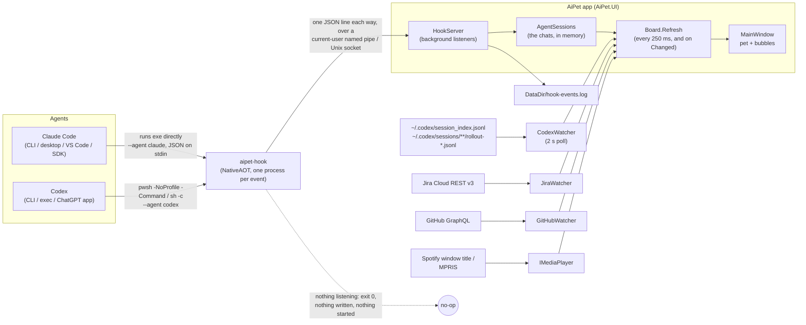
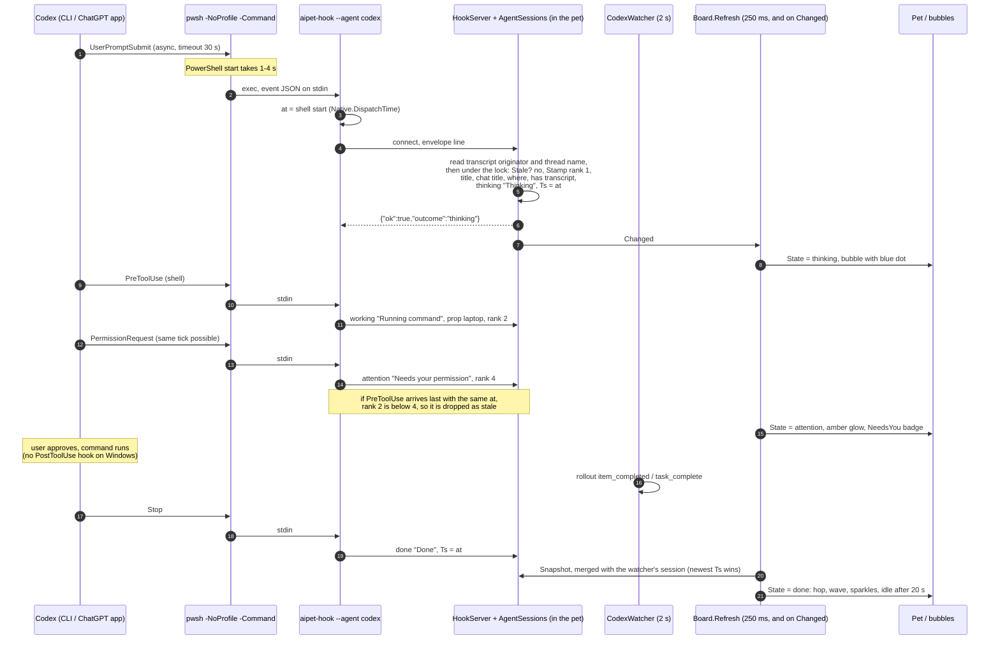

# AiPet architecture

This document describes how AiPet works as the code stands now. It covers everything from the pixels of the pet to the hook process the coding agents run. File references are relative to this `docs/` folder. Line numbers are approximate and are written as `File.cs:NN`.

---

## 1. Overview

AiPet is a floating desktop pet that mirrors the state of coding-agent chats: Claude Code (CLI, desktop app, VS Code, Agent SDK) and Codex (CLI, `codex exec`, and the ChatGPT desktop app). It also shows Jira and GitHub reviews waiting on you, and optionally the track playing in Spotify or another MPRIS player.



**Key design choices.**
- The agent-facing part is a separate tiny process. `aipet-hook` is a NativeAOT exe, so a process spawned on every event starts quickly ([AiPet.Hook.csproj](../src/AiPet.Hook/AiPet.Hook.csproj):9-13).
- The hook only observes. It never writes to stdout, never fails, and always exits 0 ([Program.cs](../src/AiPet.Hook/Program.cs):13-15, 34-53), so it cannot inject text into a chat or disturb the agent.
- The hook is a thin forwarder. Each run connects to the running pet over a local socket that only the current user can open, sends the event as one JSON line and waits for one line back ([Ipc.cs](../src/AiPet.Core/Ipc.cs)). All state logic lives in the pet ([AgentSessions.cs](../src/AiPet.Core/AgentSessions.cs)), so the chats exist only while it runs. When it isn't running, a hook does nothing at all: it writes nothing anywhere and starts nothing. Only the user or an installer starts the pet. Both ends share the endpoint, limits and field names through a source-linked `Ipc.cs`, next to [Paths.cs](../src/AiPet.Core/Paths.cs).
- Everything fails soft:
  - A hook that finds nothing listening exits 0 at once; one whose reply doesn't come within 2 s gives up and exits 0.
  - The pet drops garbage, oversized or silent connections without a reply, and never crashes on them.
  - Watcher errors become a bubble or a log line.
  - Platform features that are missing (for example X11 shapes) simply turn off.

---

## 2. Repository layout

| Path | What it is |
|---|---|
| [src/AiPet.Core/](../src/AiPet.Core/) | Platform-neutral logic: `Pet` (animation and renderer), `Avatar`, `Board` (data model), `AgentSessions` (the hooks' chats), `HookServer` (the pet's end of the socket), `Ipc` (the protocol, shared with the hook), `CodexWatcher`, `JiraWatcher`, `GitHubWatcher`, `Paths`, the `IPlatform` interfaces and `Log`. |
| [src/AiPet.UI/](../src/AiPet.UI/) | The Avalonia 12 app (`AiPet.exe`): `Program`, `App`, `MainWindow`, `SettingsWindow`, and `Platform/` (Windows, Linux, macOS stub, `PlatformFactory`). |
| [src/AiPet.Hook/](../src/AiPet.Hook/) | `aipet-hook`: `Program` (entry point, envelope and request line), `ClaudeHook`, `CodexHook` (each builds its envelope), `Native` (process facts), `Install`/`ClaudeConfig`, `CodexConfig`, `Doctor`. Links `Paths.cs` and `Ipc.cs` from Core. |
| [plugins/claude-code/](../plugins/claude-code/) | A Claude Code plugin that bundles the hook per RID (`bin/<rid>/`), selected by `bin/aipet-hook.sh`. |
| [.claude-plugin/marketplace.json](../.claude-plugin/marketplace.json) | Marketplace `aipet` that points at the plugin. |
| [avatars/](../avatars/) | A sample custom avatar (`hood-green.json`). The app does not read this folder (see §3.7). |
| [build.ps1](../build.ps1), [install.ps1](../install.ps1), [install.sh](../install.sh) | Build per RID; install on Windows or Linux. |
| `legacy/`, `web/` | Earlier prototypes. Not built or installed, and not covered here. |

---

## 3. The pet: animation and rendering

Files: [Pet.cs](../src/AiPet.Core/Pet.cs), [Avatar.cs](../src/AiPet.Core/Avatar.cs), [MainWindow.axaml](../src/AiPet.UI/MainWindow.axaml), [MainWindow.axaml.cs](../src/AiPet.UI/MainWindow.axaml.cs).

### 3.1 Grid and pipeline

The pet is a pixel-art sprite of 26x24 cells (`Pet.GW=26`, `Pet.GH=24`), drawn at 5 DIPs per cell (`Pet.P=5`). The `Sprite` panel is therefore 130x120 DIPs (Pet.cs:37, MainWindow.axaml:54). All animation logic is in the platform-neutral class `AiPet.Pet`. The UI only feeds input and copies pixels.

```
MainWindow.OnFrame (every compositor frame)
  -> fill PetInput (state, prop, hover, drag, one-shot timers, music)
  -> Pet.Update(input, t)
       ComputePose(input, t)          every call
       Draw(pose, ...)                only when (int)(t*24) changes  -> PixelsChanged
       squash / stretch / breathe     every call
       shadow scale / opacity         every call
  -> if PixelsChanged: Blit Body, Glow, Fx into three WriteableBitmaps
  -> apply ScaleTransform / TranslateTransform to Sprite and Shadow
```

- **Frame loop.** The constructor calls `RequestAnimationFrame(OnFrame)` (MainWindow.axaml.cs:154), and each `OnFrame` requests the next frame at its end (:719). There is no timer; the pet ticks once per compositor or vsync frame. The clock is a `Stopwatch`, and `Now` is seconds since the window was created (:36-37).
- **Two rates.** `ComputePose` and the transforms run at display rate, so movement is smooth at sub-pixel DIP offsets. Pixels are redrawn only at 24 fps (Pet.cs:339-345). The result is deliberately smooth motion with choppy pixel-art frames. `dt` is clamped to 0.001-0.05 s (Pet.cs:334).
- **`PetInput`** (Pet.cs:6-22):
  - `State`: `sleep`, `idle`, `thinking`, `working`, `attention` or `done`.
  - `StateSince`, `Prop` (`laptop` or `lens`), `Hover`, `Mouse` (sprite DIPs or null), `Dragging`, `Moved`, `LastMove`, `Facing` (±1).
  - One-shot deadlines: `PokeUntil`, `LandUntil`, `WaveUntil`, `AlertUntil`.
  - `Music`.

  MainWindow owns the single instance (`input`, MainWindow.axaml.cs:27).
- **`PetFrame`** (Pet.cs:25-31) holds the `Body`, `Glow` and `Fx` buffers as `uint[GW*GH]` premultiplied BGRA (`0xAARRGGBB`, which matches `PixelFormat.Bgra8888` in little-endian memory), plus `PixelsChanged`, `X`/`Y`, `ScaleX`/`ScaleY`, `ShadowScale` and `ShadowOpacity`. The arrays are the pet's own reused buffers, not copies (Pet.cs:169).

### 3.2 Where the state comes from

`MainWindow.Refresh` (every 250 ms and on watcher events) copies `board.State` into `input.State`. It resets `StateSince` only when the state changes, and it copies `input.Prop` every time (MainWindow.axaml.cs:294-303). §5 explains how `Board.State` is derived. Inside `ComputePose` (Pet.cs:219-231):

- `st = t < AlertUntil ? "attention" : inp.State`. A new Jira or GitHub review sets `AlertUntil = Now + 6` (MainWindow.axaml.cs:137, 141).
- While music is playing (`input.Music = cfg.Music && Media.Playing`), `idle` or `sleep` of any age, or `done` older than 4 s, becomes the synthetic state `listen` (Pet.cs:222; MainWindow.axaml.cs:682).
- `idleAct` is cleared on a state change (Pet.cs:223).
- The prop is used only while working: `Prop = working ? (inp.Prop ?? "laptop") : null`.
- The random look offset is re-rolled from {-1, 0, 0, 1} every 2.5-6 s (Pet.cs:233).

### 3.3 States and poses

Y is in DIPs (negative is up) and `P = 5` (Pet.cs:236-290). `Wave(rate)` is `ARM_L` plus `WAVE_A`/`WAVE_B`, alternating every `1/rate` s (Pet.cs:234).

| State | Motion | Eyes | Arms / feet | Fx layer |
|---|---|---|---|---|
| `idle` | Bob `Y=(0.5+0.5 sin 2.2t)*0.6P`. After `nextIdle` (first at 6 s, then every 5-11 s), when not hovered or dragged, picks an idle act: `look` (Lx sweeps −2..2 at 4 steps/s), `hop` (0.9 s, up to 3.2P), `stretch` (`ARMS_UP`, happy eyes, Y=−P), `wiggle` (X=sin(16t)*0.8P) or `tap` (`FOOT_TAP` at 5 Hz, Lx=1). Other acts last 1.6-2.6 s. | normal, `Lx=look` | down | none |
| `sleep` | `Y=(0.5+0.5 sin 1.2t)*0.5P` | sleep (flat lines) | down | 3 rising Z glyphs (hidden while hovered or held) |
| `thinking` | Floats up, `Y=-(0.5+0.5 sin 2.4t)*0.7P` | up, Lx=1 | down | 0-3 thought dots cycling at 3 Hz |
| `working` | Quick bounce, `Y=-abs(sin 6.3t)*0.6P` | lens: scan Lx [−1,0,1,0] at 1.5 steps/s. Laptop: down, Lx=1. | down | none |
| `attention` | 1.2 s cycle with a 0.6 s hop to 3P | normal | `Wave(3)` | outlined `!` at x 24 |
| `done` | One 0.7 s hop to 3P | happy | `Wave(3)` for the first 4 s | sparkles |
| `listen` (music) | Beat 60/112 s; nod `Y=-abs(sin(πt/beat))*1.2P`; sway `X=sin(πt/(2·beat))*0.6P` | happy for 6 of every 8 beats | down, plus headphones | 2 rising notes in the accent colour |

**Overrides.** These apply after the base pose, in this fixed order (Pet.cs:292-327):

1. **Hover tracking** (mouse over the sprite, not dragging, not working): `Lx = clamp(round((m.X-65)/28), -2, 2)`; eyes are up if `m.Y < 15`. A sleeping pet stops bobbing and opens its eyes.
2. **Wave** (`t < WaveUntil`, only in idle, sleep or done): `Wave(5)` with happy eyes. On pointer enter, `WaveUntil = Now + 1.4` unless the last wave ended less than 3 s ago (MainWindow.axaml.cs:108-112).
3. **Poke** (click without drag, `PokeUntil = Now + 1.2`): squint eyes, then happy eyes; hop `Y=-sin(pp·π)*3P`.
4. **Landing** (after a drag, `LandUntil = Now + 0.45`): hop `2.5P` with happy eyes.
5. **Running** (dragging, and the last move was under 0.25 s ago): `RUN_FEET`/`RUN_ARMS` at 10 Hz mirrored by `Facing`, a lean of `X=Facing*P`, `Lx=2*Facing`, no prop. Otherwise, **held** (the drag has passed the 4 px threshold, so `Moved` is set, but the last move was 0.25 s or more ago; a press that hasn't moved yet shows no held pose): feet dangle at 3 Hz, `ARMS_UP`, wide eyes, no prop.
6. **Blink**: when the eyes are normal, up or down and `t > blinkAt`, they blink for 0.13 s. The next blink comes 2.5-5.5 s later; the first is at t=3.

Props are hidden while poked or landing (Pet.cs:421). The eyes never mirror: `Facing` is applied through `Mirror()` only to the running limbs and the dust (Pet.cs:138-139, 313, 454).

### 3.4 Squash, stretch, breathing, shadow

These run on every call (Pet.cs:348-360):

- `v = (pose.Y - prevY)/dt`.
- **Landing** (`prevY < -2 && pose.Y >= -0.4 && v > 0`): `squash = 0.13`, decaying as `squash *= exp(-11 dt)`.
- `stretch = clamp(-v/2600, 0, 0.06)`, applied only while rising.
- `breathe = 0.012*sin(1.2t)` when sleeping or `sin(2.2t)` when idle. It keys off the raw `inp.State`, so a listening pet still breathes.
- `ScaleX = 1+squash-0.5 stretch-0.5 breathe` and `ScaleY = 1-squash+stretch+breathe`, which roughly preserves volume.
- Shadow: `lift = clamp(1+Y/45, 0.5, 1)`. `ShadowScale = Held ? 0.55 : lift` and `ShadowOpacity = Held ? 0.35 : lift`.

The sprite's `RenderTransformOrigin="50%,91.7%"` (110/120 DIPs, the bottom of feet row 21) keeps the feet planted (MainWindow.axaml:54). The transform groups are `Sprite = {Squash, Move}` and `Shadow = {ShadowScale, ShadowMove}` (MainWindow.axaml.cs:83-84). The shadow follows X only, never Y (:692-694).

### 3.5 Rendering: three layers

`Pet.Draw` (Pet.cs:364-494) clears the three buffers and paints in painter's order. `Put()` premultiplies with `Pm()` and **overwrites** the pixel; it never blends, and out-of-grid cells are dropped (Pet.cs:171-182).

| Layer | Contents | UI element |
|---|---|---|
| **Body** | The silhouette, arms and feet (`shape = body ∪ Arms ∪ Feet`, so the limbs share one outline) with a 4-neighbour `Outline` ring. Then the shaded fill, spec, blush, headphones (when `Music` is on), the face panel (bezel, screen, glint at (9, FaceTop+1) and (10, FaceTop+1)) and the props. | `BodyImg` |
| **Glow** | The eyes (`EyeHi` on a column's top cell, `EyeLo` on its bottom cell, `Eye` elsewhere) and the laptop screen's `>` prompt and 2.5 Hz cursor. | `GlowImg` with `DropShadowDirectionEffect` (depth 0, blur 10, opacity 0.9) |
| **Fx** | An else-if chain, so only the first match draws: running dust > thinking dots > listen notes > sleep Zs > attention `!`. Sparkles for done or poked are drawn separately and can stack. Most Fx are hidden while held (Pet.cs:451-493). | `FxImg` |

**Fill styles:**
- `soft`: a cell missing its bottom or right neighbour gets `Deep` (y≥19) or `Shade`; a cell missing its top or left neighbour with y<15 gets `Hi`; any other cell gets `Shade` (y≥19) or `Body`.
- `rim`: edge cells get `Hi` (y<17) or `Shade`; interior cells get `Deep` (y≥18), `Shade` (y≥14) or `Body`.
- Spec: `rim` puts `Spec` on every top-edge cell with y<8; `soft` uses the `FindSpec` cells (Pet.cs:369-448).

**Props:**
- Lens: a magnifier swinging at 1.5 Hz, made of a `RING`, translucent `GLASS 0x88A9E4FF`, a highlight and a 2-cell `HANDLE`.
- Laptop: an 8x6 lid at x 14-21, y 15-20, and an 11-cell base on row 21.

Because `Put()` overwrites, the lens glass replaces the body pixel under it, and the desktop shows through the lens.

**Why a separate glow layer.** `DropShadowDirectionEffect` blurs the whole Image it is attached to. Keeping only the eyes and screen glyphs on their own layer gives a coloured halo without blurring the outline. `GlowImg` and `FxImg` are `IsHitTestVisible=False`. An 86x88 ellipse filled `#01FFFFFF` (alpha 1) gives the sprite a solid hit target, so gaps between pixels still catch drags and boops (MainWindow.axaml:55-62).

**Blit** (MainWindow.axaml.cs:722-731):
- The bitmaps are 26x24 `WriteableBitmap`s at 96 DPI, `Bgra8888`, `AlphaFormat.Premul` (:55-61).
- `Lock()`, then a row-by-row `Marshal.Copy` that honours `RowBytes`, then `InvalidateVisual()`.
- `(int[])(object)px` reinterprets the `uint[]` for `Marshal.Copy`, which relies on CLR array variance.
- The Images use `Stretch=Fill` and `BitmapInterpolationMode=None`, so each cell is drawn as a nearest-neighbour 5x5 block.

### 3.6 Fixed anchors

Every avatar shares the same anchor cells, so every animation works with every avatar (Pet.cs:46-64, 150-166, 426-444):

| Element | Cells |
|---|---|
| Face panel | columns 8-17, rows `FaceTop..FaceBottom` with the four corners removed |
| Eyes | 2 columns wide at `L=10+lx` and `R=14+lx` (`lx` −2..2), rows 10-13. Shapes: normal 10-12, wide 10-13, up 10-11, down 12-13, blink row 12, squint `> <`, happy `^ ^`, sleep row 12. |
| Arms | x 4-5 and 20-21, rows 15-16 |
| Feet | row 21, x 8-10 and 15-17 |
| Blush | (6,13), (7,13), (18,13), (19,13) |
| Props | x 12-25, rows 13-21 (the lens handle reaches x 25 when the lens swings right; the outline goes one cell further) |

Headphones and spec are derived from the silhouette:
- `BuildHeadphones` uses the leftmost and rightmost body cells on row 10. The cups are 2 columns wide over rows 9-12, and the band hugs the silhouette top at `y=min(topmost-1, 8)` (Pet.cs:113-136).
- `FindSpec` takes up to 3 top-edge body cells (x<13, y<9, with a body cell diagonally below-right of each; topmost first) and puts each spec pixel one cell down and one cell right of that edge cell (Pet.cs:108-110).

### 3.7 Avatars

An `Avatar` ([Avatar.cs](../src/AiPet.Core/Avatar.cs):13-113) defines the look:

- **Shape and face:** `Name`, `Shapes` (ellipses `[cx,cy,rx,ry]` in grid cells), `Shading` (`soft` by default, or `rim`), `Blush` (default true), `FaceTop` (default 9) and `FaceBottom` (default 14).
- **`Palette`:** read from JSON and resolved into the public `uint` fields `Outline`, `Deep`, `Shade`, `Body`, `Hi`, `Spec`, `BlushC`, `Screen`, `Bezel`, `Glint`, `Eye`, `EyeHi`, `EyeLo`, `Glow` and `Accent`.

**Rasterising.** `Pet.SetAvatar` rasterises the avatar into cell sets. `BuildBody` includes a cell when its centre lies inside any ellipse. `BuildFace` makes the face rectangle. `SetAvatar` also sets `lastDrawFrame=-1` to force a redraw (Pet.cs:73-136).

**Built-in avatars:**
- `Sprout`: a 4-ellipse orange `soft` blob with blush, accent `#E27A52` (Avatar.cs:29-40).
- `Hood`: a 3-ellipse `rim`-lit blue hood with `FaceTop` 8, `FaceBottom` 15, no blush, glow `#3D9BFF` and accent `#4A8CFF` (Avatar.cs:43-59).

**Custom avatars.** `Avatar.All()` returns the built-ins plus every `*.json` file in `Avatar.CustomDir = Paths.DataDir/avatars` (Avatar.cs:63-89). Each file must have a non-empty `shapes`. Property names are case-insensitive. `name` defaults to the file name, and broken files are skipped.

- Palette values are `#RRGGBB` or `#AARRGGBB`.
- The palette `Dictionary` is case-sensitive, so `eyeHi` and `eyeLo` must be spelled exactly.
- Missing keys fall back to **Sprout's** colours, not the avatar's own, so a partial palette gives a mixed look.
- `glow` defaults to `eye`, and `accent` defaults to `hi` (Avatar.cs:92-112).

The repo's `avatars/hood-green.json` is a sample only. Nothing copies it into `DataDir/avatars`.

**Applying an avatar.** `ApplyAvatar` (MainWindow.axaml.cs:203-212):
- calls `pet.SetAvatar(a)`;
- sets the glow effect colour to `a.Glow`;
- sets the application's `Accent` brush and `SystemAccentColor`, and the window's own `Accent` brush, to `a.Accent`;
- sets `cfg.Avatar = a.Name`.

The accent colours the Send button, the badge, menu check marks, text selection, headphone shine and music notes.

**Where avatars are picked.**
- At startup: `cfg.Avatar`, falling back to `avatars[0]` (MainWindow.axaml.cs:89-90).
- In the context menu's Avatar submenu, which re-runs `All()` on every opening (:233-249).
- In Settings → Avatars. Its previews are drawn by a throwaway `Pet` updated at t=0.05, 0.10 and 0.15, before the first blink or look change, using the Body and Glow layers only (SettingsWindow.axaml.cs:169-177).

---

## 4. The window and bubbles

Files: [Program.cs](../src/AiPet.UI/Program.cs), [App.axaml](../src/AiPet.UI/App.axaml), [MainWindow.axaml](../src/AiPet.UI/MainWindow.axaml), [MainWindow.axaml.cs](../src/AiPet.UI/MainWindow.axaml.cs), [SettingsWindow.axaml.cs](../src/AiPet.UI/SettingsWindow.axaml.cs).

### 4.1 Process and window model

**Process start.**
- **Single instance.** `Program.Main` takes the named mutex `Local\AiPetApp` and returns if another instance holds it. On Linux .NET scopes that mutex to the login session, and `install.sh` starts the pet with `setsid`, so a pet started later from the app menu would get a mutex of its own; `OtherSessionsPet` therefore also returns when something answers on the user's socket (§6.5). It does not activate the running copy (Program.cs:11-23).
- **Avalonia setup.** `UsePlatformDetect`, with X11 `EnableSessionManagement=false` and `RenderingMode [Glx, Software]` (Software only when `AIPET_SOFTWARE=1`) (Program.cs:25-36).
- **App.** `ShutdownMode.OnMainWindowClose`. `AIPET_PLAIN=1` shows a plain 360x160 test window instead (App.axaml.cs:15-24).

**The window.** One borderless, transparent, topmost window holds everything:
- 380x600 DIP, `ShowInTaskbar=False`, `CanResize=False` (MainWindow.axaml:4-7).
- The root grid (margin 12,8, rows `*,124,Auto`) holds:
  - `Sections` (the reviews header, the `Reviews` stack and the `Pills` chat stack, both 0-height panels with `ClipToBounds=False`) and the `Compose` pill, in row 0;
  - the 140x124 pet panel, in row 1;
  - the `Toolbar`, in row 2.
- `AIPET_OPAQUE=1` gives the window a solid `#202024` background (MainWindow.axaml.cs:72-77).

**Composition root.** The MainWindow constructor (MainWindow.axaml.cs:69-156):
- relies on field initialisers for `platform = PlatformFactory.Create()`, `Board`, `Pet`, `PetInput`, `CodexWatcher` and the `AgentSessions` store `hooks` (:24-33); the constructor itself creates `JiraWatcher` and `GitHubWatcher`, both given `platform.Secrets`, and the `HookServer` over `hooks` (:78-80);
- loads `config.json`;
- wires the watcher events. UI work is posted with `Dispatcher.UIThread.Post`, but `jira.Changed` first calls `github.JiraChanged()` directly on the thread pool. `server.Changed` posts `Refresh` like the others, then `server.Start()` opens the socket (:145-146);
- starts three never-stopped `DispatcherTimer`s: `Refresh` every 250 ms, `KeepOnTop` every 2000 ms, and `Media.Poll` every 1000 ms when `cfg.Music` is on.

On `Opened` it calls `PlaceWindow`, `platform.SetupPetWindow(hwnd)` and `UpdateInputRegion(force:true)` (:97-102).

**Placement.** `PlaceWindow` (:169-179):
- uses the saved `Left`/`Top` (physical px), or else the work area's bottom-right corner (24 px in from the right edge, flush with the bottom);
- subtracts `(Height - cfg.WindowHeight)*Scale`, so the bottom-anchored pet stays in place if the window grew;
- resets to bottom-right if the pet/toolbar strip is on no screen.

**KeepOnTop.** Every 2 s, when topmost, `KeepOnTop` (:195-198) calls `platform.KeepOnTop`. `Closed` saves the config and stops the hook server (:155).

### 4.2 Click-through

The window is a fixed transparent rectangle. Its empty parts let clicks through only because `UpdateInputRegion` (MainWindow.axaml.cs:737-763) keeps the OS region trimmed to padded rectangles:

- **What it collects.** Each control's corners are translated to window coordinates (render transforms included), padded, then scaled by `RenderScaling`. Pads in DIP: Sprite 6, Toolbar 14, Compose 16, ReviewsHeader 4, each card `Body` with `Root.Opacity > 0.05` 16, and its Close button 2.
- **When the OS is called.** `OnFrame` calls this at most every 0.1 s (:718). The OS is called only when the joined rectangle string changes, or when forced (on `Opened` and when the compose box opens or closes).
- **Windows.** The rectangles are ORed with `CreateRectRgn`/`CombineRgn`, then `SetWindowRgn(h, rgn, true)` is called. The system owns the region after success (WindowsPlatform.cs:153-165). The region clips painting as well as hit-testing, which is why the pads are large enough to cover the BoxShadows. Tooltips and the context menu are separate popup windows and are not clipped.
- **Linux.** `XShapeCombineRectangles` is applied to both `ShapeBounding` and `ShapeInput`, so compositors draw no shadow box around the full rectangle. `AIPET_NOSHAPE=1` skips this (LinuxPlatform.cs:82-102).
- **macOS.** A no-op.

Inside the region, the `Root` grid has a transparent background, so every pixel is hit-testable. A right-click anywhere opens `Root.ContextMenu` (MainWindow.axaml.cs:116).

### 4.3 Bubbles (`Card`)

Each bubble is a `Card` keyed by `Session.Id` (MainWindow.axaml.cs:316-332).

**`MakeCard`** (:349-424) builds:
- a title (13.5 SemiBold) and a detail line;
- an 8x8 status dot with a pulse ellipse;
- hidden action buttons: Open, Pr, Prev/PlayPause/Next and Stop;
- the `Body` border (height 50, width 240-350, corner radius 25);
- a Close button on the top-left corner.

The root has `RenderTransformOrigin (0.5,1)`, starts at `Opacity 0` and `Y=14`, and carries `TransformGroup{Scale, Move}`.

**Lifecycle** (`SyncCards`, :476-554):
- `show = pillsVisible ? board.Cards : []`, so hiding chats animates every bubble away.
- **New id:** a card is created and eases from `Y=14`, `O=0` to its target, sliding up and fading in.
- **Id gone** (dismissed, idle, over the cap, or chats hidden): `Removing=true`, `TO=0`, `TY=Y+10`. The card is detached from its panel 0.25 s later (:713). If the id comes back while the card is still fading, the old view is removed at once and a fresh card animates in (:497-505).
- **Text:**
  - For chats, the tooltip is `{title}\nIn the {app.Label}`. Detail is prefixed with `Label · ` when more than one app label is visible, or when the label is not `Claude app`/`Claude`.
  - Thinking dots cycle via `1+(int)(t*2.5)%3`, quantised to the 250 ms refresh.
  - The last card of a section gets `  ·  +N more`.
- **Style** (only when the state or app colour changes):
  - The dot uses `Board.StatusColor[st]`; GitHub cards use `GitHubPurple #A371F7`.
  - `Pulsing` is set for working, attention, thinking and music.
  - `StyleBody(c, st=="attention")` (:428-438) draws the border in the app colour at alpha `0xB8` when there is one (else amber when highlighted, else `#26FFFFFF`). The background is `#F72E291E` when highlighted and the title `#FFE9A8`. So a chat keeps its app colour on the border while "needs you" is shown by the tint and the glow.
- **Ghost:** when nothing is shown, pills are on, and the pet is hovered and not dragged, a `_ghost` card appears: "Claude Code / Napping" or "All caught up" (:484-513).

**Layout** (`LayoutCards`, :556-578). Cards are ordered by `board.Cards` (priority, then `Ts`), with the ghost last.

| | Y target | Scale | Opacity | Content | Hit-test |
|---|---|---|---|---|---|
| Collapsed (a deck of cards) | `-i*9` | `1-0.06i` | 1, 0.78, 0.56, then hidden | front card only | front card only |
| Expanded | `-i*58` (50 px + 8 px gap) | 1 | 1 | all | all |

- The panel height target is 0 when empty, `50+(n-1)*58` when expanded, and `50+9*(min(n,3)-1)` when collapsed. Cards are never laid out by the panel: every card of a section sits in that section's bottom-aligned panel (`Pills` for chats, `Reviews` for reviews) and is positioned only by its transforms. The panel height is eased separately so the reviews stack sits above the chats.
- A stack collapses again when it drops to one card, or when the pointer has been out of the window for more than 2.5 s (:479-483).
- The reviews header reads "Reviews", "1 review waiting" or "{n} reviews waiting". The count includes the reviews beyond the cap (`Extra["reviews"]`, :575). A Jira bubble whose issue has a PR shows it in its detail line as `PR repo#N` (`Board.PrLabel`, Board.cs:77-82, 164).

**Tweens** (`OnFrame`, :697-716):
- Y, scale and panel heights use `k = 1 - exp(-13·dt)`; opacity uses `1 - exp(-16·dt)`.
- Pulse: phase `((t-BornAt)%1.3)/1.3` with ease-out cubic; the pulse scales to `1+1.6·ease` and its opacity goes to `0.55(1-ph)`.
- Attention glow: an amber BoxShadow, blur 22, with alpha `0x40 + 0x90(0.5+0.5 sin 3.5t)` (about 1.8 s period).

### 4.4 Bubble actions

`UpdateChrome` (:462-474) shows the actions and the Close button only when `Hover && (expanded || IsFront) && !Removing`.

| Control | Visible when | Action |
|---|---|---|
| Body click | always (not on a button) | A collapsed stack with more than one card expands. Otherwise `OpenItem` (:449-458): error cards open Settings on the jira or github page; music calls `Media.Focus()`; reviews call `OpenUrl(Url)`; a chat opens `s.Link` if set, else `platform.FocusAgent(agent)`. |
| ✕ Close | on hover | `board.Dismiss(id)`, then `Refresh` (:404). See §5.5. |
| ■ Stop | chat, working or thinking, `Where != "terminal"` | `FocusAgent(agent)`, then `SendEscape()` only if `OnlyDesktopChat(s)`: the pet has run for more than 15 min, `Where=="desktop"`, and it is the only chat of that agent in `board.All` (:372-377, 446). The 15 min are there because the pet only knows the chats it heard from since it started (§10). The tooltip otherwise reads "Open Claude/ChatGPT to stop it". |
| Open | `TicketUrl != null` | `OpenUrl(TicketUrl)`: the Jira issue. |
| Pr | `PrUrl != null` | `OpenUrl(PrUrl)`. |
| ⏮ ⏯ ⏭ | music card | `Media.Previous/PlayPause/Next`. |

### 4.5 Compose, toolbar, drag, menu

- **Compose**
  - **Opening** (`OpenCompose`, :586-602): the folder is the first chat card's `Cwd` (or any session's), used only if it exists and does not contain `scratch-workspaces`. The box calls `Activate()` so the normally unfocused pet window can take typing, raises `Sections` above the pill, and forces a region update.
  - **Keys and focus:** Enter sends and Escape closes. Losing focus closes the box only when it is empty and not busy (:132).
  - **Sending** (`SendCompose`, :612-626): logs only the folder and the character count, calls `platform.StartNewChat(text, folder)`, shows the result in the hint, and closes after 2.5 s.
  - **Windows:** opens `claude://code/new?q=<prompt, cut to 14000 chars>[&folder=…]`, which only prefills the chat; the user still presses Enter in Claude (WindowsPlatform.cs:105-117).
  - **Linux:** runs `claude "<prompt>"` in the first terminal emulator found (LinuxPlatform.cs:39-57).
- **Toolbar:**
  - `EditBtn` toggles compose.
  - `VoiceBtn` (Windows only, `CanVoiceType`) calls `FocusAgent(FirstChatAgent())`, then Win+H.
  - `ChevronBtn` flips `pillsVisible`, rotates the chevron and saves the config. While chats are hidden, the `Badge` shows `board.LiveCount`, in amber with black text when `NeedsYou`, otherwise in the accent colour (:304-306).
- **Drag:**
  - Press captures the pointer (left button only). More than 4 px of Manhattan movement moves `Position`. A horizontal step of at least 2 px sets `Facing` and `LastMove`, and a vertical step over 2 px sets `LastMove`.
  - Release after a move sets `LandUntil = Now+0.45` and calls `SaveConfig`. Release without a move is a boop: `PokeUntil = Now+1.2` (:635-669).
- **Context menu** (`BuildMenu`, :217-260):
  - Toggles: "Show chats" and "Always on top".
  - An Avatar submenu with "Open custom avatars folder".
  - "Settings…" and "Quit".
- **`config.json`** (`Config`, :40-51): `Left`, `Top` (physical px), `Pills`, `Toolbar`, `OnTop`, `Avatar` (`"Sprout"`), `Music` and `WindowHeight` (DIP, default 420). `SaveConfig` runs after toggles, avatar changes, a drag, a position reset, and on close.

### 4.6 Settings window

`SettingsWindow` is a borderless, transparent, topmost 800x640 window. It moves by `BeginMoveDrag` on the sidebar or header (SettingsWindow.axaml:4-6; .cs:56-61).

**How it is opened.** `OpenSettings(page)` reuses an open window or builds a `SettingsHost`. The host carries the platform, the watchers, `DefaultEmail`, the switches, `ResetPosition` and the avatar callbacks (MainWindow.axaml.cs:265-289; SettingsWindow.axaml.cs:15-27).

**Pages:**
- **General:** switches for show bubbles, show the toolbar and always on top. There is also "Listen along with {player}" when `Media != null`, plus Reset position and the data folder.
- **Avatars:** preview tiles, Reload and Open folder.
- **Jira:** site, email, JQL and a token box. The token box always starts empty, and an empty box on Save keeps the saved token. Also Test search, Create a token and Remove saved token. The enabled box starts ticked whenever no token is saved (`c.Enabled || !jira.HasToken`, SettingsWindow.axaml.cs:193).
- **GitHub:** enabled, host, token and orgs (comma-separated). Test runs `viewer{login}` plus a review count and saves nothing. Typing a token ticks the enabled box (SettingsWindow.axaml.cs:258).

On close, `settings` is set to null and `Refresh` runs.

---

## 5. From sources to bubbles: the Board

Files: [Board.cs](../src/AiPet.Core/Board.cs), [AgentSessions.cs](../src/AiPet.Core/AgentSessions.cs), [CodexWatcher.cs](../src/AiPet.Core/CodexWatcher.cs).

`Board` is a UI-thread-only model. It is rebuilt from scratch on every 250 ms tick and whenever a watcher or the hook server raises `Changed` (MainWindow.axaml.cs:135-147). Each rebuild takes a `Snapshot` of the `AgentSessions` store: copies of its entries, taken under the store's lock, so the UI never waits on a file or a hook.

### 5.1 The hooks' chats (`AgentSessions.Entry`)

The store is keyed `claude:<sid>` or `codex:<sid>` and kept in the order the chats first appeared (Board breaks exact ties by it). It lives only in the running pet: nothing is saved, and a pet that starts knows no chats until their next events (§10). How events are placed is in §6.

| Field | Set for | Read by Board | Meaning |
|---|---|---|---|
| `State` | both agents | yes (default `idle`) | `idle`, `thinking`, `working`, `attention` or `done` |
| `Detail` | both | yes | Second line, e.g. "Running command", "Needs your permission" |
| `Prop` | both | yes | `laptop`, `lens` or null |
| `Title` | both | yes (name rank 1) | First prompt line, `Short(…, 38)`, skipped for `/commands` |
| `ChatTitle` | both | yes (name rank 2) | The agent's own name for the chat, `Short(…, 44)` |
| `Agent` | both | yes (default `claude`) | `claude` or `codex` |
| `Cwd` | both | yes (name rank 0 fallback) | Working folder (Codex strips `\\?\`) |
| `Where` | both | yes | See §6.6 |
| `Ts` | both | yes | Dispatch time of the last *visible* change (Unix seconds) |
| `HostId` | Claude | yes | `CLAUDE_CODE_HOST_SESSION_ID`, kept only in the exact `local_<uuid>` form, used for the deep link |
| `HasTranscript` | Codex | yes: Codex entries without it are dropped | Set when `transcript_path` was given |
| `Dispatched`, `DispatchedRank` | both | no | Event ordering (§6.4) |
| `WhereFrom` | Codex | no | `transcript`, `package` or `process` |
| `Ended` | both (SessionEnd) | yes: the entry is skipped | Tombstone `{Ended, Ts}`, kept for 24 h |

`Recorded` (Board.cs:98-121) turns the snapshot into sessions. The name is `ChatTitle`, then `Title`, then the last folder of `Cwd`, then `AgentLabel(agent)`.

### 5.2 Sources and merging

`Board.Refresh` (Board.cs:124-226) proceeds in order:

1. **The hooks' chats** (`Recorded`, above).
2. **Merge into one `Session` per id** (`Offer`, :129-140):
   - The larger `Ts` wins; on a tie, a `hook` report beats a `log` report.
   - The winner inherits `Where`, `Link` and `Cwd` from the loser if it lacks them.
   - The name comes from the report with the higher name rank; a tie goes to the report offered later.
   - `CodexWatcher` sessions are offered after the hook entries: rank 2 if Codex's index named the chat, else rank 0 with the folder name or "Codex" (:142-150).
3. **Timeouts** (`Effective`, :51-58), applied to chats only.
4. **Review, music and error bubbles** (§8).
5. **Sort** by `Priority` descending, then `Ts` descending, into `All` (:197).
6. **Dismiss pruning**, then **cards**: `live = Eff != "idle" && !dismissed`. Each section (`chats`, `reviews`) gets the first `MaxCards = 4`, and the rest is counted in `Extra` (:206-213). A session's `Kind` is `chat`, `jira`, `github`, `music`, `jira-error` or `github-error`. `SectionOf` puts the Jira and GitHub kinds, errors included, in `reviews`, and chats and music in `chats` (Board.cs:8, 36).
7. **Mood and badge** (:216-224).

### 5.3 Timeouts and priorities

| State | Priority (:23-24) | Decays to `idle` after (:54-56) | Dot colour (:27-32) |
|---|---|---|---|
| `attention` | 5 | 3600 s | `#FFCF3F` amber |
| `review` | 4 | — | `#4C9AFF` |
| `working` | 3 | 900 s | `#E27A52` |
| `thinking` | 3 | 900 s | `#7AA7FF` |
| `done` | 2 | 20 s | `#5FD38D` |
| `error` | 2 | — | `#E5484D` |
| `idle` / `sleep` | 1 (also unknown states) | — | `#8A8A90` |
| `music` / `paused` | 0 | — | `#1DB954` / `#5E8F6E` |

The store bumps `Ts` only on a visible change, so the 900 s timeout counts from the last state or detail change. A single long tool call with no further events turns idle after 15 min.

**Pet mood.**
- `State` is the `Eff` of the first chat in `All`: highest priority, then newest. This list includes idle and dismissed chats.
- With no chats the mood is `sleep`. `idle` becomes `sleep` when the newest chat `Ts` is more than 300 s old (:216-221).
- `Prop` is the top chat's prop.
- `LiveCount = live.Count`, which counts chats, reviews, music and errors and is not capped.
- `NeedsYou` is true when any live bubble is in `attention` (:223-224).

### 5.4 App colours and deep links

`AppOf(Session s)` (Board.cs:61-73) switches on `(s.Agent, s.Where)` in order, and the first match wins (the non-codex rows match any agent other than codex):

| Agent | `where` | Label | Border |
|---|---|---|---|
| any | `terminal` | Codex CLI / Claude Code CLI | `#A3A3AD` |
| codex | `exec` | codex exec | `#A3A3AD` |
| codex | `desktop` | ChatGPT app | `#10A37F` |
| codex | contains `vscode` | Codex in VS Code | `#3794FF` |
| codex | other | Codex | `#10A37F` |
| claude | `desktop` | Claude app | `#D97757` |
| claude | `claude-vscode` | Claude in VS Code | `#3794FF` |
| claude | starts with `sdk` | Claude Agent SDK | `#B48CFF` |
| claude | other / null | Claude | `#D97757` |

`LinkFor` (:90-95) gives:
- `claude://claude.ai/epitaxy/<host_id>` for a Claude chat with `where=="desktop"` and a `host_id` of exactly the form `local_<uuid>` (`AgentSessions.IsHostId`);
- `codex://threads/<sid>` for a Codex chat with `where=="desktop"` and a sid that is a 36-character dashed GUID (braced or undashed forms get no link);
- otherwise null, and a click calls `FocusAgent`.

Both ids come from the agents' events, so anything but exactly those shapes gets no link.

The watcher never supplies `host_id`, so a Claude link comes only from the hook.

### 5.5 Dismiss

`Dismiss(id)` records `(Ts, Eff, Detail)` (Board.cs:230-234). A later `Refresh` removes the record, and the bubble comes back, when any of these holds (:202-204):
- the session is gone;
- its `Ts` is more than 2 s newer (the slack covers the hook and the log reporting the same event moments apart);
- for chats only, its `Eff` or `Detail` changed.

Consequences:
- Error bubbles use `Ts = now`, so a dismissed error returns after about 2 s.
- A dismissed `attention` chat still drives the pet's mood (§5.3) for up to an hour, without the amber badge.

### 5.6 CodexWatcher

`CodexWatcher` is a read-only fallback for Codex chats whose hooks don't fire. Hooks may not fire because they are untrusted, because the desktop app skips them, or, for interrupts, because no Interrupt hook is registered on Windows. It is started once in the MainWindow constructor and polls every 2 s on a background task. It publishes an immutable snapshot through a volatile field (CodexWatcher.cs:36-55, 106). Board clones each session before changing it (Board.cs:144).

**Which files it reads.**
- **Index:** `$CODEX_HOME/session_index.jsonl`, re-read only when its size or mtime changes. It reads the last 512 KB and takes `{id, thread_name}` from each line (:66-75, 109-134).
- **Rollout files:** `sessions/YYYY/MM/DD/rollout-*.jsonl`. The id is the last 36 characters of the file name. The first scan covers every day folder; later scans (every 30 s) cover the 21 newest (:76, 144-161).
- **What it skips:** a file with unchanged size and mtime is never opened. A never-read file older than 3 h is re-checked only every 30 s (:85-92). A chat is emitted only if `Ts` is within 3 h and it is not skipped (:98).

**How a rollout file is read.**
- The first line (up to 4 MB) is `session_meta`, giving `cwd` and `originator`. The originator maps to `where`: `Codex Desktop`/`codex_work_desktop` → desktop, `codex-tui`/`codex_cli_rs` → terminal, `codex_exec` → exec, anything else lower-cased.
- Sub-agents (`source` is an object), `guardian_review` threads and `memory*` threads are skipped (:209-222).
- After the meta line, the reader jumps to the last 512 KB. It then reads appended bytes up to the last newline and parses only lines containing `event_msg` (:173-188).

**Event mapping** (:234-254). `Ts` comes from the line's ISO `timestamp`.

| `payload.type` | Result |
|---|---|
| `task_started` | thinking, "Thinking" |
| `item_completed` (only while thinking or working) | `CommandExecution` → working "Running commands" laptop. `FileChange` → "Editing files" laptop. `WebSearch` → "Browsing the web" lens. `McpToolCall` → "Using a tool" laptop. Anything else → thinking "Thinking". |
| `task_complete` | done, "Done" |
| `turn_aborted` | idle, "Interrupted" |

This mapping is best effort against the Codex 0.155/0.156 file formats (:14).

---

## 6. The hooks at runtime

Files: [Program.cs](../src/AiPet.Hook/Program.cs), [ClaudeHook.cs](../src/AiPet.Hook/ClaudeHook.cs), [CodexHook.cs](../src/AiPet.Hook/CodexHook.cs), [Native.cs](../src/AiPet.Hook/Native.cs), [Ipc.cs](../src/AiPet.Core/Ipc.cs) (linked into the hook), and in the pet [HookServer.cs](../src/AiPet.Core/HookServer.cs) and [AgentSessions.cs](../src/AiPet.Core/AgentSessions.cs). Registration: [Install.cs](../src/AiPet.Hook/Install.cs), [CodexConfig.cs](../src/AiPet.Hook/CodexConfig.cs).

### 6.1 How each agent runs it

| | Claude Code | Codex 0.156 |
|---|---|---|
| Command | `<exe>` with `args: ["--agent","claude"]`, run directly with no shell (Install.cs:124-138) | `<exe> --agent codex`, run through a new shell per event: `pwsh/powershell -NoProfile -Command` on Windows (cmd.exe in a rare fallback), `sh -c` elsewhere (CodexConfig.cs:46-63) |
| Process tree | Claude → hook | Codex → shell → hook |
| Dispatch time (`at`) | the hook's own process start (`Native.OwnStartTime`, ClaudeHook.cs:17-18) | the parent shell's start (`Native.DispatchTime`, Native.cs:13-25) |
| Timeouts | 5 s; async except `Stop` | 30 s async. Off Windows, `Interrupt`/`SessionEnd` are sync with 3 s. |
| Missing `session_id` | recorded as `claude:default` | ignored |

`Native.DispatchTime` uses the parent's start only if the parent is a known shell (pwsh, powershell, cmd, sh, bash, dash, zsh, fish) that started at or before the hook and less than 60 s before it. Otherwise it uses the hook's own start. This guards against `sh` exec'ing the hook in its own place and against a reused long-lived shell (Native.cs:9-25, 84-99). `Program.launched` (the time `Main` started) is the fallback when the OS can't tell; a Codex hook that falls back leaves `sent` out of its envelope, so the pet logs `lag=?` (CodexHook.cs:18-22). Codex never orders by the time after stdin was read, because that would order events by when they finished.

### 6.2 Contract

- **Input:** the event JSON on stdin, read with a 3 s deadline. On timeout the payload becomes `{}`. Input that isn't JSON also becomes `{}`; with the pet running, the error goes to `%TEMP%/aipet-hook.log` and the pet logs the event as ignored (Program.cs:36-44, 62-72).
- **Fields the pet reads:** `hook_event_name`, `session_id`, `cwd`, `transcript_path`, `prompt`, `tool_name`, `tool_input` (`file_path`, `notebook_path`, `skill`, and `command` for Codex's `apply_patch`; `Ipc.ToolInputKeys`), `notification_type`, `message`, `trigger`, `agent_type`, `error_type`, and `agent_id` (Codex). Claude's hook also passes the environment variables `CLAUDE_CODE_ENTRYPOINT` and `CLAUDE_CODE_HOST_SESSION_ID` (§6.6). Everything else in the payload is ignored.
- **Output:** nothing, ever, on the hook path. This matters because Codex parses stdout: text on SessionStart or UserPromptSubmit becomes model context, and output on Stop fails the hook (CodexHook.cs:6-11).
- **Exit code:** always 0. Once the hook has reached the pet, every exception is caught in `Main` and written to `%TEMP%/aipet-hook.log`; before that it writes nothing (Program.cs:34-53, 128-142).
- **Build:** NativeAOT with `InvariantGlobalization` and `OptimizationPreference=Speed`, using AOT-safe APIs only: `JsonNode`, `System.IO.Pipes`, `DllImport` and `Regex` ([AiPet.Hook.csproj](../src/AiPet.Hook/AiPet.Hook.csproj):9-17).

**One run:**

```
Main: launched = UtcNow
 -> ReadPayload (<= 3 s)
 -> Ipc.Connect: Connect(0); on Windows a pipe that exists but has no free instance is waited for, up to 1 s,
      and the pipe's owner must be the user
      nothing listening (or not the pet's pipe) -> exit 0, having written nothing anywhere and started nothing
 -> ClaudeHook/CodexHook.Envelope: at, sent, pid, env (Claude) or packaged + parent (Codex),
      payload = the event without tool_response, every string cut to 256 Ki chars
 -> Request: one JSON line (non-ASCII kept as UTF-8); still over 4 MiB -> tool_input keeps only the keys the pet reads
 -> Ipc.Ask: write the line, read the reply line (2 s for both)
      no reply, "ok":false, or an exception -> one line in %TEMP%/aipet-hook.log
 -> exit 0

The pet, on a background thread (HookServer.Handle):
 -> Ipc.ReadLineAsync (<= 4 MiB, 2 s), then Answer
      not a JSON object -> no reply; another v -> "unsupported version"; another type -> "unknown request"
 -> ping -> {"ok":true,"app":"AiPet","pid":..,"recent":[..]}
 -> event -> AgentSessions.Apply:
      Codex without a session_id, or an unknown agent -> "ignored"
      read the chat title / Codex originator and thread name when needed (files, before the lock)
      under the lock:
        prune entries with now - Ts > 86400 (ignored and stale events prune too)
        SessionEnd? -> "stale" if older than the entry, else tombstone {Ended: at, Ts: at}  ("removed")
        event not accepted? -> "ignored"
        Stale? -> "stale"
        new or tombstoned -> fresh {State: idle, Detail: Ready, Title: ""}
        Stamp (Dispatched, DispatchedRank)
        common fields (Agent, Cwd, Where, HostId / HasTranscript, ChatTitle)
        per-event Set(state, detail, prop)
        Ts = at only if new, (State, Detail) changed, or stored Ts > now + 5
 -> Record: one line in hook-events.log and the recent list
 -> Changed (not for ignored, stale or an error) -> MainWindow posts Refresh
 -> reply {"ok":true,"outcome":"<state>|ignored|stale|removed"}, or {"ok":false,"error":"error:<Type>"}
```

### 6.3 Event → state

All of this runs in the pet, in `AgentSessions`; the hook only forwards the event.

**Claude** (AgentSessions.cs:103-218). 16 events are accepted, plus the `SessionEnd` tombstone.

| Event | State / detail |
|---|---|
| `SessionStart` | idle "Ready", only if the chat is new or idle/done (it also fires after a mid-turn compaction). |
| `UserPromptSubmit` | `title = Short(first line, 38)` unless empty or starting with `/`; thinking "Thinking". |
| `PreToolUse` | `Describe(tool_name, tool_input)` (below) |
| `PostToolUse`, `PostToolUseFailure` | thinking "Thinking" |
| `PermissionRequest` | attention "Needs your permission" |
| `PermissionDenied` | thinking "A tool call was denied" |
| `Notification` | By `notification_type`: `idle_prompt` → idle "Waiting for you" (never over done); `permission_prompt` → attention "Needs your permission"; `agent_needs_input`/`elicitation_dialog`/`elicitation_url_dialog` → attention "Needs your input"; `agent_completed` → done "Done"; `auth_success`, `elicitation_complete`/`elicitation_response`, `quota_auto_resume_*` → no change. With no type (older Claude), the text of `message` decides. |
| `Elicitation` | attention "Needs your input" |
| `ElicitationResult`, `SubagentStop` | thinking "Thinking" |
| `PreCompact` | thinking "Compacting the conversation" |
| `PostCompact` | `trigger=="manual"` → done "Compacted" (no Stop follows a `/compact`); otherwise thinking |
| `SubagentStart` | working "Delegating to a helper[ (type)]", laptop |
| `Stop` | done "Done" |
| `StopFailure` | attention with `StopError(error_type)`: e.g. "Hit a rate limit", "The service is overloaded", "Needs you to sign in again", "Has a billing problem", "Hit the output limit", otherwise "Hit an error" (AgentSessions.cs:221-233) |
| `SessionEnd` | tombstone |

**Codex** (AgentSessions.cs:275-356). 11 events are accepted.

| Event | State / detail | Registered on Windows? |
|---|---|---|
| `SessionStart` | idle "Ready" only if the chat is new or idle/done (also fires on resume, compact, fork). | yes |
| `UserPromptSubmit` | Sets `title` only when `agent_id` is empty. thinking, "Delegating to a helper" if `agent_id` is set, else "Thinking". | yes |
| `PreToolUse` | `CodexDescribe`: `apply_patch` parses `*** Update/Add/Delete File:` into "Editing X" or "Editing N files"; `spawn_agent` → "Delegating to a helper"; `view_image` → "Looking at an image" lens; otherwise `Describe` | yes |
| `PermissionRequest` | attention "Needs your permission" | yes |
| `PostToolUse` | thinking "Thinking" | **no** |
| `Stop` | done "Done" | yes |
| `Interrupt` | idle "Interrupted" | **no** |
| `PreCompact` | thinking "Compacting the conversation" | yes |
| `PostCompact`, `SubagentStop` | thinking "Thinking" | yes |
| `SubagentStart` | working "Delegating to a helper[ (type)]", laptop | yes |
| `SessionEnd` | tombstone | **no** |

**Tool description** (`Describe`, AgentSessions.cs:521-549). The hook passes every string cut to 256 Ki characters, so `apply_patch`'s file count and the untyped Notification's message check only see that much.

| Tool | Result |
|---|---|
| `Bash`, `PowerShell`, `shell`, `local_shell`, `exec_command` | working "Running command", laptop |
| `Edit`, `MultiEdit`, `Write`, `NotebookEdit` | "Editing {file}", laptop |
| `apply_patch` | "Editing files", laptop |
| `Read` | "Reading {file}", lens |
| `Grep`, `Glob`, `ToolSearch` | "Searching the code", lens |
| `WebFetch`, `WebSearch`, `web_search` | "Browsing the web", lens |
| `Agent`, `Task`, `Workflow` | "Delegating to a helper", laptop |
| `TodoWrite`, `EnterPlanMode`, `update_plan` | thinking "Planning" |
| `AskUserQuestion` | attention "Has a question for you" |
| `ExitPlanMode` | attention "Plan ready for review" |
| `Skill` | "Using skill {name}", laptop |
| `mcp__<server>__*` | server contains `Browser`/`chrome` → "Using the browser", lens. Server name over 20 characters → "Using a connector". Otherwise "Using {server}". |
| anything else | "Using {tool}", laptop |

### 6.4 Ordering

Events run in the background and can finish out of order. Each event is placed by its dispatch time `at` (AgentSessions.cs:487-512).

- **Rank:** `SessionStart`=0, `UserPromptSubmit`=1, `PreToolUse`/`PreCompact`/`SubagentStart`=2, `PostToolUse(Failure)`/`PostCompact`/`SubagentStop`=3, everything else=4. Ranks break ties within one clock tick. Windows start times move only about every 16 ms, so a `PreToolUse` and its `PermissionRequest` often share a tick.
- **`Stale`:**
  - On a tombstone, the event is stale if `Ended <= now+5 && at <= Ended + 0.5 ms`.
  - Otherwise, if the recorded `Dispatched > now+5`, the clock was set back and the event is accepted.
  - Otherwise the event is stale if `at < Dispatched - 0.5 ms`, or if it is within the tick and `Rank(ev) < DispatchedRank`.
- **`Stamp`** records `Dispatched = at` and `DispatchedRank`.
- **`Ts`** moves only on a visible change, so a repeated event doesn't reopen a closed bubble or make a done chat look newly done.
- Claude's `Stop` is the only synchronous Claude hook, so "done" is applied after the turn's other events.
- `Apply` runs under the store's lock, so events from concurrent hooks are placed one at a time.

### 6.5 The socket

Both ends share [Ipc.cs](../src/AiPet.Core/Ipc.cs): the endpoint, the limits, the envelope's field names, and the client calls `Connect`, `Ask` and `ReadLineAsync`. The pet's end is [HookServer.cs](../src/AiPet.Core/HookServer.cs). Both use `System.IO.Pipes` (`NamedPipeServerStream`/`NamedPipeClientStream`), which is NativeAOT-safe and is a Unix domain socket off Windows.

- **Endpoint** (`Ipc.Endpoint`, Ipc.cs:42-44):
  - Windows: the named pipe `\\.\pipe\AiPet-<user SID>-<session id>` (`AiPet-<user name>` if the SID can't be read). Pipe names are machine-wide, so the user and the session keep pets apart (Ipc.cs:95-104).
  - Linux: `/run/user/<effective uid>/aipet.sock` when that folder exists, else `$XDG_RUNTIME_DIR/aipet.sock`, else `DataDir/aipet.sock`; the path must be under 104 bytes (Ipc.cs:120-141). The uid's folder comes first because the pet and every hook must reach the same path whatever their environments say: a hook run from a snap (VS Code's, say) gets `XDG_RUNTIME_DIR=/run/user/<uid>/snap.<name>`, and one from an SSH login may get none.
  - `AIPET_PIPE` overrides it (a pipe name on Windows, a socket path elsewhere), for tests next to a running pet.
- **Who can connect:**
  - Windows: the pipe's ACL allows only the user and denies network clients, and the pet sets the user as the owner (`OnlyMe`, HookServer.cs:197-206). This isn't `PipeOptions.CurrentUserOnly`, which grants the token's owner: that is Administrators in an elevated process (dotnet/runtime#123903), so an elevated pet and a normal hook, or the other way round, couldn't talk. The hook checks the owner itself (`OwnedByMe`, Ipc.cs:111-115). The first instance is created with `FirstPipeInstance`, so a squatter on the name makes the pet log that it can't listen.
  - Linux: `CurrentUserOnly` on both ends (the peer's uid is checked) and the socket file is set to 0600. Before binding, `RefuseLiveServer` connects once: a live pet refuses the start; a socket file a crash left behind refuses the connect and is replaced (HookServer.cs:34-50, 209-213).
- **Server** (`Start`, `Listen`, HookServer.cs:34-99): 4 idle listeners on background tasks. Each is replaced before its connection is handed to `Handle`, so a hook never finds no instance at all and takes the pet for not running. Buffers are 64 KiB. `Stop` (on `Closed`) cancels them all.
- **Framing:** one request per connection. The client writes one UTF-8 JSON line ending in `\n`, the pet answers with one line, and both close. JSON escapes every control character, so a newline only ever ends the line.
- **Limits:** 2 s per connection on the pet's side, and 2 s for the hook's write plus reply. A request may be 4 MiB (`Ipc.MaxRequest`) and nest 128 deep (`Ipc.MaxDepth`: an event at the hook's own parse limit of 64 sits one level deeper in its envelope). Anything else (not JSON, too big, too deep, too slow, a peer that closes without a line) is dropped without a reply and never reaches the store (`Handle`, `Answer`, HookServer.cs:101-152).
- **Envelope v1** (hook to pet):
  `{"v":1,"type":"event","agent":"claude"|"codex","at":<dispatch time>,"sent":<the hook's now>,"pid":<hook pid>,"packaged":<bool, Codex>,"parent":<grandparent image, Codex>,"env":{"CLAUDE_CODE_ENTRYPOINT":..,"CLAUDE_CODE_HOST_SESSION_ID":..},"payload":{..}}`.
  Times are Unix seconds with ms precision. The payload is the agent's event without `tool_response`, with every string cut to 256 Ki characters (`Trimmed`, Program.cs:84-112). The line is written with relaxed escaping, so non-ASCII text stays UTF-8 instead of 6-byte `\uXXXX` sequences. If it is still over 4 MiB (a MultiEdit of several large files, say), `tool_input` keeps only the keys the pet reads, `Ipc.ToolInputKeys` (`Request`, Program.cs:114-126).
- **Replies:** event → `{"ok":true,"outcome":"<state>|ignored|stale|removed"}`; `{"v":1,"type":"ping"}` → `{"ok":true,"app":"AiPet","pid":..,"recent":[the last 30 hook-events.log lines]}` (the doctor); a wrong version, an unknown type, or an exception in `Apply` → `{"ok":false,"error":"unsupported version"|"unknown request"|"error:<Type>"}`. The reply is what tells the hook the pet has its event.
- **Connecting** (`Ipc.Connect`, Ipc.cs:49-65): `Connect(0)` first. On Windows only, when the pipe exists but every instance is busy (a burst of events), the hook waits up to 1 s for one; the kernel does the waiting. When the pipe doesn't exist it gives up at once. On Linux a busy pet queues connects instead, so `Connect(0)` is all.
- **Files:** `Apply` reads the chat-title and transcript files on the handler's thread before it takes the store's lock, and only when the event will use them (it decides from a copy of the entry). The UI thread never reads them. If the entry changes in between (the chat ended and started again, say), a file that wasn't read is simply missing from that event, and the next event reads it (AgentSessions.cs:66-70, 84-90, 477-482).

### 6.6 Where and title detection

**Claude `where`** (AgentSessions.cs:64-65, 237-243): the hook passes `CLAUDE_CODE_ENTRYPOINT` in `env`. `claude-desktop` → `desktop`, `cli` → `terminal`, any other value (e.g. `claude-vscode`, `sdk-ts`) → used as is, unset → null. It is overwritten on every accepted event. `HostId` comes from `CLAUDE_CODE_HOST_SESSION_ID`, kept only in the exact `local_<uuid>` form.

**Codex `where`** (AgentSessions.cs:84-91, 294-298, 377-404). It is recomputed until `WhereFrom == "transcript"`:
1. From the transcript: the first line (up to 4 MB) must be `session_meta`. Its `originator` maps as in §5.6, with `WhereFrom=transcript`.
2. Else, if the hook ran inside the app package (the envelope's `packaged`, from `Native.InAppPackage()`: `GetCurrentPackageFullName` doesn't return 15700): `desktop`, with `WhereFrom=package`.
3. Else, from the grandparent image the hook sends as `parent` (hook → shell → Codex): an image under `\OpenAI\Codex\bin\` but not under `\Programs\OpenAI\` → `desktop`; any other `codex*` image → `terminal`; `WhereFrom=process`.

**Titles:**
- Claude: the pet reads the last 512 KB of `transcript_path` for the last `custom-title` line, on SessionStart, UserPromptSubmit, Stop, Notification and PermissionRequest, or whenever `ChatTitle` is empty (AgentSessions.cs:67-70, 250-272).
- Codex: the pet reads the last 256 KB of `session_index.jsonl` for `thread_name` on SessionStart, UserPromptSubmit and Stop, or whenever `ChatTitle` is still empty (AgentSessions.cs:89, 428-450). That is the pet's `CODEX_HOME`, so a chat started with a `CODEX_HOME` of its own shows its prompt or folder instead of its Codex name.

### 6.7 When the pet isn't running

Nothing starts the pet but the user (the Start menu or app menu) and the installers (unless given `-NoStart`/`--no-start`). A hook that finds nothing listening reads its stdin as usual and returns from `Main` right after `Connect`: it has written nothing (no log, no temp file, no state) and started nothing (Program.cs:39-43). The one exception is the Linux hook's .NET runtime, which makes files of its own (§10). The events of that time are gone; each chat shows up again with its next event once the pet runs (§10). The doctor reports a closed pet as a warning (§7.4).

An outdated copy of the hook still speaks the old protocol: it writes `state.json`, which nothing reads any more, and starts the pet. Only the Claude plugin's bundled copies can realistically be that old (§7.6).

### 6.8 One Codex turn on Windows



With the pet closed, each of these hooks connects to nothing and exits at once.

### 6.9 Logs

- `DataDir/hook-events.log` (written by the pet, `HookServer.Record`, HookServer.cs:158-178): one line per event it got, ignored ones too (the doctor's test event is one). Claude: `<time> claude pid=<n> <event> <sid[..13]> where=<where|?> -> <outcome>`. Codex: `<time> codex pid=<n> <event> <sid[..13]> lag=<ms>ms|? packaged=<bool> codex=<kind> -> <outcome>`, where lag is `sent - at` (`?` when the hook couldn't tell the dispatch time) and kind is `desktop`, `cli`, `?` or the parent's file name. A missing session id shows as `-`, and another agent as `<agent> pid=<n> <event> -> ignored`. Every value from an event is put on one line and cut to 60 characters; prompt text never appears (AgentSessions.cs:73, 95, 98, 568-571). Outcomes are `ignored`, `stale`, `removed`, `error:<Type>`, or the resulting state. The file keeps its last half past 64 KB, and the last 30 lines are also kept in memory for the ping.
- `%TEMP%/aipet-hook.log` (written by the hook): errors only, and only once the hook has reached the pet, with `user=` and `pipe=` on every line. It is deleted past 64 KB. It lives in the temp folder because a sandboxed agent user may not be able to write `DataDir`. On Windows the folder comes from `TMP`/`TEMP` directly, because `Path.GetTempPath()` never returns when `TMP` is longer than `MAX_PATH` (Program.cs:128-142).

---

## 7. Installing, trust and checking

Files: [Install.cs](../src/AiPet.Hook/Install.cs), [CodexConfig.cs](../src/AiPet.Hook/CodexConfig.cs), [Doctor.cs](../src/AiPet.Hook/Doctor.cs), [build.ps1](../build.ps1), [install.ps1](../install.ps1), [install.sh](../install.sh), [plugins/claude-code/](../plugins/claude-code/).

The hook exe registers itself, so the installers need no jq or python:

```
aipet-hook --install|--uninstall claude|codex
aipet-hook --doctor claude|codex [--probe]
```

A bare `--install`, `--uninstall` or `--doctor` prints usage and exits 2 instead of running as a hook (Program.cs:23-31). `Install.Run` registers `Environment.ProcessPath`, the copy that ran the command (Install.cs:15-34).

### 7.1 Claude registration

- **File:** `$CLAUDE_CONFIG_DIR/settings.json`, else `~/.claude/settings.json` (Install.cs:41-44).
- **Events:** 17: SessionStart, UserPromptSubmit, PreToolUse\*, PostToolUse\*, PostToolUseFailure\*, PermissionRequest\*, PermissionDenied, Notification, Elicitation, ElicitationResult, PreCompact, PostCompact, SubagentStart, SubagentStop, Stop (sync), StopFailure and SessionEnd. \* marks matcher `"*"` (Install.cs:49-57).
- **Handler:** `{"type":"command","command":"<exe with forward slashes>","args":["--agent","claude"],"timeout":5,"async":true}`, with no `async` on Stop (Install.cs:124-138).
- **Edit** (Install.cs:85-116):
  1. Parse the whole file.
  2. Remove every AiPet hook (`IsOurs`: `aipet-hook`, `ClaudePet.exe`, or the legacy `~/.claude/pet/hook.py`) and the groups left empty.
  3. Append new groups at the end of each event.
  4. Drop empty event arrays and an empty `hooks` key.
  5. Write only if the result is not `DeepEquals` to the original.
  6. Back up to `settings.json.aipet-<time>.bak` (newest 3 kept), resolve a symlink, write `<real>.aipet-tmp` and move it over the file.

  Rewriting the whole file is safe because Claude has no positional trust. A `settings.json` with comments or trailing commas fails to parse, and the install exits 1.

### 7.2 Codex registration and trust

- **Files:** `$CODEX_HOME` (or `~/.codex`) `/config.toml` or `/hooks.json`. `hooks.json` is used only when the user's other hooks already live there and `config.toml` has none (`ChooseHooksJson`, CodexConfig.cs:113-123).
- **Events:** Windows gets 9, all async with a 30 s timeout: SessionStart, UserPromptSubmit, PreToolUse, PermissionRequest, Stop, PreCompact, PostCompact, SubagentStart, SubagentStop. Unix adds PostToolUse (async, 30 s) plus Interrupt and SessionEnd (sync, 3 s). Windows leaves those out because PowerShell's 1-4 s start can't reliably meet a 3 s limit, and the next event supersedes PostToolUse anyway (CodexConfig.cs:27-36).
- **Command:**
  - Windows: an unquoted path, because a quoted program path is a PowerShell error. A path with spaces gets its folder converted to the 8.3 short form (`Native.ShortPath`). The last resort is `& '<path>' --agent codex`, which only PowerShell can run. Backslashes are kept because cmd.exe reads `/` as a switch.
  - Unix: `'<exe>' --agent codex` (CodexConfig.cs:46-63).
- **Why text editing.** Codex trusts each hook by a key `"<file>:<snake_event>:<group>:<index>"` plus a hash of its definition, and it silently skips untrusted hooks (CodexConfig.cs:9-18). Re-serialising the file would move things and cost trust. So `EditToml` (CodexConfig.cs:395-461):
  1. Splits `config.toml` into table segments with its own small parser that is aware of TOML strings (:143-342).
  2. Returns unchanged if AiPet's normalised handlers already match, wherever they are (`AlreadyRegistered`, :495-500). A re-install therefore keeps trust.
  3. Otherwise drops AiPet's handler tables and AiPet-only groups, and appends a block between `# >>> AiPet hooks … >>>` and `# <<< AiPet hooks <<<` at the end (:23-24, 507-526).
  4. Drops only those `[hooks.state.'<key>']` trust entries whose key now holds a different definition or no definition. If any hooks header can't be parsed, it leaves trust alone and prints a note.
  5. Warns (`WarnIfShifting`) if another tool's hook would change position. It doesn't fix that.
  6. Keeps the file's CRLF/LF style and trailing user comments, backs up (`config.toml.aipet-<time>.bak`, 3 kept), retries up to 3 times if Codex wrote the file meanwhile, and writes via `.aipet-tmp` plus a move.
- **Recognition.** AiPet finds its own hooks by command (`aipet-hook`, or the legacy `AIPET-~N.EXE … --agent codex`), not by the markers, because Codex rewrites the file when it records trust (:16-17, 41-43).
- **Refusal.** `InlineHooks` refuses (exit 1, nothing changed) when `config.toml` defines hooks inline (`hooks = {…}`, `hooks.Stop = […]`, or a plain `[hooks.Stop]`), because TOML can't mix those with appended `[[hooks.Stop]]` tables (:71-78, 378-391).
- **After install** it prints the trust steps: run `codex`, choose *Review hooks* (or `/hooks`), trust the `aipet-hook … --agent codex` entries, restart the ChatGPT/Codex desktop app, then run `aipet-hook --doctor codex` (:91-100).

### 7.3 Uninstall

- **Claude:** `Edit(null)` removes AiPet's hooks, empty events and an empty `hooks` key (Install.cs:77-82).
- **Codex:** `EditToml(config.toml, null, removeTrustFor:[hooks.json])` removes AiPet's tables, their trust entries, the trust entries of AiPet's `hooks.json` handlers, and the markers. Then `EditHooksJson(null)` removes AiPet's JSON handlers and deletes `hooks.json` if nothing else is left and it isn't a symlink (CodexConfig.cs:104-110, 593-657).

### 7.4 Doctor

The doctor changes nothing. It prints `[ok]`, `[warn]` or `[FAIL]` lines and returns 1 on any failure (Doctor.cs:24-42).

Both modes ping the pet (`{"v":1,"type":"ping"}`, §6.5; `CheckAiPet`, Doctor.cs:305-313) after the registration checks: a running pet is `[ok]` with its pid and endpoint; no pet is `[warn] The pet isn't running; hooks do nothing until it is.`; something that listens but doesn't answer like the pet is a FAIL. At the end they list the running pet's last 8 events of that agent from the ping's recent lines, without the doctor's own (`RecentEvents`, :316-324). A registration check that finds nothing to check stops before the ping: Claude settings that can't be read or hold no AiPet hook (and no plugin), or a Codex `hooks/list` with no AiPet hook.

- **`--doctor claude`** (Doctor.cs:45-96):
  - settings readable; `disableAllHooks` not set;
  - AiPet hooks present, or the `aipet@…` plugin enabled (a warning if both are active, because events would be reported twice);
  - all events present; the exe exists;
  - managed-settings policies (`allowManagedHooksOnly`, `disableAllHooks`) are checked in the standard locations;
  - the ping;
  - a probe runs the exe with `{"hook_event_name":"AipetDoctor","session_id":"doctor<7hex>-aipet"}`. It must finish within 5 s, exit 0 and print nothing. With the pet running, the event must show up in the ping's recent list within 5 s (the pet logs it as ignored and changes no chat). With the pet closed, a run over 1 s is a warning, and so is any run over half the time limit. The probe is skipped when the hooks come only from the plugin, which runs its own copy from Claude's plugin folder (Doctor.cs:283-302).
- **`--doctor codex`** (Doctor.cs:110-200):
  - finds `codex` and runs `--version`;
  - checks `[features]` for `hooks` or `codex_hooks = false`, and warns when both config layers are in use;
  - asks Codex itself for trust over `codex app-server` JSON-RPC: `initialize` → `initialized` → `hooks/list` with `cwds:[home]`. Each AiPet hook whose `trustStatus` is `untrusted` or `modified`, or whose `enabled` is false, is a FAIL. If app-server fails, it lists the hooks from the files and says trust is unknown;
  - lints commands on Windows: a leading quote or `%VAR%` is a FAIL for AiPet's hooks and a WARN for others;
  - the ping;
  - `--probe` runs the command the way Codex does: `pwsh -NoProfile -Command`, plus a `cmd /C` fallback that only warns, or `/bin/sh -c` and `$SHELL -lc`, with a 30 s limit, and checks it like the Claude probe, but without the 1 s limit for a closed pet (starting the shell alone can take longer).

### 7.5 Build and install scripts

- **`build.ps1`:**
  - For each RID (default `win-x64`, `linux-x64`), it publishes `AiPet.UI` self-contained into `artifacts/<rid>/app`.
  - Windows hook: NativeAOT, falling back to a trimmed self-contained single file if AOT fails (for example, missing VS C++ tools). Linux hook: always the single-file build, because AOT can't cross-compile from Windows.
  - It copies the hook into `plugins/claude-code/bin/<rid>/` (build.ps1:10-49).
- **`install.ps1`** (Windows):
  1. Rebuilds (`build.ps1 -Only win-x64`) when `-Rebuild` is given, the artifacts are missing, or anything in `src/` (outside bin/obj) is newer.
  2. Stops `AiPet` and `ClaudePet`.
  3. Runs `robocopy /MIR` into `%LOCALAPPDATA%\Programs\AiPet`, and copies `aipet-hook.exe` to `%LOCALAPPDATA%\AiPet\hooks`.
  4. Creates a Start menu shortcut.
  5. Removes old leftovers: the `HKCU\…\Run` value `AiPet`, `inbox`, `app-path.txt`, and the files the hooks and the pet used to share: `state.json`, `state.json.*.tmp`, `state.lock`, `heartbeat`, `autostart-disabled`, `claude-hook.log` and `codex-hook.log`.
  6. Runs `--install claude` or `--install codex` for each detected agent (command on PATH or `~/.claude`/`~/.codex` present).
  7. Starts the app (install.ps1:10-63).
- **`install.sh`** (Linux):
  1. Picks the RID (x64 or arm64) and rebuilds when stale; rebuilding needs a .NET 10 SDK.
  2. Copies the app to `$XDG_DATA_HOME/AiPet/app` and the hook to `…/hooks`.
  3. Writes `aipet.desktop` and removes old autostart entries and the same leftovers as `install.ps1`.
  4. Registers the detected agents. Under `set -euo pipefail`, a Codex refusal aborts the script.
  5. Suggests `playerctl` and `secret-tool` if missing, then starts the app with `setsid`.

### 7.6 Claude Code plugin

`plugins/claude-code` is an alternative to the settings.json registration. Neither installer installs it.

- **Its hooks are build output.** `bin/<rid>/` holds copies of `aipet-hook` that only `build.ps1` refreshes: `install.ps1` rebuilds only `win-x64`, `install.sh` doesn't touch them, and `bin/linux-x64` changes only with a full `build.ps1`. Claude Code runs its own copy of the plugin and refreshes it only when `.claude-plugin/plugin.json`'s `version` changes, so a hook change needs a rebuild of both RIDs, a version bump, and an update of the plugin in Claude Code. A copy from before the socket still writes `state.json` and starts the pet (§6.7). The doctor can't catch a stale plugin hook, since it doesn't probe plugin hooks; a pet with no Claude events in its recent list while Claude chats run is the sign.

- **Registration:** `hooks/hooks.json` registers **10** events: SessionStart, UserPromptSubmit, PreToolUse, PostToolUse, PostToolUseFailure, PermissionRequest, Notification, Stop, StopFailure and SessionEnd. Each uses the command `sh "${CLAUDE_PLUGIN_ROOT}/bin/aipet-hook.sh" --agent claude`.
- **Missing events:** it lacks PermissionDenied, Elicitation(Result), Pre/PostCompact and SubagentStart/Stop.
- **Script:** `aipet-hook.sh` picks the binary by `uname`: `win-x64/aipet-hook.exe` under MINGW/MSYS/Cygwin, `linux-x64` or `linux-arm64` on Linux, `osx/` on Darwin. On Linux and macOS it exits 0 silently when the binary is missing or the OS is unknown. On Windows it `exec`s `win-x64/aipet-hook.exe` without checking, so a missing binary makes the shell fail with a non-zero exit. Only win-x64 and linux-x64 binaries are built by default. As in the settings registration, the plugin's `Stop` is synchronous. Because the hook runs as `sh … exec`, its own start time, which Claude events are ordered by, is the `sh` process's start (hooks/hooks.json; aipet-hook.sh:5, 13). It needs `sh`, which on Windows means MINGW, MSYS or Cygwin.

---

## 8. Other integrations and the platform layer

Files: [Jira.cs](../src/AiPet.Core/Jira.cs), [GitHub.cs](../src/AiPet.Core/GitHub.cs), [Platform.cs](../src/AiPet.Core/Platform.cs), [WindowsPlatform.cs](../src/AiPet.UI/Platform/WindowsPlatform.cs), [LinuxPlatform.cs](../src/AiPet.UI/Platform/LinuxPlatform.cs), [MacPlatform.cs](../src/AiPet.UI/Platform/MacPlatform.cs).

### 8.1 Jira

- **Settings:** `DataDir/jira.json` with PascalCase keys: `Enabled` (false), `Site` (empty), `Email`, `Jql` and `PollSeconds` (120). The default JQL is `Jira.DefaultJql`, `assignee = currentUser() AND statusCategory != Done ORDER BY updated DESC` (Jira.cs:14-30).
- **Poll:** `Restart` waits 1.5 s, then loops `PollAsync` every `max(30, PollSeconds)` s. If the watcher is not configured (`Enabled`, `Site`, `Email` and a token in `AiPet:Jira`), each poll publishes an empty issue list, clears `LastError` and raises `Changed`.
- **Request:** `GET https://{site}/rest/api/3/search/jql?jql=…&fields=summary,status,updated&maxResults=25` with Basic auth `email:token`, using a shared `HttpClient` with a 20 s timeout (Jira.cs:74-150).
- **Errors:** 401 → "Jira didn't accept the email/API token"; a timeout or an unreachable host get their own messages.
- **Alerts:** new keys that are not in `seen` raise `NewReviews`, except on the first poll.
- **Session:** each issue becomes `jira:<KEY>` with Eff `review`, `Url = TicketUrl = https://{site}/browse/{KEY}`, and `PrUrl` from GitHub (Board.cs:157-166).

### 8.2 GitHub

- **Settings:** `DataDir/github.json`: `Enabled` (false), `Host` (`github.com` or a GHES host), `Orgs` (empty), `JiraProjects` (empty) and `PollSeconds` (120). `JiraProjects` and `PollSeconds` can only be edited in the file (GitHub.cs:17-33).
- **Poll:** starts after 4 s, so the first Jira keys exist, then repeats every `max(60, PollSeconds)` s.
- **Query:** GraphQL `search(query: "is:open is:pr review-requested:@me archived:false", type: ISSUE, first: 30)` against `https://api.github.com/graphql` or `https://{host}/api/graphql`, with a `Bearer` token and `User-Agent AiPet/1.0` (GitHub.cs:102-152, 236-266).
- **Key detection:** `FindKeys` scans the title, branch, body and commit messages with `(?<![A-Z0-9])(ACS|…)-(\d+)`, case-insensitive (GitHub.cs:201-208).
- **PR for each Jira key:** `LookupJiraKeysAsync` puts all uncached keys into one GraphQL document with aliases `k0..kN` (`is:pr KEY in:title,body org:…`, OPEN first, then newest) and caches results, including misses, for 10 min. It runs after each GitHub poll and on every Jira `Changed` (GitHub.cs:96, 159-199).
- **Board:** a PR that shares a key with a watched Jira issue is folded into that bubble. Other PRs become `gh:<url>` bubbles with a `TicketUrl` built from the first key (Board.cs:168-180).
- **Error bubbles:** when a watcher is enabled and has a `LastError`, a `jira:_error` or `gh:_error` bubble appears. Clicking it opens Settings (Board.cs:192-195).

Both watchers raise `Changed` and `NewReviews` on the thread pool. MainWindow posts `Refresh` and `input.AlertUntil = Now + 6` to the UI thread (MainWindow.axaml.cs:135-141).

### 8.3 Media

`IMediaPlayer` (Platform.cs:49-95): `MediaPlayerBase.Set` stamps `TrackSince` on a new track and raises `Changed` only on a difference. It is polled every 1 s when `cfg.Music` is on.

- **Windows** (`SpotifyWindowTitle`, WindowsPlatform.cs:246-313):
  - Finds the first `Chrome_WidgetWin*` window with a non-empty title owned by a Spotify PID. The PID list is cached for 10 s; the window itself is looked up again on every poll.
  - A title of `Artist - Song` means playing. A title that starts with `Spotify`, or equals `Advertisement`, means paused and keeps the last track. Windows with empty titles are skipped. If no titled Spotify window is found, the track is cleared with `Set(null, null, false)`, so the music bubble goes away.
  - Controls send `WM_APPCOMMAND` 14/11/12 directly to Spotify's window.
- **Linux** (`Mpris`, LinuxPlatform.cs:220-304): runs `playerctl --player=spotify,%any metadata …` on the thread pool, falling back to `dbus-send` against `org.mpris.MediaPlayer2.*`.

The music bubble sits in the `chats` section with priority 0. It shows while playing, or up to 600 s after pausing (Board.cs:182-190). With music on, the pet listens along (§3.3).

### 8.4 Secrets

Tokens are only ever the ones the user types into Settings, stored under `AiPet:Jira` (user = email) and `AiPet:GitHub` (user `github`). Nothing reads gh CLI config or environment tokens (GitHub.cs:99). A saved token is never shown again.

| OS | Store |
|---|---|
| Windows | Credential Manager generic credential, `Persist=2` (local machine), UTF-16 blob (WindowsPlatform.cs:197-244) |
| Linux | `secret-tool` (`service aipet key <key>`), falling back to `DataDir/secrets.json` with mode 0600 (LinuxPlatform.cs:174-213) |
| macOS | In-memory dictionary, lost on exit (MacPlatform.cs:31-37) |

### 8.5 Platform layer

`IPlatform` (Platform.cs:5-39) is chosen by `PlatformFactory.Create()` from `OperatingSystem` checks (MacPlatform.cs:40-49).

| Capability | Windows | Linux (X11/XWayland) | macOS (stub) |
|---|---|---|---|
| `FocusAgent` | Finds a visible, unowned, titled window of `claude.exe`, or `chatgpt.exe`/`codex.exe`. If none, launches `claude://` or `codex app` and returns **false**. Otherwise brings it forward (`SetForegroundWindow`, falling back to `AttachThreadInput` + `BringWindowToTop`, deliberately no Alt tap) and waits up to about 150 ms for it to be in front (WindowsPlatform.cs:27-100) | `wmctrl -x -a <class>` or `xdotool … windowactivate`; true on exit 0, not verified | false |
| `SendEscape` | `Keys(150 ms, Esc)`: re-checks before each combo that the focused process is still in front (WindowsPlatform.cs:121-136) | `xdotool key Escape`, with no foreground check | false |
| Voice typing | Win+H after 200 ms, with the same guard | — | — |
| `StartNewChat` | `claude://code/new?q=…&folder=…` (prefill only) | `claude "<prompt>"` in a terminal | the same deep link via `open` |
| `OpenUrl` / `OpenFolder` | ShellExecute | `xdg-open` | `open` |
| `SetupPetWindow` | adds `WS_EX_TOOLWINDOW` (not in Alt+Tab) | `_COMPTON_SHADOW=0` | no-op |
| `KeepOnTop` | `SetWindowPos(HWND_TOPMOST, NOSIZE\|NOMOVE\|NOACTIVATE)` every 2 s | no-op | no-op |
| `SetInputRegion` | `SetWindowRgn` | XShape bounding + input | no-op |
| Media | Spotify window title | MPRIS | none |
| Secrets | Credential Manager | secret-tool / 0600 file | memory |

On Linux, `Sh.Which` caches tool lookups for the process lifetime, including misses (LinuxPlatform.cs:119-131). The `IPlatform` comments promise a macOS Keychain and AppleScript media, but `MacPlatform` implements neither (Platform.cs:9, 12).

---

## 9. Runtime files

`DataDir` is .NET's LocalApplicationData + `AiPet`: `%LOCALAPPDATA%\AiPet` on Windows, `$XDG_DATA_HOME/AiPet` (default `~/.local/share/AiPet`) on Linux. `$AIPET_DATA_DIR` overrides it (Paths.cs:12-20).

| Path | Written by | Read by | Purpose |
|---|---|---|---|
| `\\.\pipe\AiPet-<SID>-<session>` (Windows), `/run/user/<uid>/aipet.sock` (Linux; see §6.5) | the pet (`HookServer`), while it runs | hooks, Doctor, a starting pet (Linux, `OtherSessionsPet`) | The hooks' way in; not a file on Windows, a 0600 socket on Linux, removed on a clean stop |
| `DataDir/config.json` | `MainWindow.SaveConfig` | MainWindow | Window and pet preferences |
| `DataDir/jira.json`, `github.json` | Settings Save | watchers | Watcher settings |
| `DataDir/secrets.json` | Linux `SecretTool` fallback | same | Tokens (0600), only without a keyring |
| `DataDir/avatars/*.json` | user | `Avatar.All()` | Custom avatars |
| `DataDir/aipet.log` | app (`Log.Write`) | user | App log; deleted past 256 KB |
| `DataDir/hook-events.log` | the pet (`HookServer.Record`) | user (the doctor shows the in-memory copy of its tail) | One line per hook event the pet got; halved past 64 KB (§6.9) |
| `%TEMP%/aipet-hook.log` | hooks, only after reaching the pet | user | Hook errors; deleted past 64 KB |
| `~/.claude/settings.json` (+ `.aipet-*.bak`) | `--install claude` | Claude Code, Doctor | Claude hook registration |
| `~/.codex/config.toml` / `hooks.json` (+ `.aipet-*.bak`) | `--install codex` | Codex, Doctor | Codex hook registration and trust entries |
| `~/.codex/session_index.jsonl` | Codex | CodexWatcher, `AgentSessions` | Chat names |
| `~/.codex/sessions/**/rollout-*.jsonl` | Codex | CodexWatcher, `AgentSessions` (originator) | Turn events, where |
| Claude transcript (`transcript_path`) | Claude | `AgentSessions` | `custom-title` |
| `%LOCALAPPDATA%\Programs\AiPet\` / `DataDir/app/` | installers | Start menu shortcut / `aipet.desktop` | Installed app |
| `DataDir/hooks/aipet-hook[.exe]` | installers | agents | Installed hook |

---

## 10. Design principles and limits

**Observe only; no replies.**
- The hook never prints to the agent, and the app never sends text into a chat.
- A new chat only opens prefilled in Claude, and the user presses Enter.
- The only input the pet synthesises is Escape (Stop) and Win+H (voice). On Windows both are sent only after the agent's window has been brought forward, and only while that process is still in front (WindowsPlatform.cs:121-136).
- Escape is sent only when it can only hit the right chat: a desktop chat, the only chat of that agent the board knows, and not in the pet's first 15 minutes, while it may not have heard from every chat yet (MainWindow.axaml.cs:372-377, 442-447).

**Tokens only from the user.** Jira and GitHub tokens come only from the Settings boxes and live in the OS secret store. No other credentials on the machine are read (GitHub.cs:99).

**Hooks start nothing.** A hook connects to the current user's pipe or socket and nothing else; when nothing listens it exits without writing anything. Only the user (Start menu, app menu) and the installers start the pet; it doesn't start at sign-in, and an outdated plugin copy of the hook is the only thing that still would (§6.7). The installers remove the old `HKCU\…\Run` autostart (install.ps1:44-50).

**Behaviour that security tooling may look at.** The code doesn't mention antivirus. The notes below describe what the code does in areas such tools commonly inspect:
- The hook opens one local pipe or socket per event and writes one line to it. Only the current user can open it: on Windows an ACL for the user alone with network clients denied, and an owner check by the hook; on Linux a 0600 socket in the user's runtime folder and a peer uid check (§6.5).
- The hook starts no process, and with the pet closed writes no file (the Linux runtime's own files aside, below).
- Keystroke synthesis is limited to Escape and Win+H, behind a focus check.
- No Alt-key foreground trick is used (WindowsPlatform.cs:64-65).
- The installers don't use a Run key.
- On Windows the hook is a NativeAOT exe, with a trimmed single-file fallback when AOT fails.

**State lives only in the running pet.** Nothing is saved, so a pet that starts (or restarts) knows no chats until they send their next events, and while it's closed the events are lost. Concretely:
- A chat shows up with its next event. One waiting on a permission prompt, a question or an elicitation sends nothing until you answer, so the pet doesn't show that it needs you.
- `Title` (the first prompt line) is only set by UserPromptSubmit, so a Claude chat without a custom title shows its folder until its next prompt. `ChatTitle`, `Where` and `HostId` come back with the next event.
- The first event creates the entry fresh. If that is a SessionStart from a compaction in the middle of a turn, a busy chat shows "Ready" until its next event.
- The Stop button's Escape guard counts only the chats the pet knows, so for the pet's first 15 minutes it presses no Escape (above). Codex chats are also seen through `CodexWatcher` (up to 3 h back); Claude chats only through their hooks.
- A second pet started from another Linux login session (the mutex is per session there) finds the first on the socket and quits (Program.cs:16-23).

**What the pet can't know or do.**
- **Deep links:**
  - A terminal chat has no link; a click just brings the app forward.
  - A Claude chat links only with the hook's `host_id` in the exact form `local_<uuid>`, which only the desktop app provides.
  - A Codex chat links only when `where=="desktop"` and the id is a 36-character dashed GUID (Board.cs:90-95).
- **Stop can't target a specific chat:** the apps can't open a given chat, so Escape stops whichever chat the app shows. When the app wasn't running, `FocusAgent` launches it and returns false, so Stop and Voice need a second click.
- **Codex trust:**
  - Codex runs only hooks the user has trusted, and the desktop app needs a restart afterwards. Any change to AiPet's hook definitions means trusting them again.
  - Until then, the pet sees Codex chats only through `CodexWatcher`, which is best effort against Codex's internal file formats.
  - Hooks run from inside the ChatGPT app package use the same pipe as any other. That hasn't been tried inside the package yet: with the pet running, the doctor's recent events show whether their events arrive.
- **Codex chat names** come from the pet's `CODEX_HOME`, so a chat started with a `CODEX_HOME` of its own shows its prompt or folder instead.
- **Large events:** the hook cuts every string to 256 Ki characters, and a request still over 4 MiB keeps only the `tool_input` keys the pet reads; one still over after that is dropped (the hook logs the broken pipe).
- **The Linux hook isn't NativeAOT** (`build.ps1` can't cross-compile AOT from Windows, and `install.sh` builds the same trimmed single file), so it runs on CoreCLR, which creates its diagnostics socket and debugger pipes (`dotnet-diagnostic-<pid>-…-socket`, `clr-debug-pipe-<pid>-…`) in `$TMPDIR` on every run, the closed-pet run included. They go away when the hook exits normally but stay behind when an agent kills it (the 3 s sync hooks). This is the one exception to "writes nothing"; a NativeAOT build made on Linux, or `DOTNET_EnableDiagnostics=0` in the hook's environment, would avoid it.
- **Windows PowerShell cost:**
  - Every Codex hook on Windows pays a 1-4 s PowerShell start and runs async.
  - PostToolUse, Interrupt and SessionEnd aren't registered on Windows. The chat's hook entry therefore keeps "working {tool}" until the next PreToolUse, PermissionRequest or Stop. The exception is when CodexWatcher sees a newer rollout event (for example an `item_completed` becoming "Thinking" or "Running commands"): its later `Ts` wins the merge and is what the bubble shows. Interrupts are seen only through the rollout's `turn_aborted`, and Codex entries are never tombstoned; they are pruned after 24 h.
- **Timeouts are guesses:**
  - thinking/working → idle after 15 min without a visible change; done → idle after 20 s; attention → idle after 1 h (Board.cs:51-58).
  - A dismissed attention chat can keep the pet's mood at attention with no badge.
- **Hidden Codex runs:** Codex entries without a transcript (`codex exec` helpers, internal threads) are hidden (Board.cs:107). Sub-agent events are folded into the parent chat.
- **macOS** compiles but is a stub: no click-through, focus, Escape, voice or media, and secrets are in memory only.
- **No organisation defaults:** the Jira site, GitHub organisations, Jira project keys and email start empty; users fill them in under Settings.