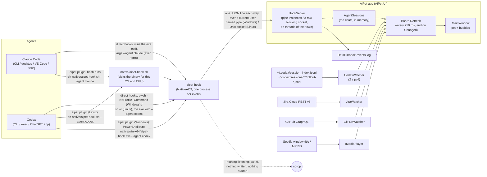
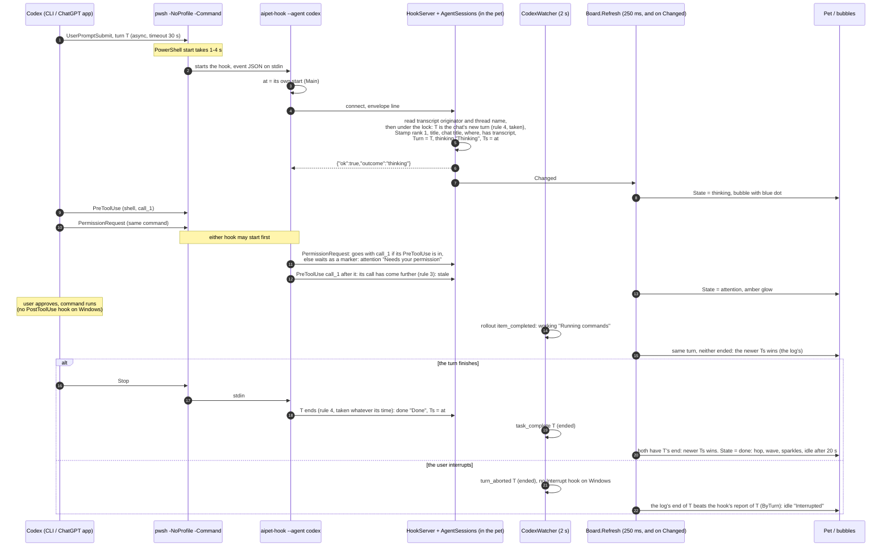

# AiPet architecture

This document describes how AiPet works as the code stands now. It covers everything from the pixels of the pet to the hook process the coding agents run. File references are relative to this `docs/` folder. Line numbers are approximate and are written as `File.cs:NN`.

---

## 1. Overview

AiPet is a floating desktop pet that mirrors the state of coding-agent chats: Claude Code (CLI, desktop app, VS Code, Agent SDK) and Codex (CLI, `codex exec`, and the ChatGPT desktop app). It also shows the Jira issues a search finds (by default your own open issues) and the GitHub pull requests waiting on your review, and optionally the track playing in Spotify or another MPRIS player.



**Key design choices.**
- The agent-facing part is a separate tiny process. `aipet-hook` is built with NativeAOT ([AiPet.Hook.csproj](../src/AiPet.Hook/AiPet.Hook.csproj):14-18), so a process spawned on every event starts quickly. Releases publish it that way for Windows and Linux (§7).
- The hook only observes. On the hook path it never writes to stdout, never fails, and always exits 0 ([Program.cs](../src/AiPet.Hook/Program.cs):13-17, 23-80), so it cannot inject text into a chat or disturb the agent.
- The hook is a thin forwarder. Each run connects to the running pet over a local socket that only the current user can open, sends the event as one JSON line and waits for one line back ([Ipc.cs](../src/AiPet.Core/Ipc.cs)). All state logic lives in the pet ([AgentSessions.cs](../src/AiPet.Core/AgentSessions.cs)), so the chats exist only while it runs. When it isn't running, a hook does nothing at all: it writes nothing anywhere and starts nothing. Only the user, an installer, or the Windows updater after an update starts the pet. Both ends share the endpoint, limits and field names through a source-linked `Ipc.cs`, next to [Paths.cs](../src/AiPet.Core/Paths.cs).
- Claude reaches the hook in one of two ways: hooks registered directly in its settings (exec form, no shell), or the `aipet` plugin, whose hooks run `sh` on a launcher script with `"shell": "bash"`. Codex likewise has direct hooks (through PowerShell on Windows, `sh -c` elsewhere) or the same plugin. §6 and §7 cover both.
- Everything fails soft:
  - A hook that finds nothing listening exits 0 at once. One that gets no event on stdin within 2 s sends nothing. One whose reply doesn't come within 2 s gives up and exits 0.
  - The pet drops garbage, oversized or silent connections without a reply, and never crashes on them.
  - Watcher errors become a bubble or a log line.
  - Platform features that are missing (for example X11 shapes) simply turn off.

---

## 2. Repository layout

| Path | What it is |
|---|---|
| [src/AiPet.Core/](../src/AiPet.Core/) | Platform-neutral logic: `Pet` (animation and renderer), `Avatar`, `Board` (data model), `AgentSessions` (the hooks' chats), `HookServer` (the pet's end of the socket), `Ipc` (the protocol, shared with the hook), `CodexWatcher`, `JiraWatcher`, `GitHubWatcher`, `Paths`, the `IPlatform` interfaces and `Log` (`Platform.cs`), `Preset` (Settings' "Import defaults…"), `UpdateStatus` and `HookCleanup` (for the Windows uninstaller). |
| [src/AiPet.UI/](../src/AiPet.UI/) | The Avalonia 12 app (`AiPet.exe`, `AiPet` on Linux): `Program`, `App`, `MainWindow`, `SettingsWindow`, `Updates` (Velopack), `app.manifest`, and `Platform/` (Windows, Linux, macOS stub, `PlatformFactory`). |
| [src/AiPet.Hook/](../src/AiPet.Hook/) | `aipet-hook`: `Program` (entry point, request line), `ClaudeHook`, `CodexHook` (each builds its envelope), `Install` and `ClaudeConfig` (`Install.cs`), `CodexConfig`, `Doctor`, `PluginHooks` (`--print-plugin-hooks`). Links `Paths.cs` and `Ipc.cs` from Core. |
| [tests/AiPet.Tests/](../tests/AiPet.Tests/) | xUnit tests. They run the hook as the agents do (`dotnet hook/aipet-hook.dll`) against a real `HookServer` on a temp endpoint, with temp data folders ([TestEnv.cs](../tests/AiPet.Tests/TestEnv.cs)), and cover ordering, the Board, the server (starved thread pool included), registration, the launcher, the installers, the plugin hook files, presets, Velopack, the release workflow and the exe resources. |
| [AiPet.slnx](../AiPet.slnx), [Directory.Build.props](../Directory.Build.props) | The solution (three projects and the tests), and the version and metadata every project shares. Releases set the version from the tag (`-p:Version`). |
| [build/](../build/) | `Win32Resources.targets`, which both exe projects import: it writes each exe's `.res` (icon, manifest, and a version resource that names the `.exe`, not the `.dll`) without `rc.exe`, on any OS. `default.win32manifest` is the manifest it uses when a project has none. |
| [assets/icon/](../assets/icon/), [tools/IconGen/](../tools/IconGen/) | The app icon (`aipet.ico` and PNGs). IconGen draws it with the pet's own renderer and also writes the plugin's icons and the Linux hicolor icons. Its output is committed; builds only use the committed files. |
| [plugins/aipet/](../plugins/aipet/) | One plugin folder for both agents: `.claude-plugin/plugin.json` and `hooks/hooks.json` (Claude Code), `.codex-plugin/plugin.json` and `hooks/codex.json` (Codex), the launcher `native/aipet-hook.sh`, assets, README and LICENSE. The hook binaries (`native/<rid>/`) are gitignored: the release workflow adds them in the plugin repository. |
| [.claude-plugin/marketplace.json](../.claude-plugin/marketplace.json), [.agents/plugins/marketplace.json](../.agents/plugins/marketplace.json) | The marketplaces `aipet` for Claude Code and for Codex. Both point at `plugins/aipet` in the separate repository `xMarcinator/ai-pet-plugin`, pinned to a tag and a commit. |
| [packaging/linux/](../packaging/linux/) | The Linux package's `install.sh` (install, update, `--uninstall`), the menu entry template `aipet.desktop.in`, the hicolor icons, and `hyprland/` with the Hyprland window rules (`aipet.lua`, `aipet.conf`). |
| [packaging/windows/](../packaging/windows/) | A README on the Windows packages the release workflow builds. Nothing in it runs. |
| [install.ps1](../install.ps1), [install.sh](../install.sh) | The end-user one-line installers: the latest release's app, then the plugin for each agent on `PATH`. |
| [build.ps1](../build.ps1), [build.sh](../build.sh) | Builds per RID into `artifacts/`, bundles the hook into the plugin and makes a local marketplace to try it. |
| [scripts/](../scripts/) | `install-from-source.sh` and `install-from-source.ps1` (install a build from a clone, with direct hooks), and `check-plugin.sh` (the plugin and marketplace files are consistent, and the hook files match the code). |
| [.github/](../.github/) | `workflows/ci.yml` (build and tests on Windows and Linux, the plugin check, the scripts), `workflows/release.yml` (check, win, linux, plugin, publish) and `dependabot.yml` (updates for the pinned actions). |
| [avatars/](../avatars/) | A sample custom avatar (`hood-green.json`). The app does not read this folder (see §3.7). |
| `web/` | An earlier prototype. Not built or installed, and not covered here. |

---

## 3. The pet: animation and rendering

Files: [Pet.cs](../src/AiPet.Core/Pet.cs), [Avatar.cs](../src/AiPet.Core/Avatar.cs), [MainWindow.axaml](../src/AiPet.UI/MainWindow.axaml), [MainWindow.axaml.cs](../src/AiPet.UI/MainWindow.axaml.cs).

### 3.1 Grid and pipeline

The pet is a pixel-art sprite of 26x24 cells (`Pet.GW=26`, `Pet.GH=24`), drawn at 5 DIPs per cell (`Pet.P=5`). The `Sprite` panel is therefore 130x120 DIPs (Pet.cs:37, MainWindow.axaml:39). All animation logic is in the platform-neutral class `AiPet.Pet`. The UI only feeds input and copies pixels.

```
MainWindow.OnFrame (every compositor frame)
  -> fill PetInput (state, prop, hover, drag, one-shot timers, music)
  -> Pet.Update(input, t)
       ComputePose(input, t)          every call
       Draw(pose, ...)                only when (int)(t*24) changes  -> PixelsChanged
       squash / stretch / breathe     every call
       shadow scale / opacity         every call
  -> if PixelsChanged: Blit Body, Glow, Fx into three WriteableBitmaps
  -> apply ScaleTransform / TranslateTransform to Sprite and Shadow
```

- **Frame loop.** The constructor calls `RequestAnimationFrame(OnFrame)` (MainWindow.axaml.cs:142), and each `OnFrame` requests the next frame at its end (:677). There is no timer; the pet ticks once per compositor or vsync frame. The clock is a `Stopwatch`, and `Now` is seconds since the window was created (:38-39).
- **Two rates.** `ComputePose` and the transforms run at display rate, so movement is smooth at sub-pixel DIP offsets. Pixels are redrawn only at 24 fps (Pet.cs:339-345). The result is deliberately smooth motion with choppy pixel-art frames. `dt` is clamped to 0.001-0.05 s (Pet.cs:334).
- **`PetInput`** (Pet.cs:6-22):
  - `State`: `sleep`, `idle`, `thinking`, `working`, `attention` or `done`.
  - `StateSince`, `Prop` (`laptop` or `lens`), `Hover`, `Mouse` (sprite DIPs or null), `Dragging`, `Moved`, `LastMove`, `Facing` (±1).
  - One-shot deadlines: `PokeUntil`, `LandUntil`, `WaveUntil`, `AlertUntil`.
  - `Music`.

  MainWindow owns the single instance (`input`, MainWindow.axaml.cs:29).
- **`PetFrame`** (Pet.cs:25-31) holds the `Body`, `Glow` and `Fx` buffers as `uint[GW*GH]` premultiplied BGRA (`0xAARRGGBB`, which matches `PixelFormat.Bgra8888` in little-endian memory), plus `PixelsChanged`, `X`/`Y`, `ScaleX`/`ScaleY`, `ShadowScale` and `ShadowOpacity`. The arrays are the pet's own reused buffers, not copies (Pet.cs:169).

### 3.2 Where the state comes from

`MainWindow.Refresh` (every 250 ms and on watcher events) copies `board.State` into `input.State`. It resets `StateSince` only when the state changes, and it copies `input.Prop` every time (MainWindow.axaml.cs:292-303). §5 explains how `Board.State` is derived. Inside `ComputePose` (Pet.cs:219-231):

- `st = t < AlertUntil ? "attention" : inp.State`. A new Jira or GitHub review sets `AlertUntil = Now + 6` (MainWindow.axaml.cs:125, 129).
- While music is playing (`input.Music = cfg.Music && Media.Playing`), `idle` or `sleep` of any age, or `done` older than 4 s, becomes the synthetic state `listen` (Pet.cs:222; MainWindow.axaml.cs:638).
- `idleAct` is cleared on a state change (Pet.cs:223).
- The prop is used only while working: `Prop = working ? (inp.Prop ?? "laptop") : null`.
- The random look offset is re-rolled from {-1, 0, 0, 1} every 2.5-6 s (Pet.cs:233).

### 3.3 States and poses

Y is in DIPs (negative is up) and `P = 5` (Pet.cs:236-290). `Wave(rate)` is `ARM_L` plus `WAVE_A`/`WAVE_B`, alternating every `1/rate` s (Pet.cs:234).

| State | Motion | Eyes | Arms / feet | Fx layer |
|---|---|---|---|---|
| `idle` | Bob `Y=(0.5+0.5 sin 2.2t)*0.6P`. After `nextIdle` (first at 6 s, then every 5-11 s), when not hovered or dragged, picks an idle act: `look` (Lx sweeps −2..2 at 4 steps/s), `hop` (0.9 s, up to 3.2P), `stretch` (`ARMS_UP`, happy eyes, Y=−P), `wiggle` (X=sin(16t)*0.8P) or `tap` (`FOOT_TAP` at 5 Hz, Lx=1). Other acts last 1.6-2.6 s. | normal, `Lx=look` | down | none |
| `sleep` | `Y=(0.5+0.5 sin 1.2t)*0.5P` | sleep (flat lines) | down | 3 rising Z glyphs (hidden while hovered or held) |
| `thinking` | Floats up, `Y=-(0.5+0.5 sin 2.4t)*0.7P` | up, Lx=1 | down | 0-3 thought dots cycling at 3 Hz |
| `working` | Quick bounce, `Y=-abs(sin 6.3t)*0.6P` | lens: scan Lx [−1,0,1,0] at 1.5 steps/s. Laptop: down, Lx=1. | down | none |
| `attention` | 1.2 s cycle with a 0.6 s hop to 3P | normal | `Wave(3)` | outlined `!` at x 24 |
| `done` | One 0.7 s hop to 3P | happy | `Wave(3)` for the first 4 s | sparkles |
| `listen` (music) | Beat 60/112 s; nod `Y=-abs(sin(πt/beat))*1.2P`; sway `X=sin(πt/(2·beat))*0.6P` | happy for 6 of every 8 beats | down, plus headphones | 2 rising notes in the accent colour |

**Overrides.** These apply after the base pose, in this fixed order (Pet.cs:292-327):

1. **Hover tracking** (mouse over the sprite, not dragging, not working): `Lx = clamp(round((m.X-65)/28), -2, 2)`; eyes are up if `m.Y < 15`. A sleeping pet stops bobbing and opens its eyes.
2. **Wave** (`t < WaveUntil`, only in idle, sleep or done): `Wave(5)` with happy eyes. On pointer enter, `WaveUntil = Now + 1.4` unless the last wave ended less than 3 s ago (MainWindow.axaml.cs:112-116).
3. **Poke** (click without drag, `PokeUntil = Now + 1.2`): squint eyes, then happy eyes; hop `Y=-sin(pp·π)*3P`.
4. **Landing** (after a drag, `LandUntil = Now + 0.45`): hop `2.5P` with happy eyes.
5. **Running** (dragging, and the last move was under 0.25 s ago): `RUN_FEET`/`RUN_ARMS` at 10 Hz mirrored by `Facing`, a lean of `X=Facing*P`, `Lx=2*Facing`, no prop. Otherwise, **held** (the drag has passed the 4 px threshold, so `Moved` is set, but the last move was 0.25 s or more ago; a press that hasn't moved yet shows no held pose): feet dangle at 3 Hz, `ARMS_UP`, wide eyes, no prop.
6. **Blink**: when the eyes are normal, up or down and `t > blinkAt`, they blink for 0.13 s. The next blink comes 2.5-5.5 s later; the first is at t=3.

Props are hidden while poked or landing (Pet.cs:421). The eyes never mirror: `Facing` is applied through `Mirror()` only to the running limbs and the dust (Pet.cs:138-139, 313, 454).

### 3.4 Squash, stretch, breathing, shadow

These run on every call (Pet.cs:348-360):

- `v = (pose.Y - prevY)/dt`.
- **Landing** (`prevY < -2 && pose.Y >= -0.4 && v > 0`): `squash = 0.13`, decaying as `squash *= exp(-11 dt)`.
- `stretch = clamp(-v/2600, 0, 0.06)`, applied only while rising.
- `breathe = 0.012*sin(1.2t)` when sleeping or `sin(2.2t)` when idle, and 0 while the pet is pressed or dragged (`inp.Dragging`). It keys off the raw `inp.State`, so a listening pet still breathes.
- `ScaleX = 1+squash-0.5 stretch-0.5 breathe` and `ScaleY = 1-squash+stretch+breathe`, which roughly preserves volume.
- Shadow: `lift = clamp(1+Y/45, 0.5, 1)`. `ShadowScale = Held ? 0.55 : lift` and `ShadowOpacity = Held ? 0.35 : lift`.

The sprite's `RenderTransformOrigin="50%,91.7%"` (110/120 DIPs, the bottom of feet row 21) keeps the feet planted (MainWindow.axaml:39). The transform groups are `Sprite = {Squash, Move}` and `Shadow = {ShadowScale, ShadowMove}` (MainWindow.axaml.cs:88-89). The shadow follows X only, never Y (:646-650).

### 3.5 Rendering: three layers

`Pet.Draw` (Pet.cs:364-494) clears the three buffers and paints in painter's order. `Put()` premultiplies with `Pm()` and **overwrites** the pixel; it never blends, and out-of-grid cells are dropped (Pet.cs:171-182).

| Layer | Contents | UI element |
|---|---|---|
| **Body** | The silhouette, arms and feet (`shape = body ∪ Arms ∪ Feet`, so the limbs share one outline) with a 4-neighbour `Outline` ring. Then the shaded fill, spec, blush, headphones (when `Music` is on), the face panel (bezel, screen, glint at (9, FaceTop+1) and (10, FaceTop+1)) and the props. | `BodyImg` |
| **Glow** | The eyes (`EyeHi` on a column's top cell, `EyeLo` on its bottom cell, `Eye` elsewhere) and the laptop screen's `>` prompt and 2.5 Hz cursor. | `GlowImg` with `DropShadowDirectionEffect` (depth 0, blur 10, opacity 0.9) |
| **Fx** | An else-if chain, so only the first match draws: running dust > thinking dots > listen notes > sleep Zs > attention `!`. Sparkles for done or poked are drawn separately and can stack. Most Fx are hidden while held (Pet.cs:451-493). | `FxImg` |

**Fill styles:**
- `soft`: a cell missing its bottom or right neighbour gets `Deep` (y≥19) or `Shade`; a cell missing its top or left neighbour with y<15 gets `Hi`; any other cell gets `Shade` (y≥19) or `Body`.
- `rim`: edge cells get `Hi` (y<17) or `Shade`; interior cells get `Deep` (y≥18), `Shade` (y≥14) or `Body`.
- Spec: `rim` puts `Spec` on every top-edge cell with y<8; `soft` uses the `FindSpec` cells (Pet.cs:369-448).

**Props:**
- Lens: a magnifier swinging at 1.5 Hz, made of a `RING`, translucent `GLASS 0x88A9E4FF`, a highlight and a 2-cell `HANDLE`.
- Laptop: an 8x6 lid at x 14-21, y 15-20, and an 11-cell base on row 21.

Because `Put()` overwrites, the lens glass replaces the body pixel under it, and the desktop shows through the lens.

**Why a separate glow layer.** `DropShadowDirectionEffect` blurs the whole Image it is attached to. Keeping only the eyes and screen glyphs on their own layer gives a coloured halo without blurring the outline. `GlowImg` and `FxImg` are `IsHitTestVisible=False`. An 86x88 ellipse filled `#01FFFFFF` (alpha 1) gives the sprite a solid hit target, so gaps between pixels still catch drags and boops (MainWindow.axaml:39-47).

**Blit** (MainWindow.axaml.cs:743-752):
- The bitmaps are 26x24 `WriteableBitmap`s at 96 DPI, `Bgra8888`, `AlphaFormat.Premul` (:64-65).
- `Lock()`, then a row-by-row `Marshal.Copy` that honours `RowBytes`, then `InvalidateVisual()`.
- `(int[])(object)px` reinterprets the `uint[]` for `Marshal.Copy`, which relies on CLR array variance.
- The Images use `Stretch=Fill` and `BitmapInterpolationMode=None`, so each cell is drawn as a nearest-neighbour 5x5 block.

### 3.6 Fixed anchors

Every avatar shares the same anchor cells, so every animation works with every avatar (Pet.cs:46-64, 150-166, 426-444):

| Element | Cells |
|---|---|
| Face panel | columns 8-17, rows `FaceTop..FaceBottom` with the four corners removed |
| Eyes | 2 columns wide at `L=10+lx` and `R=14+lx` (`lx` −2..2), rows 10-13. Shapes: normal 10-12, wide 10-13, up 10-11, down 12-13, blink row 12, squint `> <`, happy `^ ^`, sleep row 12. |
| Arms | x 4-5 and 20-21, rows 15-16 |
| Feet | row 21, x 8-10 and 15-17 |
| Blush | (6,13), (7,13), (18,13), (19,13) |
| Props | x 12-25, rows 13-21 (the lens handle reaches x 25 when the lens swings right; the outline goes one cell further) |

Headphones and spec are derived from the silhouette:
- `BuildHeadphones` uses the leftmost and rightmost body cells on row 10. The cups are 2 columns wide over rows 9-12, and the band hugs the silhouette top at `y=min(topmost-1, 8)` (Pet.cs:113-136).
- `FindSpec` takes up to 3 top-edge body cells (x<13, y<9, with a body cell diagonally below-right of each; topmost first) and puts each spec pixel one cell down and one cell right of that edge cell (Pet.cs:108-110).

### 3.7 Avatars

An `Avatar` ([Avatar.cs](../src/AiPet.Core/Avatar.cs):13-120) defines the look:

- **Shape and face:** `Name`, `Shapes` (ellipses `[cx,cy,rx,ry]` in grid cells), `Shading` (`soft` by default, or `rim`), `Blush` (default true), `FaceTop` (default 9) and `FaceBottom` (default 14).
- **`Palette`:** read from JSON and resolved into the public `uint` fields `Outline`, `Deep`, `Shade`, `Body`, `Hi`, `Spec`, `BlushC`, `Screen`, `Bezel`, `Glint`, `Eye`, `EyeHi`, `EyeLo`, `Glow` and `Accent`.

**Rasterising.** `Pet.SetAvatar` rasterises the avatar into cell sets. `BuildBody` includes a cell when its centre lies inside any ellipse. `BuildFace` makes the face rectangle. `SetAvatar` also sets `lastDrawFrame=-1` to force a redraw (Pet.cs:73-136).

**Built-in avatars:**
- `Sprout`: a 4-ellipse orange `soft` blob with blush, accent `#E27A52` (Avatar.cs:29-40).
- `Hood`: a 3-ellipse `rim`-lit blue hood with `FaceTop` 8, `FaceBottom` 15, no blush, glow `#3D9BFF` and accent `#4A8CFF` (Avatar.cs:43-59).

**Custom avatars.** `Avatar.All()` returns the built-ins plus every `*.json` file in `Avatar.CustomDir = Paths.DataDir/avatars` (Avatar.cs:63-89). Property names are case-insensitive, and `name` defaults to the file name.

- **Validation.** A file is used only when the pet can draw it (`Drawable`, Avatar.cs:93-96): `shapes` is non-empty, every shape has at least 4 finite numbers with `rx` and `ry` above 0, and `0 ≤ faceTop ≤ faceBottom < 24`. A file that doesn't parse or fails the check is skipped, so a hand-edited file with a missing number can't take the pet down. Settings also skips, and logs, any avatar whose preview throws (SettingsWindow.axaml.cs:227-230).
- Palette values are `#RRGGBB` or `#AARRGGBB`.
- The palette `Dictionary` is case-sensitive, so `eyeHi` and `eyeLo` must be spelled exactly.
- Missing keys fall back to **Sprout's** colours, not the avatar's own, so a partial palette gives a mixed look.
- `glow` defaults to `eye`, and `accent` defaults to `hi` (Avatar.cs:108-119).

The repo's `avatars/hood-green.json` is a sample only. Nothing copies it into `DataDir/avatars`.

**Applying an avatar.** `ApplyAvatar` (MainWindow.axaml.cs:205-214):
- calls `pet.SetAvatar(a)`;
- sets the glow effect colour to `a.Glow`;
- sets the application's `Accent` brush and `SystemAccentColor`, and the window's own `Accent` brush, to `a.Accent`;
- sets `cfg.Avatar = a.Name`.

The accent colours the Save buttons, the menu check marks, Fluent's accent (toggle switches, focus rings, text selection), the headphone shine and the music notes. The Settings window keeps its own copy (`SetAccent`, SettingsWindow.axaml.cs:76-81) for its sidebar dot, the selected page's icon and the selected avatar tile.

**Where avatars are picked.**
- At startup: `cfg.Avatar`, falling back to `avatars[0]` (Sprout) (MainWindow.axaml.cs:93-94).
- The context menu's "Avatars…" opens Settings on the Avatars page (:247-249).
- Settings → Avatars runs `All()` again whenever it fills its tiles (when the window opens, and on Reload). A click on a tile applies the avatar and saves the config (MainWindow.axaml.cs:273). The previews are drawn by a throwaway `Pet` updated at t=0.05, 0.10 and 0.15, before the first blink or look change, using the Body and Glow layers only (SettingsWindow.axaml.cs:264-272).

---

## 4. The window and bubbles

Files: [Program.cs](../src/AiPet.UI/Program.cs), [App.axaml](../src/AiPet.UI/App.axaml), [MainWindow.axaml](../src/AiPet.UI/MainWindow.axaml), [MainWindow.axaml.cs](../src/AiPet.UI/MainWindow.axaml.cs), [SettingsWindow.axaml.cs](../src/AiPet.UI/SettingsWindow.axaml.cs), and the platforms' window calls in [LinuxPlatform.cs](../src/AiPet.UI/Platform/LinuxPlatform.cs) and [WindowsPlatform.cs](../src/AiPet.UI/Platform/WindowsPlatform.cs).

### 4.1 Process and window model

**Process start** (`Program.Main`, Program.cs:8-28).
- **Velopack first.** `Updates.App().Run()` runs before anything else. The Windows installer, updater and uninstaller start the app with arguments of their own, which it handles before it exits; any other start goes on at once (Program.cs:13; §8).
- **Single instance.** `Program.Main` takes the named mutex `Local\AiPetApp` and returns if another instance holds it. An `UnauthorizedAccessException` (a pet started elevated owns the mutex) also counts as another pet. On Linux .NET scopes that mutex to the login session, and the Linux installer starts the pet with `setsid`, so a pet started later from the app menu would get a mutex of its own; `OtherSessionsPet` therefore also returns when something answers on the user's socket (§6). It does not activate the running copy (Program.cs:16-37).
- **Updates.** `Updates.Start()` runs once the pet knows it is the only one. It returns false, and the pet exits, when an update downloaded earlier is installed first; Velopack's `Update.exe` then starts the pet again (Program.cs:25).
- **Avalonia setup.** `UsePlatformDetect`, with these X11 options (Program.cs:39-54):
  - `EnableSessionManagement=false`, so libICE/libSM aren't needed.
  - `OverlayPopups=true`: menus and tooltips are drawn inside their window, not as windows of their own. A compositor can stack the pet's window above popup windows (Hyprland does when the pet is pinned), and with focus following the mouse, moving onto a popup window takes the focus from the pet's window, which closes a menu.
  - `RenderingMode [Glx, Software]`, or Software only when `AIPET_SOFTWARE=1`.

  On Linux the app runs on X11, through XWayland under a Wayland compositor.
- **App.** `ShutdownMode.OnMainWindowClose`. `AIPET_PLAIN=1` shows a plain 360x160 test window instead (App.axaml.cs:15-24).

**The window.** One borderless, transparent, topmost window holds everything:
- 380x600 DIP, `ShowInTaskbar=False`, `CanResize=False` (MainWindow.axaml:4-6). On Linux the window is usually smaller than that: it is fitted to what it shows (§4.2). The XAML size is kept as `full` (MainWindow.axaml.cs:76), the size the window has before fitting and while the menu is open.
- The root grid (margin 12,8,12,8, rows `*,124`) holds (MainWindow.axaml:9-50):
  - in row 0, `Sections`: a bottom-aligned `StackPanel` with a bottom margin of 8, holding the reviews header and the three stacks' panels `Reviews`, `Pills` (chats) and `Music`, top to bottom. The panels start at height 0 and have `ClipToBounds=False`;
  - in row 1, the 140x124 pet panel.
- `AIPET_OPAQUE=1` gives the window a solid `#202024` background (MainWindow.axaml.cs:77-82).

**Composition root.** The MainWindow constructor (MainWindow.axaml.cs:73-144):
- relies on field initialisers for `platform = PlatformFactory.Create()`, `Board`, `Pet`, `PetInput`, `CodexWatcher` and the `AgentSessions` store `hooks` (:26-34); the constructor itself creates `JiraWatcher` and `GitHubWatcher`, both given `platform.Secrets`, and the `HookServer` over `hooks` (:83-85);
- loads `config.json` and applies the avatar, the chats switch and `Topmost` (:91-96);
- wires the watcher events. UI work is posted with `Dispatcher.UIThread.Post`, but `jira.Changed` first calls `github.JiraChanged()` on the thread that raised it. `server.Changed` posts `Refresh` like the others, then `server.Start()` opens the socket (:123-135);
- starts three never-stopped `DispatcherTimer`s: `Refresh` every 250 ms, `KeepOnTop` every 2000 ms, and `Media.Poll` every 1000 ms when `cfg.Music` is on (:137-139).

On `Opened` it calls `PlaceWindow`, marks the window placed (fitting starts only after that), calls `platform.SetupPetWindow(hwnd)` and `UpdateInputRegion(force:true)` (:98-104). `Resized` posts a forced region update once the new layout is done (:106). `Closed` saves the config and stops the hook server (:143).

**Placement.** `PlaceWindow` (:160-173) runs while the window still has its full size:
- It uses the saved `Left`/`Top` (physical px), or else the work area's bottom-right corner (24 px in from the right edge, flush with the bottom).
- It subtracts `(Height - savedHeight)*Scale`, so the bottom-anchored pet stays in place if the window grew. `savedHeight` is `cfg.WindowHeight`, less the 42 DIPs of the old toolbar row when the file says the toolbar showed (`OldToolbarRow`, :158).
- It resets to bottom-right if the pet's strip at the bottom of the window is on no screen.

`ResetPosition` (:175-181) puts the whole window back in the bottom-right corner, fitted or not, and saves the config.

**SetupPetWindow and KeepOnTop.**
- `SetupPetWindow`: on Windows it adds `WS_EX_TOOLWINDOW`, so the pet isn't in Alt+Tab (WindowsPlatform.cs:128-131). On Linux it sets `_COMPTON_SHADOW=0`, which picom and compton read (LinuxPlatform.cs:76-90). On macOS it does nothing.
- `KeepOnTop` (MainWindow.axaml.cs:197-200) runs once at start and then every 2 s. When `Topmost` is on it calls `platform.KeepOnTop`: Windows re-asserts `HWND_TOPMOST` (WindowsPlatform.cs:133); Linux and macOS do nothing.

### 4.2 Fitting the window (Linux)

On Linux the pet's window is kept only as big as what it shows (`FitWindow`, [MainWindow.axaml.cs](../src/AiPet.UI/MainWindow.axaml.cs)). `IPlatform.FitsPetWindow` turns this on; `LinuxPlatform` returns true unless `AIPET_NOFIT=1`, and Windows and macOS keep the default, false (Platform.cs:29).

**Why.** Click-through on X11 relies on the window's input shape (§4.3). Hyprland ignores the X11 input shape, so every pixel of an XWayland window's rectangle takes the mouse: with a fixed 380x600 window, nothing under its transparent parts could be clicked. So on Linux the window itself shrinks to the pet and its bubbles. Outside that box clicks reach the windows below on any compositor. Inside it, on Hyprland, the transparent parts still take the mouse (§10).

**The size** (`FittedSize`, :729-741), in DIPs:
- The width is the widest of: the pet's 140-DIP panel, each bubble's width plus 20 DIPs on each side (for its shadow and close button), and the reviews header. Root's side margins are added.
- The height is Root's margins, the pet's 124-DIP row, and above it the three panels, each at its current or its target height, whichever is larger, plus the reviews header and `Sections`' bottom margin. With no stacks there are 20 DIPs of room for the pet to hop instead.
- Both are capped at `full`, and at the screen's work area (`Room`): a window manager may hold a window to the work area, and a size it never grants would be asked for again and again. While the menu is open, or about to open, the size is that cap.

**How it changes.**
- It grows at once, for what is about to show. It shrinks only once the stacks have settled (every panel within 0.5 DIP of its target, no card fading out) and stayed so for 0.4 s.
- The pet's bottom-centre stays where it is. Every position is derived from the whole window's with one integer formula, `OffsetFor(w, h)` = `((fullW - w)/2, fullH - h)` in pixels, so no rounding pixel ever moves the pet across grow and shrink cycles. The layout (the stacks sit at the bottom of row 0, above the pet) therefore needs no change.
- Before a resize, the input region is set to the whole of the larger of the two sizes, so nothing of the pet is clipped while the layout catches up. The periodic region update pauses until the new size is in, or for 0.5 s at most (:676, :697-699); then `Resized` posts the forced update for the new layout.
- Nothing is fitted before the window is placed, or while the pet is dragged.
- `LinuxPlatform.MoveResize` sets `WM_NORMAL_HINTS` to min = max = the new size, then makes one `XMoveResizeWindow` call for the window and, in the same batch, one for the child window Avalonia renders into (resized to the same size at 0,0). The window can't be resized by the user (min = max, as Avalonia sets them), which is also why window managers float it.
- Until the frame for the new size is drawn, the X server shows what was drawn before. `SetupPetWindow` gives the window and its render child South bit gravity, so that old frame stays at the bottom-centre, under the pet; with the default NorthWest gravity the pet showed twice for a moment when the window grew. Only the child's bit gravity, not its window gravity, changes: Avalonia resizes that child but never moves it back to 0,0.
- A fitted window has no X11 bounding shape, only the input shape (`SetInputRegion`). XWayland updates only what is inside a bounding shape, so what was drawn outside it stayed on screen (the pet where it was before the window grew, a bubble that went) and what was drawn there never showed (the menu).

**The menu on a fitted window.** The context menu opens above the pet, inside the window (§4.6). A fitted window has no room for it. So `Opening` is cancelled while the window is smaller than that room, or a smaller size is still on its way, and `menuWanted` is set; `FitWindow` grows the window, then opens the menu itself once the size is in.

**Config and dragging.** `config.json` keeps meaning "the 380x600 window's position": `SaveConfig` and `ResetPosition` convert with `FittedOffset`, the distance by which a fitted window's corner is inward of the whole window's. A drag also works on the whole window's position and adds the current offset back on every move, so a size change that lands during a drag doesn't pull the pet away from the pointer.

**Hyprland.** AiPet ships window rules that the user includes in their Hyprland config (files and include line in §7). For the pet (class and title `AiPet`) they set float, pin (on every workspace of its monitor), no border, no rounding, no blur, no shadow and no animation. Without them Hyprland frames the transparent window, and animates each move the pet makes while dragged, so the drag overshoots. The Settings window (title `AiPet · Settings`) gets no border, rounding, blur or shadow. The rules never use `no_focus`: an XWayland window with it gets no mouse input at all. The pet's window stays a normal managed window; an override-redirect one would not follow the pet's own moves under Hyprland.

### 4.3 Click-through

The window's empty parts let clicks through only because `UpdateInputRegion` (MainWindow.axaml.cs:758-787) keeps the OS region trimmed to padded rectangles:

- **What it collects.** Each control's corners are translated to window coordinates (render transforms included), padded, then scaled by `RenderScaling`. Pads in DIP: Sprite 6, ReviewsHeader 4, each card `Body` with `Root.Opacity > 0.05` 16, and its Close button (when shown) 2. The popups drawn in the window's overlay layer (the open menu and tooltips, on X11) and the open `ContextMenu` are added with a pad of 2. The overlay layer is found from `Root`; from the window itself it isn't (:780-782).
- **When the OS is called.** `OnFrame` calls this at most every 0.1 s, except while a resize is on its way (:676). The OS is called only when the joined rectangle string changes, or when forced (on `Opened`, and after `Resized`). The menu's `Opened` posts an update too (:233).
- **Windows.** The rectangles are ORed with `CreateRectRgn`/`CombineRgn`, then `SetWindowRgn(h, rgn, true)` is called. The system owns the region after success (WindowsPlatform.cs:135-147). The region clips painting as well as hit-testing, which is why the pads are large enough to cover the BoxShadows. `OverlayPopups` is an X11 option, so on Windows tooltips and the context menu are separate popup windows and are not clipped.
- **Linux.** `XShapeCombineRectangles` sets the input shape (`ShapeInput`) to the rectangles, which is why the menu and tooltips are in them. A fitted window (§4.2, the default) has no bounding shape; with `AIPET_NOFIT=1` the rectangles are the bounding shape too, which keeps compositors from drawing a shadow box around the whole 380x600 rectangle. Compositors that honour the input shape let the rest click through; Hyprland doesn't, hence §4.2. `AIPET_NOSHAPE=1` skips all of this.
- **macOS.** A no-op.

Inside the region, the `Root` grid has a transparent background, so every pixel is hit-testable. A right-click anywhere in it opens `Root.ContextMenu` (MainWindow.axaml.cs:120).

### 4.4 Bubbles (`Card`)

Each bubble is a `Card` keyed by `Session.Id` (MainWindow.axaml.cs:308-326).

**`MakeCard`** (:341-424) builds:
- a title (13.5 SemiBold) and a detail line;
- an 8x8 status dot with a pulse ellipse;
- hidden action buttons: Open, Pr, Prev/PlayPause/Next and Stop;
- the `Body` border (height 50, width 240-350, corner radius 25);
- a Close button on the top-left corner.

The root has `RenderTransformOrigin (0.5,1)`, starts at `Opacity 0` and `Y=14`, and carries `TransformGroup{Scale, Move}`.

**Three stacks.** Each bubble belongs to one of three stacks, by its kind (`Board.SectionOf`, Board.cs:42-47). From the pet up (MainWindow.axaml:13-25):
- `music`: the one music bubble, right above the pet, so no chat ever hides it;
- `chats`: the agents' chats;
- `reviews`: Jira and GitHub bubbles and their error bubbles, under the reviews header.

Board caps each stack (`MaxCards`: 4 chats, 4 reviews, 1 music, Board.cs:26) and counts the rest in `Extra`. In the reviews stack a watcher's error bubble always shows, first (§5).

**Lifecycle** (`SyncCards`, :475-553):
- `show = pillsVisible ? board.Cards : []`, so hiding chats animates every bubble away.
- **New id:** a card is created in its stack's panel and eases from `Y=14`, `O=0` to its target, sliding up and fading in.
- **Id gone** (dismissed, idle, over the cap, or chats hidden): `Removing=true`, `TO=0`, `TY=Y+10`. The card is detached from its panel 0.25 s later (:669). If the id comes back while the card is still fading, the old view is removed at once and a fresh card animates in (:496-504).
- **Text:**
  - For chats, the tooltip is `{title}\nIn the {app.Label}`. Detail is prefixed with `Label · ` when more than one app label is visible, or when the label is not `Claude app`/`Claude` (:525-531).
  - Thinking dots cycle via `1+(int)(t*2.5)%3`, quantised to the 250 ms refresh.
  - The last card of a stack gets `  ·  +N more` when that stack has more than it shows.
- **Style** (only when the state or app colour changes):
  - The dot uses `Board.StatusColor[st]`; GitHub cards use `GitHubPurple #A371F7`.
  - `Pulsing` is set for working, attention, thinking and music.
  - `StyleBody(c, st=="attention")` (:428-438) draws the border in the app colour at alpha `0xB8` when there is one (else amber when highlighted, else `#26FFFFFF`). The background is `#F72E291E` when highlighted and the title `#FFE9A8`. So a chat keeps its app colour on the border while "needs you" is shown by the tint and the glow.
- **Ghost:** when nothing at all is shown, bubbles are on, and the pet is hovered and not dragged, a `_ghost` card appears in the chats stack: "Claude Code / Napping" or "All caught up" (:483, 507-513).

**Layout** (`LayoutCards`, :563-586). Within each stack, cards are ordered as `board.Cards` gives them, with the ghost last.

| | Y target | Scale | Opacity | Content | Hit-test |
|---|---|---|---|---|---|
| Collapsed (a deck of cards) | `-i*9` | `1-0.06i` | 1, 0.78, 0.56, then hidden | front card only | front card only |
| Expanded | `-i*58` (50 px + 8 px gap) | 1 | 1 | all | all |

- Cards are never laid out by the panel. Every card of a stack sits in that stack's panel and is positioned only by its transforms. The panel's height is eased separately, so each stack sits above the one below it.
- The panel height target is 0 when empty. Otherwise it is the stack's gap (14 DIPs above the chats and the music, none for the reviews, whose header has its own margin) plus `50+(n-1)*58` when expanded or `50+9*(min(n,3)-1)` when collapsed (:561, 580).
- **One stack expanded at a time.** A click on a collapsed stack with more than one card expands it and collapses the others (:414-420). The stacks share the 452 DIPs above the pet (600, less Root's margins, the pet's row and `Sections`' margin). A bottom-aligned `StackPanel` taller than that spills down behind the pet, and two expanded stacks would be. With one expanded, the tallest case (4 reviews or 4 chats expanded, the other collapsed, music and the header) is about 401 DIPs. Raising a cap or adding a stack needs this sum checked again (:555-560).
- A stack collapses again when it drops to one card, or when the pointer has been out of the window for more than 2.5 s (:478-482).
- **The reviews header** shows while the reviews stack holds a card. It reads "{n} waiting on you", where n counts the Jira and GitHub bubbles shown plus those beyond the cap (`Extra["reviews"]`), or "Jira and GitHub" when the stack holds only error bubbles (:582-585). It doesn't say "reviews" because Jira's search may find your own issues rather than reviews. A Jira bubble whose issue has a PR shows it in its detail line as `PR repo#N` (`Board.PrLabel`, Board.cs:86-91, 177).

**Tweens** (`OnFrame`, :652-672):
- Y, scale and panel heights use `k = 1 - exp(-13·dt)`; opacity uses `1 - exp(-16·dt)`.
- Pulse: phase `((t-BornAt)%1.3)/1.3` with ease-out cubic; the pulse scales to `1+1.6·ease` and its opacity goes to `0.55(1-ph)`.
- Attention glow: an amber BoxShadow, blur 22, with alpha `0x40 + 0x90(0.5+0.5 sin 3.5t)` (about 1.8 s period).

### 4.5 Bubble actions

`UpdateChrome` (:460-473) shows the actions and the Close button only when `Hover && (expanded || IsFront) && !Removing`.

| Control | Visible when | Action |
|---|---|---|
| Body click | always (left button, not on a button) | A collapsed stack with more than one card expands (§4.4). Otherwise `OpenItem` (:447-456): error cards open Settings on the jira or github page; music calls `Media.Focus()`; reviews call `OpenUrl(Url)`; a chat opens `s.Link` if set, else calls `platform.FocusAgent(agent)`. |
| ✕ Close | on hover | `board.Dismiss(id)`, then `Refresh` (:399). See §5. |
| ■ Stop | chat, working or thinking, `Where == "desktop"` | Only desktop-app chats get it: the pet can only stop a chat through its agent's desktop app, so terminal, VS Code, SDK and exec chats get none (:466). If `OnlyDesktopChat(s)`, it calls `FocusAgent(agent, link)` and presses Escape (`SendEscape()`) only when that returns true. Otherwise it calls `OpenItem`, as a click on the bubble does, and the tooltip reads "Open Claude to stop it" or "Open ChatGPT to stop it" (:364-372, 467-468). |
| Open | `TicketUrl != null` | `OpenUrl(TicketUrl)`: the Jira issue. |
| Pr | `PrUrl != null` | `OpenUrl(PrUrl)`. |
| ⏮ ⏯ ⏭ | music card | `Media.Previous/PlayPause/Next`. |

- **`OnlyDesktopChat`** (:444-445) holds when the pet has run for more than 15 min, `Where=="desktop"`, and the chat is the only chat of that agent in `board.All`. Escape stops whichever chat the app has open, so it is pressed only when that must be this chat. The 15 min are there because the pet only knows the chats it heard from since it started (§10).
- **`FocusAgent(agent, link)`** (Platform.cs:15-18) brings the agent's desktop app forward and returns true only if it is really in front. It never runs the agent's CLI. When no window of the app is found it opens at most one URL (the chat's link when given, else on Windows `claude://` for Claude and nothing for Codex) and still returns false, so no Escape follows. `SendEscape` presses nothing if that app is no longer in front (§8).

### 4.6 Drag, menu, config

- **Drag** (:591-625):
  - Press captures the pointer (left button only). More than 4 px of Manhattan movement moves `Position`. A horizontal step of at least 2 px sets `Facing` and `LastMove`, and a vertical step over 2 px sets `LastMove`.
  - Release after a move sets `LandUntil = Now+0.45` and calls `SaveConfig`. Release without a move is a boop: `PokeUntil = Now+1.2`.
  - The window isn't fitted while the pet is dragged (§4.2). Under Hyprland the rules' `no_anim` keeps the drag from overshooting.
- **Context menu** (`BuildMenu`, :219-259):
  - It opens above the pet (`PlacementTarget = Sprite`, `Placement = Top`). On X11 it is drawn inside the window (`OverlayPopups`), so the window's edge cuts off whatever reaches past it; above the pet is where the window has room.
  - There is no submenu, for the same reason: a submenu opens sideways, out of the window.
  - Items: the toggles "Show chats" and "Always on top" (each saves the config), "Avatars…" (Settings on the Avatars page), "Settings…", and "Quit". Quit calls `Updates.InstallOnQuit()`, which installs a downloaded update once the pet has exited, then closes the window (:256).
  - On a fitted window it first grows the window (§4.2).
- **`config.json`** (`Config`, :42-56):
  - `Left`, `Top`: physical px, the position of the whole 380x600 window even when the window is fitted.
  - `Pills` (show bubbles), `OnTop`, `Avatar` (`"Sprout"`), `Music` (default true).
  - `WindowHeight`: DIPs, the whole window's height when the position was saved (default 420, for files without it). `SaveConfig` writes `full.Height`.
  - `Toolbar`: read only, from files written while a toolbar sat under the pet (see Placement). It is never written again.

  `SaveConfig` (:188-195) runs after toggles, avatar changes, a drag, a position reset, the Settings switches, and on close.

### 4.7 Settings window

`SettingsWindow` is a borderless, transparent, topmost 800x640 window, titled `AiPet · Settings`, centred on the screen (SettingsWindow.axaml:1-6). It moves by `BeginMoveDrag` on the sidebar or the header, but not on their buttons, and Escape closes it (SettingsWindow.axaml.cs:60-66).

**How it is opened.** `OpenSettings(page)` reuses an open window, showing the page and activating it, or builds a `SettingsHost`. The host carries the platform, the watchers, `DefaultEmail`, the switches, `ResetPosition`, `Quit` and the avatar callbacks (MainWindow.axaml.cs:264-287; SettingsWindow.axaml.cs:17-31). On close, `settings` is set to null and `Refresh` runs.

**Pages** (SettingsWindow.axaml.cs:42-48):
- **General** (SettingsWindow.axaml:152-192):
  - The pet: switches for "Show chat bubbles" and "Always on top", and "Listen along with {player}" when the platform has a media player.
  - More: Position (Reset), the data folder with Open, and Team defaults with "Import defaults…".
  - About: "AiPet {version}" (the assembly's informational version, which releases set from the tag), a line on where the app's update stands, and one button (`BuildUpdates`, SettingsWindow.axaml.cs:128-150). The button reads "Check for updates", or "Restart to update" once an update is downloaded; that installs it and quits the pet, and the updater starts it again. A copy that doesn't update itself (anything but the Windows install) shows no button and says so. §8 covers the updates.
- **Avatars:** preview tiles, Reload and Open folder (§3.7).
- **Jira:** enabled, site, email, token and JQL. The token box always starts empty, and an empty box on Save keeps the saved token. Also Test search, Create a token and Remove saved token. The enabled box starts ticked whenever no token is saved (`c.Enabled || !jira.HasToken`, SettingsWindow.axaml.cs:315). An empty JQL box means the default search, your own open issues.
- **GitHub:** enabled, host, token and organisations (comma-separated). Test connection runs `viewer{login}` plus a review count and saves nothing. Typing a token ticks the enabled box (SettingsWindow.axaml.cs:356).

**Import defaults…** (`ImportAsync`, SettingsWindow.axaml.cs:154-204) sets the Jira and GitHub settings from a preset file a team shares, saved as the pages' Save does.
- The file is picked with the desktop's file picker. An error from the picker shows as a message rather than taking the pet down.
- The format ([Presets.cs](../src/AiPet.Core/Presets.cs):5-8) is `{"version":1,"jira":{site,jql,enabled},"github":{host,orgs[],jiraProjects[],enabled}}`. Every section and field is optional, and a file of another version is refused with a message. A preset never carries credentials: tokens and the Jira email are never read from it, even when the file has them.
- When a preset points Jira at another site, or GitHub at another host, while a token is saved, that token is removed before Save restarts the watcher (`Preset.MovesJira`, `MovesGitHub`, Presets.cs:108-118). A shared file therefore can't send your token to an address you never typed. The result line asks you to paste the token again if you trust the new address.

---

## 5. From sources to bubbles: the Board

Files: [Board.cs](../src/AiPet.Core/Board.cs), [AgentSessions.cs](../src/AiPet.Core/AgentSessions.cs), [CodexWatcher.cs](../src/AiPet.Core/CodexWatcher.cs).

`Board` is a UI-thread-only model. It is rebuilt from scratch on every 250 ms tick and whenever a watcher, the media player or the hook server raises `Changed` (MainWindow.axaml.cs:123-137, 292-303). Each rebuild takes a `Snapshot` of the `AgentSessions` store: copies of its entries, taken under the store's lock, so the UI never waits on a file or a hook (AgentSessions.cs:58).

### 5.1 The hooks' chats (`AgentSessions.Entry`)

The store is keyed `claude:<sid>` or `codex:<sid>` and kept in the order the chats first appeared (Board breaks exact ties by it). It lives only in the running pet: nothing is saved, and a pet that starts knows no chats until their next events (§10). How events are placed is in §6.

| Field | Set for | Read by Board | Meaning |
|---|---|---|---|
| `State` | both agents | yes (default `idle`) | `idle`, `thinking`, `working`, `attention` or `done` |
| `Detail` | both | yes | Second line, e.g. "Running command", "Needs your permission" |
| `Prop` | both | yes | `laptop`, `lens` or null |
| `Title` | both | yes (name rank 1) | First prompt line, `Short(…, 38)`, skipped for `/commands` and, for Codex, for a sub-agent's prompt |
| `ChatTitle` | both | yes (name rank 2) | The agent's own name for the chat, `Short(…, 44)` |
| `Agent` | both | yes (default `claude`) | `claude` or `codex` |
| `Cwd` | both | yes (name rank 0 fallback) | Working folder (Codex strips `\\?\`) |
| `Where` | both | yes | See §6.6 |
| `Ts` | both | yes | `at` of the event behind the last *visible* change (Unix seconds) |
| `HostId` | Claude | yes | `CLAUDE_CODE_HOST_SESSION_ID`, kept only in the exact `local_<uuid>` form, used for the deep link |
| `HasTranscript` | Codex | yes: Codex entries without it are dropped | Set when `transcript_path` was given |
| `Turn`, `TurnEnded` | Codex | yes (`ByTurn`, §5.2) | The chat's own current turn id, and whether its end is in; copied out of `Threads` |
| `Dispatched`, `DispatchedRank` | both | no | The chat's latest event, for ordering (§6.4) |
| `Threads` (internal) | Codex | no | How far each of the chat's threads has come (§6.4) |
| `Asks` (internal) | Claude | no | The last 16 PreToolUse and PermissionRequest halves, for pairing (§6.4) |
| `Ended` | both (SessionEnd) | yes: the entry is skipped | Tombstone `{Ended, Ts}`, pruned 24 h after its `Ts` |

`Threads` and `Asks` are shared by a snapshot's copies, but only `Apply` touches them, under the lock (AgentSessions.cs:19-40).

`Recorded` (Board.cs:107-130) turns the snapshot into sessions. It skips tombstones and Codex entries without a transcript. The name is `ChatTitle`, then `Title`, then the last folder of `Cwd`, then `AgentLabel(agent)` ("Claude" or "ChatGPT").

### 5.2 Sources and merging

`Board.Refresh` (Board.cs:133-241) proceeds in order:

1. **The hooks' chats** (`Recorded`, above).
2. **Merge into one `Session` per id** (`Offer`, :141-152):
   - For a Codex chat reported by both the hook and the log, the turn ids decide first (`ByTurn`, below).
   - Otherwise the larger `Ts` wins; on a tie, a `hook` report beats a `log` report. The winner keeps its own `Ts`.
   - The winner inherits `Where` and `Cwd` from the loser if it lacks them, and `Link` too; with no link on either side, one is worked out from the (possibly inherited) `Where`.
   - The name comes from the report with the higher name rank; a tie goes to the report offered later.
   - `CodexWatcher` sessions are offered after the hook entries: rank 2 if Codex's index named the chat, else rank 0 with the folder name or "Codex" (:154-162).
3. **Timeouts** (`Effective`, :60-67), applied to the merged chats only (:164).
4. **Review, music and error bubbles** (:166-207, below).
5. **Sort** by `Priority` descending, then `Ts` descending, into `All` (:209).
6. **Dismiss pruning** (§5.5), then **cards** (:218-232): `live = Eff != "idle" && !dismissed`. `MaxCards` gives each stack a cap: 4 for `chats`, 4 for `reviews`, 1 for `music` (Board.cs:26). A section's `jira-error` and `github-error` bubbles are always taken, first, so an error is the front card of the reviews stack. The remaining room goes to the other bubbles in `All` order, and `Extra` counts only those left out. The reviews header's count (MainWindow.axaml.cs:583) is therefore the number of reviews, errors excluded.
7. **Mood** (:234-240, §5.3).

A session's `Kind` is `chat`, `jira`, `github`, `music`, `jira-error` or `github-error`. `SectionOf` (Board.cs:42-47) gives three stacks: the Jira and GitHub kinds, errors included, go to `reviews`; `music` to `music`; chats to `chats`.

**The hook against CodexWatcher** (`ByTurn`, Board.cs:251-259). Their times don't compare. The hook's `Ts` is when its hook started, which on Windows is 1-4 s late (PowerShell). The log's is when Codex wrote the line. By time alone, an interrupt or an error, which only the log reports, would lose to a hook event Codex sent just before it. So when one report is the hook's and the other the log's, and both name a turn:
- The log's end of a turn beats the hook's report of that turn, unless the hook has that turn's end too.
- The log's end of a turn beats the hook's report of an older turn.
- The hook's report of a later turn beats the log.
- Anything else goes by time: the same turn with both or neither ended, a newer log turn that hasn't ended, ids that aren't UUIDv7s and differ, or a report without a turn.

Turns order as in §6.4 (`AgentSessions.V7Before`). The hook's `Turn` is the chat's own thread's current turn, and `TurnEnded` says whether its Stop, Interrupt or manual PostCompact is in (AgentSessions.cs:307-308). The watcher's come from the latest `task_started`, `task_complete` or `turn_aborted` (§5.6).

**Review, music and error bubbles** (§8 has the watchers):
- A Jira issue becomes `jira:<KEY>`, named `{KEY} · {summary}`. Its detail is the issue's status, plus `PR repo#N` when GitHub found a PR for it (`PrLabel`), joined by ` · ` (:167-179). It doesn't say "review", because the default search finds your own open issues.
- A GitHub review request whose keys match no watched Jira issue becomes `gh:<url>`, named `repo#N · title`, with the detail "PR review requested[ · KEY]" (:180-192).
- The music bubble (`music` or `paused`) shows while playing, or up to 600 s after pausing (:195-202).
- An enabled watcher with a `LastError` adds `gh:_error` ("GitHub reviews") or `jira:_error` ("Jira") with the detail `{error}. Click to fix` and `Ts = now`. A closed error bubble stays closed until the error's text changes (§5.5).

### 5.3 Timeouts and priorities

| State | Priority (:28-29) | Decays to `idle` after (:60-67) | Dot colour (:32-37) |
|---|---|---|---|
| `attention` | 5 | 3600 s | `#FFCF3F` amber |
| `review` | 4 | — | `#4C9AFF` |
| `working` | 3 | 900 s | `#E27A52` |
| `thinking` | 3 | 900 s | `#7AA7FF` |
| `done` | 2 | 20 s | `#5FD38D` |
| `error` | 2 | — | `#E5484D` |
| `idle` / `sleep` | 1 (also unknown states) | — | `#8A8A90` |
| `music` / `paused` | 0 | — | `#1DB954` / `#5E8F6E` |

The store bumps `Ts` only on a visible change, so the 900 s timeout counts from the last state or detail change. A single long tool call with no further events turns idle after 15 min.

**Pet mood** (Board.cs:234-240).
- `State` is the `Eff` of the first chat in `All`: highest priority, then newest. This list includes idle and dismissed chats.
- With no chats the mood is `sleep`. `idle` becomes `sleep` when the newest chat `Ts` is more than 300 s old.
- `Prop` is the top chat's prop.

### 5.4 App colours and deep links

`AppOf(Session s)` (Board.cs:70-82) switches on `(s.Agent, s.Where)` in order, and the first match wins (the non-codex rows match any agent other than codex):

| Agent | `where` | Label | Border |
|---|---|---|---|
| any | `terminal` | Codex CLI / Claude Code CLI | `#A3A3AD` |
| codex | `exec` | codex exec | `#A3A3AD` |
| codex | `desktop` | ChatGPT app | `#10A37F` |
| codex | contains `vscode` | Codex in VS Code | `#3794FF` |
| codex | other | Codex | `#10A37F` |
| claude | `desktop` | Claude app | `#D97757` |
| claude | `claude-vscode` | Claude in VS Code | `#3794FF` |
| claude | starts with `sdk` | Claude Agent SDK | `#B48CFF` |
| claude | other / null | Claude | `#D97757` |

`LinkFor` (:99-104) gives:
- `claude://claude.ai/epitaxy/<host_id>` for a Claude chat with `where=="desktop"` and a `host_id` of exactly the form `local_<uuid>` (`AgentSessions.IsHostId`);
- `codex://threads/<sid>` for a Codex chat with `where=="desktop"` and a sid that is a 36-character dashed GUID (braced or undashed forms get no link);
- otherwise null, and a click calls `FocusAgent` (§4.4).

Both ids come from the agents' events, so anything but exactly those shapes gets no link. `host_id` comes only from the Claude hook's environment. A `CodexWatcher` session gets a Codex link from its own `where`.

### 5.5 Dismiss

`Dismiss(id)` records `(Ts, Eff, Detail)` (Board.cs:264-268). A later `Refresh` removes the record, and the bubble comes back, when any of these holds (:214-216):
- the session is gone;
- for an error bubble (`jira-error`, `github-error`), its `Detail` changed: another error. Error bubbles are made anew with `Ts = now` on every refresh, so time can't tell;
- otherwise, its `Ts` is more than 2 s newer (the slack covers the hook and the log reporting the same event moments apart);
- for chats only, its `Eff` or `Detail` changed.

Consequences:
- A dismissed error stays hidden until the watcher reports another error, or the error clears and comes back.
- A review returns when its issue or PR is updated, and the music bubble with the next track.
- A dismissed `attention` chat still drives the pet's mood (§5.3) for up to an hour, while its bubble stays hidden.

### 5.6 CodexWatcher

`CodexWatcher` is a read-only fallback for Codex chats, or parts of a turn, that the hooks don't report (CodexWatcher.cs:6-9):
- hooks that aren't trusted yet, which Codex skips silently;
- a desktop app that doesn't run them;
- an interrupted turn where no Interrupt hook is registered: on Windows, and with the plugin everywhere (§6.1);
- a turn that ends in an error, after which Codex runs no Stop hook.

It is started once in the MainWindow constructor (MainWindow.axaml.cs:131) and polls every 2 s on a thread-pool task. It publishes an immutable snapshot through a volatile field (CodexWatcher.cs:41-62, 112). Board clones each session before changing it (Board.cs:156).

**Which files it reads.**
- **Index:** `$CODEX_HOME/session_index.jsonl` (`Paths.CodexHome`), re-read only when its size or mtime changes. It reads the last 512 KB and takes `{id, thread_name}` from each line (:71-80, 115-140).
- **Rollout files:** `sessions/YYYY/MM/DD/rollout-*.jsonl`. The id is the last 36 characters of the file name. The first scan covers every day folder; later scans (every 30 s) cover the 21 newest. A file whose chat isn't in the index yet is followed only if it was written within 3 h (:81, 145-168).
- **What it skips:** a file with unchanged size and mtime is never opened. A never-read file older than 3 h is re-checked only every 30 s. A file it couldn't open is tried again at the next poll (:92-97). A chat is emitted only if its `Ts` is within 3 h and it is not skipped (:103).

**How a rollout file is read.**
- The first line (up to 4 MB) is `session_meta`, giving `cwd` (without `\\?\`) and `originator`. The originator maps to `where` as the hook's does (§6.6): `Codex Desktop`/`codex_work_desktop` → desktop, `codex-tui`/`codex_cli_rs` → terminal, `codex_exec` → exec, anything else lower-cased.
- Sub-agents (`source` is an object) and threads whose `thread_source` is `guardian_review` or starts with `memory` are skipped (:209-231).
- After the meta line, the reader jumps to the last 512 KB. It then reads appended bytes up to the last newline and parses only lines containing `event_msg` (:172-199).

**Event mapping** (:233-265). `Ts` comes from the line's ISO `timestamp`. The turn is the payload's `turn_id`, or null when the line has none.

| `payload.type` | Result | Turn |
|---|---|---|
| `task_started` | thinking, "Thinking" | this turn, not ended |
| `item_completed` (only while thinking or working) | `CommandExecution` → working "Running commands" laptop. `FileChange` → "Editing files" laptop. `WebSearch` → "Browsing the web" lens. `McpToolCall` → "Using a tool" laptop. Anything else → thinking "Thinking". | unchanged |
| `task_complete` | done, "Done" | this turn, ended |
| `turn_aborted` | idle, "Interrupted" | this turn, ended |

This mapping is best effort against the Codex 0.155/0.156 file formats (:15).

---

## 6. The hooks at runtime

Files: [Program.cs](../src/AiPet.Hook/Program.cs), [ClaudeHook.cs](../src/AiPet.Hook/ClaudeHook.cs), [CodexHook.cs](../src/AiPet.Hook/CodexHook.cs), [Ipc.cs](../src/AiPet.Core/Ipc.cs) (linked into the hook), the plugin's launcher [aipet-hook.sh](../plugins/aipet/native/aipet-hook.sh), and in the pet [HookServer.cs](../src/AiPet.Core/HookServer.cs) and [AgentSessions.cs](../src/AiPet.Core/AgentSessions.cs). Registration: [Install.cs](../src/AiPet.Hook/Install.cs), [CodexConfig.cs](../src/AiPet.Hook/CodexConfig.cs), [plugins/aipet/hooks/](../plugins/aipet/hooks/).

### 6.1 How each agent runs it

Each agent runs the hook either through a direct registration (`--install`, §7) or through the `aipet` plugin. Don't use both: every event would reach the pet twice.

| | Claude, direct | Claude, plugin | Codex, direct | Codex, plugin |
|---|---|---|---|---|
| Command | `<exe>` with `args: ["--agent","claude"]` (exec form, no shell; Install.cs:196-214) | `sh "${CLAUDE_PLUGIN_ROOT}/native/aipet-hook.sh" --agent claude` with `"shell": "bash"` | `<exe> --agent codex` through a new shell per event: `pwsh`/`powershell -NoProfile -Command` on Windows (cmd.exe in a rare fallback), `sh -c` style elsewhere (CodexConfig.cs:52-69) | `sh "$PLUGIN_ROOT/native/aipet-hook.sh" --agent codex`; on Windows `commandWindows`, `& (Join-Path $env:PLUGIN_ROOT 'native\win-x64\aipet-hook.exe') --agent codex`, through PowerShell |
| Process tree | Claude → hook | Claude → bash → sh (the launcher) → hook | Codex → shell → hook | Codex → shell → sh (the launcher) → hook; Windows: Codex → PowerShell → hook |
| Events | 17, all async except `Stop` (Install.cs:86-94) | the same 17 ([hooks.json](../plugins/aipet/hooks/hooks.json)) | Windows 9; elsewhere 12, adding PostToolUse, Interrupt and SessionEnd (CodexConfig.cs:32-37) | the Windows 9 everywhere ([codex.json](../plugins/aipet/hooks/codex.json), `CodexConfig.PluginEvents`) |
| Timeouts | 5 s | 5 s | 30 s async; Interrupt and SessionEnd sync with 3 s | 30 s async |
| Missing `session_id` | recorded as `claude:default` | the same | ignored | ignored |

The dispatch time `at` is the same for all four: `Program.launched`, taken as `Main` starts, before stdin is read (Program.cs:83-87). Registered directly, that is about when Claude started the hook. Through the plugin it comes after bash, sh and the launcher: a few ms later on Linux, maybe tens of ms on Git Bash. For Codex it comes after the shell, which PowerShell makes 1-4 s late at random, so the pet orders Codex events by Codex's own ids first (§6.4). The hook looks at no process, its own or any other. Anything but `--agent codex` is sent as a Claude event.

**The launcher** ([aipet-hook.sh](../plugins/aipet/native/aipet-hook.sh):7-25) runs the plugin's copy of the hook for this OS and CPU, from `native/<rid>/` next to it, with the same arguments and stdin. It forks as little as it can, because its time delays `at` and each fork is slow on Git Bash:
- Its folder comes from `$0`, with no `dirname`.
- `$OS = Windows_NT` means `win-x64/aipet-hook.exe` with no `uname`. Otherwise one `uname -sm` decides: MINGW, MSYS or Cygwin → `win-x64`; Linux x86_64/amd64 → `linux-x64`, only when `/lib64/ld-linux-x86-64.so.2` exists; Linux aarch64/arm64 → `linux-arm64`, only when `/lib/ld-linux-aarch64.so.1` exists. Only glibc builds are shipped, so musl or a 32-bit userland is skipped.
- An unknown platform, a missing binary, or one that stays non-executable after a `chmod +x` exits 0.
- The hook runs as `"$bin" "$@" 2>/dev/null; exit 0`, not with `exec`. A binary that still can't load (a glibc older than the one it was built against, or an .exe that antivirus blocks) therefore ends in a quiet 0 too.

### 6.2 Contract

- **Input:** the event JSON on stdin, read within 2 s (`Ipc.StdinMs`). When nothing complete came in time, the hook returns at once and sends nothing. Empty input becomes `{}`. Before parsing, each escaped lone surrogate (half an emoji, which Node's `JSON.stringify` writes for text cut in the middle of one) becomes `�`: System.Text.Json parses one but then can't read or write the string, which would lose the event (`Mended`, Program.cs:104-128). Input that isn't a JSON object becomes `{}`; with the pet running, the error goes to the hook's trace log (§6.9) and the pet logs the event as ignored (Program.cs:44-49, 65, 89-102).
- **Fields the pet reads:** `hook_event_name`, `session_id`, `cwd`, `transcript_path`, `prompt`, `tool_name`, `tool_input` (its `file_path`, `notebook_path`, `skill` and `command`, `Ipc.ToolInputKeys`; the whole input only to tell calls apart when it has none of those, §6.4), `notification_type`, `message`, `trigger`, `agent_type`, `error_type`, and for Codex `agent_id`, `turn_id` and `tool_use_id`. Claude's hook also passes the environment variables `CLAUDE_CODE_ENTRYPOINT` and `CLAUDE_CODE_HOST_SESSION_ID` (`Ipc.ClaudeEnv`, §6.6). Everything else in the payload is ignored.
- **Output:** nothing, ever, on the hook path: not on stdout, and not on stderr. This matters because Codex parses stdout: text on SessionStart or UserPromptSubmit becomes model context, and output on Stop fails the hook (CodexHook.cs:6-13).
- **Exit code:** always 0. The envelope and the request line are built before the pet is reached, so a failure there never takes an instance for nothing. Once the hook has reached the pet, every exception is caught in `Main` and traced; before that it writes nothing (Program.cs:40-79).
- **Time budget** (Ipc.cs:28-37). Claude gives a hook 5 s. The hook's own budget is 4.5 s from `Main` (`HookBudgetMs`): stdin up to 2 s (`StdinMs`), then a free instance for what the budget has left once the reply's 2 s (`TimeoutMs`) is set aside, at most 2.5 s (`ConnectMs`) and about 500 ms when stdin took its full 2 s, then the reply. That leaves about 500 ms of Claude's 5 s for starting the hook (bash, sh and the launcher for the plugin, then the runtime). A hook that was slow to get its stdin waits for an instance that much less (Program.cs:57).
- **Build:** NativeAOT (`PublishAot`) with `InvariantGlobalization`, `OptimizationPreference=Speed` and `ConcurrentGarbageCollection=false`: a run lasts well under a second, so a background GC thread gains nothing. It links `Paths.cs` and `Ipc.cs` from Core ([AiPet.Hook.csproj](../src/AiPet.Hook/AiPet.Hook.csproj):14-23). Nothing on the hook path uses `System.Diagnostics.Process`. Releases publish the NativeAOT build for every platform. From source, `build.sh` makes a NativeAOT hook where clang is installed and a trimmed single file otherwise, and `scripts/install-from-source.sh` builds the single file when it rebuilds (§7, §10).

**One run:**

```
Main: launched = UtcNow  (this is `at`)
 -> ReadPayload (<= 2 s): nothing in time -> exit 0, nothing sent or written
      escaped lone surrogates -> �; not a JSON object -> {} (traced once the pet is reached)
 -> ClaudeHook/CodexHook.Envelope: v, type, agent, at, pid, env (Claude),
      payload = the event without tool_response, every string cut to 256 Ki chars
 -> Request: one JSON line (non-ASCII kept as UTF-8); over 4 MiB - 32 bytes -> tool_input keeps only the keys the pet reads
 -> Ipc.Connect, waiting at most min(2.5 s, 4.5 s - 2 s - time so far) for a free instance
      nothing listening (or on Windows, not the pet's pipe) -> exit 0, having written nothing anywhere and started nothing
      the pet's pipe or socket is there but took no connection in time -> one "stayed busy" trace line, exit 0
 -> Ipc.Ask: write the line with sent = now, read the reply line (2 s for both)
      no reply, "ok":false, or an exception -> one trace line
 -> exit 0

The pet, on a thread of its own (HookServer.Handle):
 -> Ipc.ReadLine (<= 4 MiB; cut off after 2 s), then Answer
      not a JSON object (or nested deeper than 128) -> no reply; another v -> "unsupported version"; another type -> "unknown request"
 -> ping -> {"ok":true,"app":"AiPet","pid":..,"recent":[..]}
 -> event -> AgentSessions.Apply:
      Codex without a session_id, or an unknown agent -> "ignored"
      read the chat title / Codex originator and thread name when needed (files, before the lock)
      under the lock:
        prune entries with now - Ts > 86400 (an event found ignored or stale prunes too)
        SessionEnd? -> "stale" if older than the entry, else tombstone {Ended: at, Ts: at}  ("removed")
        event not accepted? -> "ignored"
        ClaudeStale / CodexStale? -> "stale" (a late Codex prompt still names the chat first)
        new or tombstoned -> fresh {State: idle, Detail: Ready, Title: ""}
        Stamp (Dispatched, DispatchedRank)
        common fields (Agent, Cwd, Where, HostId / HasTranscript, ChatTitle; Codex: Turn, TurnEnded)
        per-event Set(state, detail, prop)
        Ts = at only if new, (State, Detail) changed, or stored Ts > now + 5
 -> Record: one line in hook-events.log and the recent list
 -> Changed (not for ignored, stale or an error) -> MainWindow posts Refresh
 -> reply {"ok":true,"outcome":"<state>|ignored|stale|removed"}, or {"ok":false,"error":"error:<Type>"}
```

### 6.3 Event → state

All of this runs in the pet, in `AgentSessions`; the hook only forwards the event.

**Claude** (AgentSessions.cs:118-235). 16 events are accepted, plus the `SessionEnd` tombstone. Direct registration and the plugin register all 17.

| Event | State / detail |
|---|---|
| `SessionStart` | idle "Ready", only if the chat is new or idle/done (it also fires after a mid-turn compaction). |
| `UserPromptSubmit` | `title = Short(first line, 38)` unless empty or starting with `/`; thinking "Thinking". |
| `PreToolUse` | `Describe(tool_name, tool_input)` (below) |
| `PostToolUse`, `PostToolUseFailure` | thinking "Thinking" |
| `PermissionRequest` | attention "Needs your permission" |
| `PermissionDenied` | thinking "A tool call was denied" |
| `Notification` | By `notification_type`: `idle_prompt` → idle "Waiting for you" (never over done); `permission_prompt` → attention "Needs your permission"; `agent_needs_input`/`elicitation_dialog`/`elicitation_url_dialog` → attention "Needs your input"; `agent_completed` → done "Done"; `auth_success`, `elicitation_complete`/`elicitation_response`, `quota_auto_resume_*` → no change. With no type (older Claude), the text of `message` decides. |
| `Elicitation` | attention "Needs your input" |
| `ElicitationResult`, `SubagentStop` | thinking "Thinking" |
| `PreCompact` | thinking "Compacting the conversation" |
| `PostCompact` | `trigger=="manual"` → done "Compacted" (no Stop follows a `/compact`); otherwise thinking |
| `SubagentStart` | working "Delegating to a helper[ (type)]", laptop |
| `Stop` | done "Done" |
| `StopFailure` | attention with `StopError(error_type)`: "Hit a rate limit", "The service is overloaded", "Hit a server error", "Needs you to sign in again", "Has a billing problem", "Hit the output limit", "Its model isn't available", "Hit a request error", "Has a cloud credentials problem", otherwise "Hit an error" (AgentSessions.cs:238-250) |
| `SessionEnd` | tombstone |

**Codex** (AgentSessions.cs:292-380). 11 events are accepted, plus the `SessionEnd` tombstone.

| Event | State / detail | In the Windows and plugin set? |
|---|---|---|
| `SessionStart` | idle "Ready" only if the chat is new or idle/done (also fires on resume, compact, fork). | yes |
| `UserPromptSubmit` | Sets `title` only when `agent_id` is empty. thinking, "Delegating to a helper" if `agent_id` is set, else "Thinking". A late one only names the chat (§6.4). | yes |
| `PreToolUse` | `CodexDescribe`: `apply_patch` parses `*** Update/Add/Delete File:` into "Editing X" or "Editing N files"; `spawn_agent` → "Delegating to a helper"; `view_image` → "Looking at an image" lens; otherwise `Describe` | yes |
| `PermissionRequest` | attention "Needs your permission" | yes |
| `PostToolUse` | thinking "Thinking" | **no** |
| `Stop` | done "Done" | yes |
| `Interrupt` | idle "Interrupted" | **no** |
| `PreCompact` | thinking "Compacting the conversation" | yes |
| `PostCompact` | a manual one on the chat's own thread → done "Compacted" (a `/compact` is a turn of its own with no Stop); otherwise thinking "Thinking" | yes |
| `SubagentStop` | thinking "Thinking" | yes |
| `SubagentStart` | working "Delegating to a helper[ (type)]", laptop | yes |
| `SessionEnd` | tombstone | **no** |

**Tool description** (`Describe`, AgentSessions.cs:758-786). The hook passes every string cut to 256 Ki characters, so `apply_patch`'s file count and the untyped Notification's message check only see that much.

| Tool | Result |
|---|---|
| `Bash`, `PowerShell`, `shell`, `local_shell`, `exec_command` | working "Running command", laptop |
| `Edit`, `MultiEdit`, `Write`, `NotebookEdit` | "Editing {file}", laptop |
| `apply_patch` | "Editing files", laptop |
| `Read` | "Reading {file}", lens |
| `Grep`, `Glob`, `ToolSearch` | "Searching the code", lens |
| `WebFetch`, `WebSearch`, `web_search` | "Browsing the web", lens |
| `Agent`, `Task`, `Workflow` | "Delegating to a helper", laptop |
| `TodoWrite`, `EnterPlanMode`, `update_plan` | thinking "Planning" |
| `AskUserQuestion` | attention "Has a question for you" |
| `ExitPlanMode` | attention "Plan ready for review" |
| `Skill` | "Using skill {name}", laptop |
| `mcp__<server>__*` | server contains `Browser`/`chrome` → "Using the browser", lens. Server name over 20 characters → "Using a connector". Otherwise "Using {server}". |
| anything else | "Using {tool}", laptop |

### 6.4 Ordering

Events run in the background and can finish out of order. The pet places each one against what the chat already has (AgentSessions.cs:487-749): Claude's by `at`, apart from a call's PreToolUse and PermissionRequest, and Codex's by its own ids first. `Apply` runs under the store's lock, so events from concurrent hooks are placed one at a time. A chat's first event is always taken.

**Shared rules.**
- **Rank** (:492-499): `SessionStart`=0, `UserPromptSubmit`=1, `PreToolUse`/`PreCompact`/`SubagentStart`=2, `PostToolUse(Failure)`/`PostCompact`/`SubagentStop`=3, everything else=4. Ranks break ties only within the same millisecond (`at` has ms precision). A wider tie would make a quick next PreToolUse stale after a PostToolUse.
- **`Stale`** (:504-510):
  - On a tombstone, the event is stale if `Ended <= now+5 && at <= Ended + 0.5 ms`.
  - Otherwise, if the recorded `Dispatched > now+5`, the clock was set back and the event is accepted.
  - Otherwise the event is stale if `at < Dispatched - 0.5 ms`, or if it is within 0.5 ms and `Rank(ev) < DispatchedRank`.
- **`Stamp`** (:515-524) records `Dispatched = at` and `DispatchedRank`. An event taken although it started before the latest (a paired PermissionRequest, or one in the same millisecond) doesn't move the latest back: only `DispatchedRank` rises, so what started between the two stays stale. After the clock was set back it stamps as usual.
- **`Ts`** moves only on a visible change, so a repeated event doesn't reopen a closed bubble or make a done chat look newly done.

**Claude** (`ClaudeStale`, `ClaudePair`, :527-560). Claude dispatches a call's PreToolUse and then its PermissionRequest a few ms apart at most, and the plugin's shells start each hook a few ms late at random. So `at` can put the two either way round. PermissionRequest has no `tool_use_id`, so the pet pairs the two by `CallKey` (tool name plus `command`, `file_path` or `notebook_path`, else the whole input; :735-741), the closest unpaired half within 1 s (`PairWindow`):
- A PreToolUse whose PermissionRequest is in already is stale.
- A PermissionRequest is taken when its own PreToolUse is the chat's latest event (`Dispatched`, rank 2).
- Anything else goes by `Stale`.

Each half pairs once, so the same command run again soon after isn't taken for the earlier call. The last 16 halves are kept in `Entry.Asks`, and a half is recorded even when its time then finds it stale. Claude's `Stop` is its only synchronous hook, directly and in the plugin, so "done" normally comes after the turn's other events.

**Codex** (`CodexStale`, `CodexOrder`, `Turns`, :562-731). On Windows Codex runs each hook through PowerShell, which starts it 1-4 s late at random. So neither when an event arrives nor `at` says which came first. Codex's own ids do, as far as they go. Turns are followed per thread (`ThreadOf`, :646-652): `""` for the chat itself, `agent:<id>` for a sub-agent, and `transcript:<path>` for any other thread reporting under the chat's session. What the ids say of a thread is recorded even when the event's time then finds it stale.

1. **Old turns.** An event of a turn before its thread's current one is stale. Turn ids are UUIDv7s, which begin with the turn's start time, so they sort even when all of a turn's events come late (`V7Before`, :748-749). Ids of another shape only tell a turn seen before (the last 16 are kept) from a new one. So does a v7 id while the current one's time is well past now, after the clock was set back. A turn's `UserPromptSubmit` is its first event, so once another event of the turn is in, even its end, a late prompt only names the chat: it sets `Title` and `ChatTitle`, and is reported "stale" without being stamped.
2. **Ended turns.** Nothing of a turn is taken after its end: `Stop`; `SubagentStop` for a sub-agent; `Interrupt`; the `PostCompact` of a `/compact` (`ManualCompact`, :640-641). Once the chat's own turn has ended, its other threads' events are stale too, until its next turn.
3. **Tool calls** (`Turns.Call`, :689-730). Within a turn, a PreToolUse whose call has come further already (its PermissionRequest or PostToolUse is in) is stale. Calls are told apart by `tool_use_id`. A PermissionRequest has none, so it goes with the latest call of the same `CallKey` that is still at its PreToolUse and started within 5 s (`HookSpread`): an identical call after the one that asked can only start once the ask is answered. The request may still be for a rerun whose PreToolUse hasn't come (Codex reruns a command that failed in the sandbox, with approval, a second or two later). So it also leaves a marker that such a PreToolUse takes, within the same 5 s, and is then stale. The asking call's PostToolUse drops the marker. A PermissionRequest whose call's PreToolUse is the chat's latest event is taken whatever its time.
4. **The chat's own turn starting or ending** is taken whatever its time. It comes after everything else of the chat, so it sets the latest (`Dispatched`) itself, even backwards.
5. **Anything else** goes by `at` and Rank as for Claude (`Stale`): SessionStart, which has no turn; one tool call against another; a sub-agent against the chat; an automatic compaction; any event without a `turn_id`.

Left wrong:
- The same command run again within 5 s of an approved request, and before that call's PostToolUse (none on Windows or with the plugin), shows the chat asking until its next event.
- When another tool's Stop hook makes Codex go on, or a sub-agent works on past its chat's turn, the chat shows done until its next turn.

### 6.5 The socket

Both ends share [Ipc.cs](../src/AiPet.Core/Ipc.cs): the endpoint, the limits, the envelope's field names, and the client calls `Connect`, `Ask` and `ReadLineAsync`. The hook connects with `NamedPipeClientStream`, which is NativeAOT-safe and a Unix domain socket off Windows. The pet's end is [HookServer.cs](../src/AiPet.Core/HookServer.cs).

- **Endpoint** (`Ipc.Endpoint`, Ipc.cs:52-55):
  - Windows: the named pipe `\\.\pipe\AiPet-<user SID>-<session id>` (`AiPet-<user name>` if either can't be read). The session id comes from `ProcessIdToSessionId`, not from `Process.SessionId`, which lists every process on the machine. Pipe names are machine-wide, so the user and the session keep pets apart (Ipc.cs:157-170).
  - Linux: `/run/user/<effective uid>/aipet.sock` when that folder exists, else `$XDG_RUNTIME_DIR/aipet.sock`, else `DataDir/aipet.sock`; the path must be under 104 bytes. The effective uid is read from `/proc/self/status`, which starts no process (Ipc.cs:187-211). The uid's folder comes first because the pet and every hook must reach the same path whatever their environments say: a hook run from a snap (VS Code's, say) gets `XDG_RUNTIME_DIR=/run/user/<uid>/snap.<name>`, and one from an SSH login may get none.
  - `AIPET_PIPE` overrides it (a pipe name on Windows, a socket path elsewhere), for tests next to a running pet.
- **Who can connect:**
  - Windows: the pipe's ACL allows only the user and denies network clients, and the pet sets the user as the owner (`OnlyMe`, HookServer.cs:338-351). This isn't `PipeOptions.CurrentUserOnly`, which grants the token's owner: that is Administrators in an elevated process (dotnet/runtime#123903), so an elevated pet and a normal hook, or the other way round, couldn't talk. The hook checks the owner itself (`OwnedByMe`, Ipc.cs:175-181). The first instance is created with `FirstPipeInstance`, so a squatter on the name makes the pet log that it can't listen.
  - Linux: the socket file is set to 0600 before the pet listens. The pet checks each peer's uid against its own `geteuid()`, with `SO_PEERCRED` (getpeereid on other Unixes), and refuses a peer it can't tell; the mode keeps other users out, but not root (`SameUser`, HookServer.cs:383-400). The hook's `CurrentUserOnly` checks the pet's uid in turn (Ipc.cs:69-70).
- **Server** (`Start`, HookServer.cs:54-85). Listening and answering run on threads of their own and only ever block, so nothing waits for the thread pool. While the pool is busy (the pet's watchers, a burst of hooks reading transcripts), a hook would otherwise get no answer in time, or on Windows find every instance taken and drop its event as if the pet were closed. [StarvedPoolTests.cs](../tests/AiPet.Tests/StarvedPoolTests.cs) checks this.
  - Windows: 8 synchronous pipe instances, whose waits, reads and writes happen in the kernel, each with a thread (`Listen`, :120-150). Each listener makes the next instance before handing its connection off, so a hook never finds no instance at all and takes the pet for not running. Buffers are 64 KiB.
  - Linux: a plain `Socket`, never used asynchronously, so .NET keeps it blocking and `Accept` is `accept(2)` on the calling thread (`Bind`, :360-381). (`NamedPipeServerStream` waits for an `AcceptAsync` that the pool completes.) `RefuseLiveServer` connects first: a live pet refuses the start; a socket file a crash left behind refuses the connect and is replaced (:353-358). 8 threads wait in `Accept` on the one socket, and the kernel queues connects meanwhile (`Accept`, :169-205). An accept error (out of file descriptors, say) is logged, and the thread tries again 100 ms later. If only some threads start, the pet still listens and logs how many.
  - `Serve` (:209-225) hands each connection to a thread of its own. Past 64 at once (`MaxConnections`), or when no thread can be started, the connection is dropped at once, so a flood can't take a thread each for 2 s until none can be started. Such drops are logged at most once every 10 s (`Warn`).
  - `Stop` (on `Closed`) wakes each listener with a connection of its own. On Linux it then closes the socket, and .NET removes the file it bound (:87-116).
- **Framing:** one request per connection. The client writes one UTF-8 JSON line ending in `\n`, the pet answers with one line, and both close. JSON escapes every control character, so a newline only ever ends the line.
- **Limits:** 2 s for the hook's write plus reply. On the pet's side a Timer cuts off a silent connection after 2 s, and again every 2 s, since a read that starts after a cancel on Windows needs cutting too (`Handle`, :234-251). On Linux the accepted socket's receive and send timeouts (2 s) stand in for it while the pool is too busy to run the Timer. A request may be 4 MiB (`Ipc.MaxRequest`) and nest 128 deep (`Ipc.MaxDepth`: an event at the hook's own parse limit of 64 sits one level deeper in its envelope). Anything else (not JSON, too big, too deep, too slow, a peer that closes without a line) is dropped without a reply and never reaches the store (`Answer`, :266-299).
- **Envelope v1** (hook to pet):
  `{"v":1,"type":"event","agent":"claude"|"codex","at":<the hook's start>,"pid":<hook pid>,"env":{"CLAUDE_CODE_ENTRYPOINT":..,"CLAUDE_CODE_HOST_SESSION_ID":..},"payload":{..},"sent":<when it was sent>}`, with `env` for Claude only.
  Times are Unix seconds with ms precision. The payload is the agent's event without `tool_response`, with every string cut to 256 Ki characters (`Trimmed`, Program.cs:142-172). The line is written with relaxed escaping, so non-ASCII text stays UTF-8 instead of 6-byte `\uXXXX` sequences. If it is over 4 MiB less 32 bytes (a MultiEdit of several large files, say), `tool_input` keeps only `Ipc.ToolInputKeys` (`Request`, Program.cs:178-187). The 32 bytes leave room for `sent`, which is appended just before the line is written (`Sent`, :189-191). Older hooks also sent `packaged` and `parent` (Codex), which the pet ignores, and some left out `sent`.
- **Replies:** event → `{"ok":true,"outcome":"<state>|ignored|stale|removed"}`; `{"v":1,"type":"ping"}` → `{"ok":true,"app":"AiPet","pid":..,"recent":[the last 30 hook-events.log lines]}` (the doctor); a wrong version, an unknown type, or an exception in `Apply` → `{"ok":false,"error":"unsupported version"|"unknown request"|"error:<Type>"}`. The reply is what tells the hook the pet has its event.
- **Connecting** (`Ipc.Connect`, Ipc.cs:59-110):
  - Windows: `Connect(0)` first. When the pipe exists but every instance is busy (a burst of events), the hook waits for one, up to what its budget allows; the kernel does the waiting. When the pipe doesn't exist it gives up at once.
  - Linux: a busy pet queues connects, but `connect()` has no time limit and blocks while the queue is full (a suspended pet, say). So it runs on a thread of its own, joined for the same wait (at least 50 ms); a thread still blocked then is left to the hook's exit.
  - Giving up on a pipe or socket that is still there counts as busy: the hook traces "stayed busy" (§6.9).
  - The doctor's and the pet's own connects (`RefuseLiveServer`, and `OtherSessionsPet` on Linux) wait up to 2.5 s (`Ipc.ConnectMs`).
- **Files:** `Apply` reads the chat-title and transcript files on the handler's thread before it takes the store's lock, and only when the event will use them (it decides from a copy of the entry, `Peek`). The UI thread never reads them. If the entry changes in between (the chat ended and started again, say), a file that wasn't read is simply missing from that event, and the next event reads it (AgentSessions.cs:77-81, 94-100, 482-485).

### 6.6 Where and title detection

**Claude `where`** (AgentSessions.cs:75-76, 135, 254-260): the hook passes `CLAUDE_CODE_ENTRYPOINT` in `env`. `claude-desktop` → `desktop`, `cli` → `terminal`, any other value (e.g. `claude-vscode`, `sdk-ts`) → used as is, unset → null. It is overwritten on every accepted event. `HostId` comes from `CLAUDE_CODE_HOST_SESSION_ID`, kept only in the exact `local_<uuid>` form (:137, 263-264).

**Codex `where`** (AgentSessions.cs:98, 317, 400-427) comes only from the transcript. While the entry has no `where`, the pet reads the first line of `transcript_path` (up to 4 MB). It must be `session_meta`, and its `originator` maps as `CodexWhere` says: `Codex Desktop`/`codex_work_desktop` → desktop, `codex-tui`/`codex_cli_rs` → terminal, `codex_exec` → exec, anything else lower-cased. Once set it stays. Until then the chat is plain "Codex" (§5.4).

**Titles:**
- Claude: the pet reads the last 512 KB of `transcript_path` for the last `custom-title` line, on SessionStart, UserPromptSubmit, Stop, Notification and PermissionRequest, or whenever `ChatTitle` is empty (AgentSessions.cs:77-81, 138-139, 267-289).
- Codex: the pet reads the last 256 KB of `session_index.jsonl` for `thread_name` on SessionStart, UserPromptSubmit and Stop, or whenever `ChatTitle` is still empty (AgentSessions.cs:99, 318-319, 431-453). That is the pet's `CODEX_HOME`, so a chat started with a `CODEX_HOME` of its own shows its prompt or folder instead of its Codex name.

### 6.7 When the pet isn't running

Nothing starts the pet but the user (the Start menu or app menu), the installers (unless told not to, §7) and Velopack's updater, which starts a pet it has just updated (§8). A hook that finds nothing listening reads its stdin as usual and returns from `Main` right after `Connect`: it has written nothing (no log, no temp file, no state) and started nothing (Program.cs:55-64). The events of that time are gone; each chat shows up again with its next event once the pet runs (§10). The doctor reports a closed pet as a warning (§7).

The one exception is a Linux hook that isn't NativeAOT (the trimmed single file of a from-source build, §6.2): it runs on CoreCLR, which makes files of its own in `$TMPDIR` on every run (§10).

### 6.8 One Codex turn on Windows



With the pet closed, each of these hooks reads its stdin, connects to nothing and exits.

### 6.9 Logs

- `DataDir/hook-events.log` (written by the pet, `HookServer.Record`, HookServer.cs:303-325): one line per event it got, ignored ones too (the doctor's `AipetDoctor` test event is one). Each starts with `yyyy-MM-dd HH:mm:ss.fff`. Claude: `claude pid=<n> <event> <sid[..13]> where=<where|?> -> <outcome>`. Codex: `codex pid=<n> <event> <sid[..13]> lag=<ms>ms|? where=<where|?> -> <outcome>`, where lag is `sent - at`: reading stdin and waiting for the pet (`?` when an older hook left out `sent`). A missing session id shows as `-`, another agent as `<agent> pid=<n> <event> -> ignored`, and an exception in `Apply` as `event -> error:<Type>`. Every value from an event is put on one line and cut to 60 characters; prompt text never appears (AgentSessions.cs:84, 107-113, 805-808). Outcomes are `ignored`, `stale`, `removed`, `error:<Type>`, or the resulting state. The file keeps its last half past 64 KB, and the last 30 lines are also kept in memory for the ping.
- The hook's trace log (written by the hook, `Program.Trace`, Program.cs:193-218): problems only, and only once the hook has reached the pet, plus the "stayed busy" line when the pet's pipe or socket is there but took no connection in time. Every line has `user=` and `pipe=`. It is deleted past 64 KB. It lives in the temp folder because a sandboxed agent user may not be able to write `DataDir`.
  - Windows: `%TEMP%\aipet-hook.log`. The folder comes from `TMP`/`TEMP` directly, because `Path.GetTempPath()` never returns when `TMP` is longer than `MAX_PATH`.
  - Unix: `$TMPDIR` (else `/tmp`) `/aipet-hook-<euid>.log`, created 0600, because the temp folder is shared. Another user could put a file or a link at that name first, so the hook writes only to a file of mode exactly 0600 that it opened under that name, checked on the open file (its mode, and its name through `/proc/self/fd`).
- `DataDir/aipet.log` (the pet's app log) gets the server's `hooks:` lines: listening or can't listen, a listener that stopped, dropped connections, and events whose `Apply` failed.

---

## 7. Installing, trust and checking

Files: [Install.cs](../src/AiPet.Hook/Install.cs), [CodexConfig.cs](../src/AiPet.Hook/CodexConfig.cs), [Doctor.cs](../src/AiPet.Hook/Doctor.cs), [PluginHooks.cs](../src/AiPet.Hook/PluginHooks.cs), [HookCleanup.cs](../src/AiPet.Core/HookCleanup.cs), [plugins/aipet/](../plugins/aipet/), [install.ps1](../install.ps1), [install.sh](../install.sh), [packaging/linux/install.sh](../packaging/linux/install.sh), [scripts/](../scripts/), [build.ps1](../build.ps1), [build.sh](../build.sh), [release.yml](../.github/workflows/release.yml), [ci.yml](../.github/workflows/ci.yml).

An agent gets AiPet's hook in one of two ways:
- **The aipet plugin**, for Claude Code and for Codex (§7.6). The one-line installers set it up.
- **A direct registration** in the agent's own config, written by `aipet-hook --install`. The from-source scripts use it, and so does `install.ps1` for Claude when Git Bash is missing.

Using both reports every event twice. `--install` therefore registers nothing when the plugin already reports every event, and removes the direct hooks registered before it; the installers also remove a direct registration once they have added the plugin.

The hook exe registers itself, so no installer needs jq or python:

```
aipet-hook --install|--uninstall claude|codex
aipet-hook --doctor claude|codex [--probe]
aipet-hook --print-plugin-hooks claude|codex
```

A bare `--install`, `--uninstall`, `--doctor` or `--print-plugin-hooks` prints usage and exits 2 instead of running as a hook. The agent name is lower-cased (Program.cs:26-39).

### 7.1 Claude registration

- **File:** `$CLAUDE_CONFIG_DIR/settings.json`, else `~/.claude/settings.json` (Install.cs:78-81).
- **What is registered:** `Environment.ProcessPath`, the copy that ran the command (Install.cs:24).
- **Refusals** (Install.cs:17-30, 113-130):
  - An unknown agent: usage, exit 2.
  - A process that isn't named `aipet-hook` or `aipet-hook.exe`: exit 1, nothing read or written. Under `dotnet aipet-hook.dll` the process is `dotnet`, which would fail on every event and which `--uninstall` couldn't tell from anyone else's hook. `--uninstall` and `--doctor` still work from the dll.
  - The `aipet@…` plugin enabled in `enabledPlugins`, installed (listed in `plugins/installed_plugins.json`, or in `plugins/cache/<market>/aipet/`: a `settings.json` synced from another machine can enable a plugin this one never installed), and able to run: nothing is registered, AiPet hooks registered in `settings.json` before are removed (the plugin replaces them), a note on stdout says how to switch (`claude plugin disable <id>`), and the exit code is 0. The pet gets every event either way, and the installers call `--install` without checking.
  - On Windows the plugin's hooks run in Git Bash. `GitBash()` looks where `install.ps1`'s `Find-GitBash` looks: `CLAUDE_CODE_GIT_BASH_PATH`, `<Git>\bin\bash.exe` next to a `git.exe` on PATH, `%ProgramFiles%\Git\bin\bash.exe`, then `%LOCALAPPDATA%\Programs\Git\bin\bash.exe`. Without it the direct hooks are registered anyway, with a note to run `--uninstall claude` once Git for Windows is installed (Install.cs:132-149).
- **Events:** 17: SessionStart, UserPromptSubmit, PreToolUse\*, PostToolUse\*, PostToolUseFailure\*, PermissionRequest\*, PermissionDenied, Notification, Elicitation, ElicitationResult, PreCompact, PostCompact, SubagentStart, SubagentStop, Stop (sync), StopFailure and SessionEnd. \* marks matcher `"*"` (Install.cs:86-94).
- **Handler** (exec form, no shell): `{"type":"command","command":"<exe with forward slashes>","args":["--agent","claude"],"timeout":5,"async":true}`, with no `async` on Stop (`Add`, `Group`, Install.cs:196-214).
- **Edit** (Install.cs:159-188):
  1. Parse the whole file.
  2. Remove every AiPet hook (`IsOurs`: a command with `aipet-hook` or `ClaudePet.exe`, or the legacy `~/.claude/pet/hook.py` in the command or its args) and the groups left empty (Install.cs:96-104).
  3. Append new groups at the end of each event.
  4. Drop empty event arrays and an empty `hooks` key.
  5. Write only if the result is not `DeepEquals` to the original.
  6. Back up to `settings.json.aipet-<time>.bak` (newest 3 kept), resolve a symlink, and write the file it points at (§7.3).

  Rewriting the whole file is safe because Claude has no positional trust. A `settings.json` with comments or trailing commas fails to parse, and the install exits 1.

### 7.2 Codex registration and trust

- **Files:** `$CODEX_HOME` (or `~/.codex`) `/config.toml` or `/hooks.json`. `hooks.json` is used only when the user's other hooks already live there and `config.toml` has none (`ChooseHooksJson`, CodexConfig.cs:141-151).
- **Refusals** (CodexConfig.cs:87-106):
  - The aipet plugin in use: a `[plugins."aipet@<market>"]` entry that isn't `enabled = false` (table, dotted and inline forms), plus the plugin's folder in `plugins/cache/<market>/aipet/` (`Plugin` in CodexConfig.cs). Nothing is registered, AiPet hooks registered before are removed from `config.toml` and `hooks.json`, a note suggests `codex plugin remove <id>`, and the exit code is 0, as for Claude.
  - Hooks defined inline in `config.toml` (`hooks = {…}`, `hooks.Stop = […]`, or a plain `[hooks.Stop]`): exit 1, nothing changed, because TOML can't mix those with appended `[[hooks.Stop]]` tables (`InlineHooks`, CodexConfig.cs:428-444).
- **Events:** Windows gets 9, all async with a 30 s timeout: SessionStart, UserPromptSubmit, PreToolUse, PermissionRequest, Stop, PreCompact, PostCompact, SubagentStart, SubagentStop. Unix adds PostToolUse (async, 30 s) plus Interrupt and SessionEnd (sync, 3 s). Windows leaves those out because PowerShell's 1-4 s start can't reliably meet a 3 s limit, and the next event supersedes PostToolUse anyway (CodexConfig.cs:28-37).
- **Command** (`BuildCommand`, CodexConfig.cs:52-69):
  - Windows: an unquoted path, because a quoted program path is a PowerShell error. A path with spaces gets its folder converted to the 8.3 short form. The last resort is `& '<path>' --agent codex`, which only PowerShell can run. Backslashes are kept because cmd.exe reads `/` as a switch.
  - Unix: `'<exe>' --agent codex`.
  - These strings are frozen: Codex asks every user to trust a hook again when its definition changes.
- **Why text editing.** Codex trusts each hook by a key `"<file>:<snake_event>:<group>:<index>"` plus a hash of its definition, and it silently skips untrusted hooks (CodexConfig.cs:13-19). Re-serialising the file would move things and cost trust. So `EditToml` (CodexConfig.cs:446-512):
  1. Splits `config.toml` into table segments with its own small parser that is aware of TOML strings (CodexConfig.cs:194-395).
  2. Returns unchanged if AiPet's normalised handlers already match, wherever they are (`AlreadyRegistered`, CodexConfig.cs:544-551). A re-install therefore keeps trust.
  3. Otherwise drops AiPet's handler tables and AiPet-only groups, and appends a block between `# >>> AiPet hooks … >>>` and `# <<< AiPet hooks <<<` at the end (CodexConfig.cs:24-25, 567-577).
  4. Drops only those `[hooks.state.'<key>']` trust entries whose key now holds a different definition or no definition. If any hooks header can't be parsed, it leaves trust alone and prints a note.
  5. Warns (`WarnIfShifting`) if another tool's hook would change position. It doesn't fix that (CodexConfig.cs:579-589).
  6. Keeps the file's CRLF/LF style and trailing user comments, backs up (`config.toml.aipet-<time>.bak`, 3 kept), retries up to 3 times if Codex wrote the file meanwhile, and writes through `Install.Save` (§7.3).
- **hooks.json** is edited as JSON (`EditHooksJson`, CodexConfig.cs:645-712): nothing is written when AiPet's handlers are already exactly right, other tools' commands keep their characters, and the file keeps its line endings.
- **Recognition.** AiPet finds its own hooks by command (`aipet-hook`, or the legacy `AIPET-~N.EXE … --agent codex`), not by the markers, because Codex rewrites the file when it records trust (`IsOurs`, CodexConfig.cs:46-49).
- **After install** it prints the trust steps: run `codex`, choose *Review hooks* (or `/hooks`), trust the `aipet-hook … --agent codex` entries, restart the ChatGPT/Codex desktop app, then run `aipet-hook --doctor codex` (CodexConfig.cs:119-128).

### 7.3 Writing the files

`Install.Save` writes every agent config file the hook changes: `settings.json`, `config.toml` and `hooks.json` (Install.cs:46-71).
- It deletes a leftover `<file>.aipet-tmp`, creates a new one, writes the text as UTF-8 without a BOM, then moves it over the file. A reader or a crash never sees half a file.
- On Unix the temp file is created with the old file's mode (0600 for a new file), and the mode is set again after writing, because the umask may have narrowed it. Codex keeps `config.toml` 0600, and these files often hold tokens.
- A symlinked file (a dotfiles repo, say) is resolved first, so the file it points at is replaced and the link stays.

### 7.4 Uninstall

- **Claude:** `Edit(null)` removes AiPet's hooks, empty events and an empty `hooks` key (Install.cs:151-156).
- **Codex:** `EditToml(config.toml, null, removeTrustFor:[hooks.json])` removes AiPet's tables, their trust entries, the trust entries of AiPet's `hooks.json` handlers, and the markers. Then `EditHooksJson(null)` removes AiPet's JSON handlers and deletes `hooks.json` if nothing else is left and it isn't a symlink (CodexConfig.cs:132-138, 696-702).
- `--uninstall` removes every AiPet hook, whichever copy it names. The scripts that remove an install therefore call it only when a config names that install's own hook:
  - **Windows app** (Velopack's uninstaller): `HookCleanup.Run` checks `settings.json`, `config.toml` and `hooks.json` for `%LOCALAPPDATA%\AiPetApp\current\aipet-hook.exe`, with either slash, JSON/TOML escaping, PowerShell's doubled `''`, and the 8.3 forms `BuildCommand` writes. For each agent that names it, it runs `aipet-hook --uninstall <agent>` with no window and a 10 s limit, and writes the result to `aipet.log`. Nothing in it throws (HookCleanup.cs:34-102). It is registered as Velopack's before-uninstall callback (Updates.cs:47-48).
  - **Linux package** (`install.sh --uninstall`): runs `$app/aipet-hook --uninstall` when a config names `$app/aipet-hook`, with or without symlinks resolved, since the hook registers `/proc/self/exe` (packaging/linux/install.sh:70-85).
  - **From source** (`install-from-source.sh --uninstall`): the same for `$data/hooks/aipet-hook`, also with symlinks resolved.
- The plugins are never touched: the agents manage them (`claude plugin uninstall aipet@aipet`, `codex plugin remove aipet@aipet`).

### 7.5 Doctor

The doctor changes nothing. It prints `[ok]`, `[warn]` or `[FAIL]` lines and returns 1 on any failure (Doctor.cs:25-43).

Both modes ping the pet (`{"v":1,"type":"ping"}`, §6.5; `CheckAiPet`, Doctor.cs:366-375) after the registration checks:
- a running pet is `[ok]` with its pid and endpoint;
- no pet is `[warn] The pet isn't running; hooks do nothing until it is.`;
- something that listens but doesn't answer like the pet is a FAIL.

At the end they list the running pet's last 8 events of that agent from the ping's recent lines, without the doctor's own (`RecentEvents`, Doctor.cs:377-386). When Claude's settings can't be read or show no AiPet hook, or `hooks/list` lists none, the doctor stops before the ping.

**The probe** (`Probe`, Doctor.cs:340-364) runs the hook with `{"hook_event_name":"AipetDoctor","session_id":"doctor<7hex>-aipet"}`. It must exit 0 within the limit and print nothing. With the pet running, the event must show up in the ping's recent list within 5 s (the pet logs it as ignored and changes no chat). A run over half the time limit is a warning.

- **`--doctor claude`** (Doctor.cs:46-100):
  - settings readable; `disableAllHooks` not set;
  - where the hooks come from:
    - only the plugin, and it can run: `[ok]`;
    - only the plugin, on Windows without Git Bash: FAIL (install Git for Windows, or run `--install claude`);
    - direct hooks: a warning for each of the 17 events that is missing, and a FAIL if the registered exe doesn't exist. The plugin enabled as well is a warning: every event is reported twice, or, without Git Bash, a hint to run `--uninstall claude` once Git for Windows is installed;
    - neither: FAIL;
  - managed-settings policies (`allowManagedHooksOnly`, `disableAllHooks`) in the standard locations (Doctor.cs:81-111);
  - the ping;
  - the probe, run as Claude runs it: the exe with `--agent claude` and a 5 s limit. With the pet closed, a run over 1 s is a warning. It is skipped when the hooks come only from the plugin, which runs its own copy from Claude's plugin folder.
- **`--doctor codex`** (Doctor.cs:114-211):
  - finds `codex` and runs `--version`;
  - checks `[features]` for `hooks` or `codex_hooks = false`, and warns when both config layers are in use;
  - asks Codex itself over `codex app-server` JSON-RPC: `initialize` → `initialized` → `hooks/list` with `cwds:[home]` (`HooksList`, Doctor.cs:295-337). Each AiPet hook whose `trustStatus` is `untrusted` or `modified`, or whose `enabled` is false, is a FAIL;
  - splits AiPet's hooks into plugin hooks (`source` is `plugin`, `pluginId` starts with `aipet@`, or the command has `PLUGIN_ROOT`) and direct ones (`FromPlugin`, Doctor.cs:225-227):
    - plugin hooks are checked against `CodexConfig.PluginEvents`, with the advice to update the plugin, never to run `--install codex`;
    - the plugin's folder is two levels above its `sourcePath`. If the launcher's binary for this OS is missing there, that is a FAIL: the launcher would silently do nothing (Doctor.cs:189-197, 229-234);
    - plugin and direct hooks together are a warning: every event is reported twice, so run `--uninstall codex`;
    - direct hooks alone are checked against `CodexConfig.Events`;
  - if app-server fails, it lists the hooks from the files, says trust is unknown, and uses `CodexConfig.Plugin()` to see whether the plugin is in use (Doctor.cs:137-162);
  - lints commands on Windows: a leading quote or `%VAR%` is a FAIL for AiPet's hooks and a warning for others (`Lint`, Doctor.cs:286-293);
  - the ping;
  - `--probe` runs AiPet's command the way Codex does, with a 30 s limit: `pwsh -NoProfile -Command`, plus a `cmd /C` fallback that only warns, or `/bin/sh -c` and `$SHELL -lc`. A direct hook is preferred. A plugin hook is run with `PLUGIN_ROOT` set, or skipped when Codex didn't say where the plugin is. There is no 1 s limit for a closed pet here: starting the shell alone can take longer (`ProbeCodex`, Doctor.cs:236-261).

### 7.6 The plugin and the marketplaces

`plugins/aipet/` is one plugin for both agents: `.claude-plugin/plugin.json`, `.codex-plugin/plugin.json` (which points at `./hooks/codex.json`), `hooks/hooks.json` for Claude, `hooks/codex.json` for Codex, `assets/`, and the launcher `native/aipet-hook.sh`.

- **Claude's hooks:** the same 17 events and groups as the direct registration, with the command `sh "${CLAUDE_PLUGIN_ROOT}/native/aipet-hook.sh" --agent claude` and `"shell": "bash"`, so Claude never falls back to PowerShell. Stop is synchronous here too (PluginHooks.cs:35-50).
- **Codex's hooks:** the 9 events of `CodexConfig.PluginEvents`, each async with a 30 s timeout on every OS. A plugin can't pick its events per OS, so it has the Windows set everywhere (CodexConfig.cs:39-42). The command is `sh "$PLUGIN_ROOT/native/aipet-hook.sh" --agent codex`; on Windows Codex runs `commandWindows` with PowerShell instead: `& (Join-Path $env:PLUGIN_ROOT 'native\win-x64\aipet-hook.exe') --agent codex`, with no Git Bash (PluginHooks.cs:52-73).
- **Frozen.** Codex trusts a hook by a hash of its definition, so `codex.json` must not change after the first release. The plugin and marketplace names stay `aipet`: Codex trust keys contain `aipet@aipet` ([check-plugin.sh](../scripts/check-plugin.sh):79). The release notes warn when a release changes `codex.json` (§7.9).
- **The launcher** (`native/aipet-hook.sh`, POSIX sh) runs the hook for this OS and CPU with the same arguments and stdin:
  - `OS=Windows_NT` (or a MINGW/MSYS/Cygwin `uname`) runs `win-x64/aipet-hook.exe`.
  - Linux x86_64 and aarch64 run `linux-x64` or `linux-arm64`, but only when the glibc loader (`/lib64/ld-linux-x86-64.so.2`, `/lib/ld-linux-aarch64.so.1`) exists: the binaries are glibc builds, which musl or a 32-bit userland can't load.
  - Anything else, a missing binary, or one that can't be made executable exits 0.
  - It runs the binary without `exec`, with stderr discarded, and always exits 0, so a binary that still can't load (a glibc older than it needs, an exe antivirus blocks) ends quietly too. It forks one `uname` at most (none on Windows) plus the hook itself (aipet-hook.sh:1-25).
  - Because the plugin goes through bash, sh and the launcher, a Claude event's `at` comes a few ms after Claude started the hook on Linux, and maybe tens of ms on Git Bash (Program.cs:83-87; §6.4).
- **The binaries are release output.** `native/<rid>/` is gitignored. The release workflow adds `win-x64/aipet-hook.exe`, `linux-x64/aipet-hook` and `linux-arm64/aipet-hook` to its commit in the plugin repository (§7.9). `build.ps1` and `build.sh` copy local builds there, for trying the plugin with `claude --plugin-dir plugins/aipet` or the local marketplace in `artifacts/marketplace/` (§7.7).
- **Marketplaces:** [.claude-plugin/marketplace.json](../.claude-plugin/marketplace.json) for Claude and [.agents/plugins/marketplace.json](../.agents/plugins/marketplace.json) for Codex. Both are named `aipet` and have one entry, `aipet`, with a `git-subdir` source: `https://github.com/xMarcinator/ai-pet-plugin.git`, path `plugins/aipet`, pinned by `ref` (the release tag) and `sha` (its commit). The release workflow updates the pins; the all-zero sha is the placeholder from before the first release. The plugin repository is separate and only the release workflow writes to it.
- **Updating.** Claude keeps users on a plugin's version and Codex refreshes its copy only when the version changes, so each release stamps its version into both `plugin.json` files.

`aipet-hook --print-plugin-hooks claude|codex` prints `hooks.json` or `codex.json` exactly as committed, made from the tables the direct hooks come from: `ClaudeConfig.Events` with `ClaudeConfig.Group`, and `CodexConfig.PluginEvents` with `CodexConfig.JsonHandler` and the fixed plugin values (async, 30 s). It writes the UTF-8 bytes with LF line endings, whatever the console's code page. It isn't a hook run, so it may print (PluginHooks.cs:8-33). `scripts/check-plugin.sh --hook <command>...` compares both files with its output byte for byte, ignoring CRs in the file (a Windows checkout), and shows a diff on a mismatch. Without `--hook` the hook files are only checked to be JSON, and the OK line says so. The script also checks that the manifests are named `aipet` and agree on the version, the Codex manifest's `hooks` path, that the launcher starts with `#!` and has LF line endings, the three binaries with `--release`, and the marketplace entries with `--marketplaces` ([check-plugin.sh](../scripts/check-plugin.sh):1-16).

### 7.7 Installers and build scripts

**One-line installers** for end users. Both download from the latest GitHub release (or `AIPET_VERSION`), check the download against the release's `SHA256SUMS`, install the app, add the plugins for the agents on PATH, and print what is left to do. Running one again updates everything. Settings are environment variables: `AIPET_VERSION` (the app only: the plugin always comes from the latest release, and the installer says so), `AIPET_NO_PLUGINS=1`, `AIPET_NO_START=1`, and `GITHUB_TOKEN` while the repositories are private. The token goes to GitHub's API (`install.sh` passes it to curl through a header file, so it isn't in `ps`) and to the git the agents run, through `GIT_CONFIG_*` variables for those commands only. The package installer, Velopack's Setup and the pet are started without it.

- **`install.sh`** (Linux, POSIX sh, `curl … | sh`):
  1. Refuses macOS, Windows shells and CPUs other than x64 and arm64. Everything runs inside `main`, so a command that reads stdin can't eat the rest of the script (install.sh:22-23, 94-109).
  2. Downloads `AiPet-<version>-<rid>.tar.gz` and `SHA256SUMS`, and compares the checksum (install.sh:118-137).
  3. Runs the package's `install.sh` (below) with `GITHUB_TOKEN` unset, passing `--no-start` for `AIPET_NO_START=1` (install.sh:140-146).
  4. Claude: `claude plugin marketplace add xMarcinator/ai-pet --sparse .claude-plugin`, then `marketplace update aipet`, `plugin install aipet@aipet` and `plugin update aipet@aipet`. Codex: `codex plugin marketplace add xMarcinator/ai-pet --sparse .agents/plugins`, `marketplace upgrade aipet` and `plugin add aipet@aipet`. Once a plugin is in, a direct registration (a config file of that agent that mentions `aipet-hook`) is removed with the app's own `aipet-hook --uninstall` (install.sh:150-197).
  5. Prints the Codex trust step: run `codex`, open `/hooks` and trust the `aipet@aipet` hooks, then restart the ChatGPT app.
- **`install.ps1`** (Windows, `irm … | iex`, Windows PowerShell 5.1 and PowerShell 7):
  1. Downloads `AiPet-Setup-<version>-win-x64.exe` and `SHA256SUMS`, and compares the checksum (install.ps1:131-147).
  2. Stops a running `AiPet` or `ClaudePet`, then runs Setup with `--silent --log %TEMP%\aipet-setup.log`, without `GITHUB_TOKEN` (`Start-WithoutToken`), and checks its exit code (install.ps1:149-165). Velopack installs to `%LOCALAPPDATA%\AiPetApp` for this user, without admin rights (§8.5).
  3. Removes the `HKCU\…\Run` values `AiPet` and `ClaudePet` of older installs, unless one points into `%LOCALAPPDATA%\AiPetApp` (added by hand) (install.ps1:170-179).
  4. Claude: with Git Bash, adds the plugin as `install.sh` does and removes a direct registration. Without Git Bash, runs `current\aipet-hook.exe --install claude` instead; uninstalling the app removes that registration again (§7.4) (install.ps1:198-224).
  5. Codex: adds the plugin, whose Windows command needs no Git Bash, and removes a direct registration (install.ps1:226-240).
  6. Starts the pet through Velopack's stub `%LOCALAPPDATA%\AiPetApp\AiPet.exe` unless `AIPET_NO_START=1`, and points out an older install in `%LOCALAPPDATA%\Programs\AiPet` (install.ps1:243-250).

**The Linux package installer** (`packaging/linux/install.sh`, POSIX sh) is inside each tarball. Run from the extracted folder, it installs or updates; with `--no-start` it doesn't start the pet; with `--uninstall` it removes the install. The copy installed as `app/uninstall.sh` uninstalls by default.
- **Install** (packaging/linux/install.sh:157-237):
  - checks that the package's ELF machine matches this CPU;
  - stops a running pet (`pkill -u <uid> -x AiPet`) and removes older sign-in entries (`~/.config/autostart/aipet.desktop`), except a copy of the menu entry (`Icon=aipet`), which desktop settings make when the user chooses to start AiPet at sign-in;
  - creates a new data folder with mode 0700; an existing one keeps its mode;
  - copies `app/` to `$data/app` through `$data/.app-new`, with `uninstall.sh`;
  - writes `~/.local/share/applications/aipet.desktop` from `aipet.desktop.in`, with the app's path in double quotes. A path with characters a menu entry can't hold gets no menu entry;
  - copies the hicolor icons and the Hyprland rules (§7.8);
  - names `playerctl` and `secret-tool` if they are missing;
  - starts the pet with `setsid` (or `nohup`) and without `GITHUB_TOKEN`, unless there is no desktop session.
- **Uninstall**: stops the pet, unregisters hooks registered at the app's hook (§7.4), removes the Hyprland include line (§7.8; best effort: a config it can't write, such as home-manager's, gets a note to remove the line by hand), the app, the rules, the menu entry, every sign-in entry and the icons. Settings and logs stay. It prints how to remove the plugins.

**From-source scripts**, for a clone of the repository. They register the hook directly and don't add the plugins, so they stand in for the plugins.
- **`scripts/install-from-source.sh`** (Linux, bash):
  - Uses `artifacts/<rid>` from `build.sh` or `build.ps1`. When those are missing or older than `src/`, or with `--rebuild`, it publishes the app and a trimmed self-contained single-file hook (`PublishAot=false`), which needs the .NET 10 SDK (scripts/install-from-source.sh:53-70).
  - Creates a new data folder with mode 0700 (an existing one keeps its mode), installs the app to `$data/app`, the hook to `$data/hooks/aipet-hook` (copied next to it and renamed over it: the agents run the hook all the time, and a running program can't be written over), a menu entry, and the Hyprland rules with the hint (§7.8). Removes old leftovers: the sign-in entry, `inbox`, `app-path.txt`, and the files the hooks and the pet used to share (`state.json`, `state.json.*.tmp`, `state.lock`, `heartbeat`, `autostart-disabled`, `claude-hook.log`, `codex-hook.log`).
  - Runs `--install claude` and `--install codex` for each agent found (the command on PATH, or `~/.claude`/`~/.codex`), unless `--no-hooks`. It starts the pet with `setsid` unless `--no-start`.
  - `--uninstall` unregisters the hooks registered at `$data/hooks/aipet-hook` (with or without symlinks resolved), removes `$data/hooks`, then runs the package installer's `--uninstall` for the rest.
- **`scripts/install-from-source.ps1`** (Windows): rebuilds with `build.ps1 -Only win-x64` when needed, stops the pet, mirrors the app into `%LOCALAPPDATA%\Programs\AiPet` with `robocopy /MIR`, copies the hook to `%LOCALAPPDATA%\AiPet\hooks`, makes a Start menu shortcut, removes the same leftovers and the `HKCU\…\Run` value `AiPet`, registers the agents unless `-NoHooks`, and starts the pet unless `-NoStart`. It has no uninstall.

**Build scripts:**
- **`build.sh`** (Linux): for each RID (this machine's by default), publishes the app self-contained to `artifacts/<rid>/app`. The hook is NativeAOT for this machine's RID when clang is installed (falling back to the single file if that fails), and a trimmed self-contained single file otherwise, since NativeAOT can't cross-compile. It copies the hook to `plugins/aipet/native/<rid>/` and writes a local marketplace in `artifacts/marketplace/` (build.sh:1-102).
- **`build.ps1`** (Windows): the same for `win-x64` and `linux-x64` by default. The Windows hook is NativeAOT with a single-file fallback (for example, without the Visual Studio C++ tools); the Linux hook is always the single file (build.ps1:1-87).

### 7.8 Hyprland rules

Hyprland frames, rounds, blurs and shadows every window, and animates each move. For the pet's transparent window that frames the whole rectangle, and an animated move makes a drag overshoot. [packaging/linux/hyprland/](../packaging/linux/hyprland/) has two rules files:
- `aipet.lua` for Hyprland 0.55 and later (the Lua config), with `hl.window_rule`;
- `aipet.conf` for 0.53 and 0.54 (`windowrule { … }` blocks in `hyprland.conf`), with the `windowrulev2` lines for 0.52 and earlier in comments.

Both have the same two rules:
- the pet (`class ^AiPet$`, `title ^AiPet$`): float, pin, border size 0, rounding 0, no blur, no shadow, no animation;
- the Settings window (`title ^AiPet · Settings$`): border size 0, rounding 0, no blur, no shadow. It keeps focus and its open animation.

Neither has `no_focus`: an XWayland window with it gets no mouse input at all (§10).

The installers copy the folder to `$data/hyprland` and never edit the user's config. When `HYPRLAND_INSTANCE_SIGNATURE` is set and the config doesn't include the rules yet, they print the line to add: to `~/.config/hypr/hyprland.lua` when it exists (as in Hyprland), else to `hyprland.conf` (packaging/linux/install.sh:87-110, 211-215):

```
pcall(dofile, os.getenv("HOME") .. "/.local/share/AiPet/hyprland/aipet.lua")
source = ~/.local/share/AiPet/hyprland/aipet.conf
```

`pcall` skips the file once AiPet is uninstalled instead of breaking the config. `install-from-source.sh` prints the same lines with the absolute path.

The uninstall removes every line that names `AiPet/hyprland/aipet.lua` or `.conf` and isn't a comment, together with an `AiPet:` comment right above it. It backs the config up first (`<config>.aipet-<time>.bak`) and writes it in place, so a symlinked config stays a symlink (packaging/linux/install.sh:112-134).

### 7.9 Release and CI

**Release** ([release.yml](../.github/workflows/release.yml)) runs by hand from the Actions tab on main, with the version to release. Its jobs:

- **check** (release.yml:50-117):
  - the run is on main, the version looks like `0.2.0` (or `0.3.0-rc.1`), and its tag is new;
  - the plugin repository can be read with the deploy key `PLUGIN_DEPLOY_KEY` and has a branch. The key goes to a 0600 file in `$RUNNER_TEMP`, and ssh trusts only GitHub's published ed25519 host key. An empty secret, a missing branch or a failed read stop the release before the builds;
  - `check-plugin.sh --marketplaces` (hook files as JSON only), and the packaging files are there.
- **win** (windows-2022; release.yml:119-230):
  - publishes the app self-contained and the hook with NativeAOT, with no fallback: a managed `aipet-hook.dll` next to the exe fails the job;
  - checks both exes' version resources as Windows reads them: `OriginalFilename` and `InternalName` are the exe's own name, `ProductName` is `AiPet`, `ProductVersion` is the version. [build/Win32Resources.targets](../build/Win32Resources.targets) makes each project's `.res` (icon, manifest, and a version resource that names the `.exe`, not the `.dll`) on every OS without rc.exe; the SDK copies it into the apphost and NativeAOT into the native exe. The version comes from `-p:Version` through [Directory.Build.props](../Directory.Build.props);
  - puts the hook next to `AiPet.exe` and deletes the `.pdb` files;
  - runs Velopack's `vpk` (`VPK_VERSION`): `download github` for the previous full package, so `pack` can make a delta, then `pack --packId AiPetApp --channel win --shortcuts StartMenuRoot --noPortable`. The packId is `AiPetApp`, never `AiPet`, which is the data folder;
  - collects `AiPet-Setup-<version>-win-x64.exe`, the full and delta `.nupkg`, `releases.win.json` cut to this version's packages, and a portable zip of the app folder made with 7z.
- **linux** (linux-x64 and linux-arm64; release.yml:232-330):
  - runs on ubuntu-24.04 inside Microsoft's `dotnet-buildtools/prereqs` Azure Linux cross images, pinned by digest. They hold clang, lld and the target's Ubuntu 18.04 root file system;
  - publishes the app self-contained, and the hook with NativeAOT against that root file system (`-p:SysRoot=/crossrootfs/<arch> -p:LinkerFlavor=lld`); arm64 is cross-compiled;
  - checks with `readelf` that the hook needs no `GLIBC_` version above 2.27 (`GLIBC_FLOOR`). Linked on the runner, it would need the runner's glibc, and older loaders would refuse it on every event;
  - makes `AiPet-<version>-<rid>.tar.gz`: `app/` with `aipet-hook` in it, `install.sh`, `aipet.desktop.in`, `icons/hicolor`, `hyprland/`, and the licence files.
- **plugin** (release.yml:332-421):
  - checks out the plugin repository with the deploy key and checks that the tag is new there;
  - assembles `plugins/aipet` with this release's three hook binaries (mode 755), stamps the version into both `plugin.json` files, and adds `.gitattributes` with `* -text` at the root and in the plugin folder: Git for Windows would otherwise convert the launcher to CRLF, which sh can't run;
  - runs `check-plugin.sh --release --hook` with the release's own linux-x64 hook, so the hook files must be what the released hook prints;
  - commits, tags `v<version>` and pushes both at once.
- **publish** (release.yml:423-554):
  - writes `SHA256SUMS` over every file;
  - decides whether this is the latest release: not for a prerelease, nor when main's marketplaces pin a newer version;
  - creates the GitHub release with install notes, the plugin commit, generated notes, `--latest` from that decision, and `--prerelease` for a version with `-`. A note tells Codex users to trust the hooks again when `codex.json` differs from the latest stable tag (and, for a prerelease, from the nearest tag);
  - only for the latest release: pins both marketplaces to the new tag and commit (only `ref` and `sha` change, in place) and pushes that to main, rebasing up to 3 times.

  So a prerelease gets its plugin tag and a GitHub prerelease, while every user's marketplace and the one-line installers' `releases/latest` stay on the latest stable release.
- **Pins and permissions:** every action is pinned to a commit and the containers by digest. The workflow has no permissions by default, and each job gets only what it needs. `VPK_VERSION` must equal the app's Velopack package version (a test checks it). A version's plugin tag can be pushed only once, so a failed later job is re-run with "Re-run failed jobs".

**CI** ([ci.yml](../.github/workflows/ci.yml)) runs on pushes to main and on pull requests:
- on windows-2022 and ubuntu-22.04: build, `dotnet test`, and `check-plugin.sh --marketplaces . plugins/aipet --hook dotnet src/AiPet.Hook/bin/Release/net10.0/aipet-hook.dll`. On Windows it also parses the PowerShell scripts in PowerShell 7 and in Windows PowerShell 5.1 (ci.yml:24-79);
- a shell job: `dash -n` for the POSIX scripts (the one-liner, the package installer, the launcher), `bash -n` for the rest, ShellCheck at warning level, and a check that `build.sh`, `install.sh`, `packaging/linux/install.sh` and `scripts/*.sh` are in git with mode 100755 (ci.yml:81-110).

---

## 8. Other integrations and the platform layer

Files: [Jira.cs](../src/AiPet.Core/Jira.cs), [GitHub.cs](../src/AiPet.Core/GitHub.cs), [Presets.cs](../src/AiPet.Core/Presets.cs), [Platform.cs](../src/AiPet.Core/Platform.cs), [UpdateStatus.cs](../src/AiPet.Core/UpdateStatus.cs), [Updates.cs](../src/AiPet.UI/Updates.cs), [WindowsPlatform.cs](../src/AiPet.UI/Platform/WindowsPlatform.cs), [LinuxPlatform.cs](../src/AiPet.UI/Platform/LinuxPlatform.cs), [MacPlatform.cs](../src/AiPet.UI/Platform/MacPlatform.cs).

### 8.1 Jira

- **Settings:** `DataDir/jira.json` with PascalCase keys: `Enabled` (false), `Site` (empty), `Email`, `Jql` and `PollSeconds` (120). The default JQL is `Jira.DefaultJql`, `assignee = currentUser() AND statusCategory != Done ORDER BY updated DESC` (Jira.cs:16-30).
- **Poll:** `Restart` waits 1.5 s, then loops `PollAsync` every `max(30, PollSeconds)` s. If the watcher is not configured (`Enabled`, `Site`, `Email` and a token in `AiPet:Jira`), each poll publishes an empty issue list, clears `LastError` and raises `Changed` (Jira.cs:79-116).
- **Request:** `GET https://{site}/rest/api/3/search/jql?jql=…&fields=summary,status,updated&maxResults=25` with Basic auth `email:token`, using a shared `HttpClient` with a 20 s timeout (Jira.cs:119-157).
- **Errors:** 401 → "Jira didn't accept the email/API token"; a timeout or an unreachable host get their own messages.
- **Alerts:** new keys that are not in `seen` raise `NewReviews`, except on the first poll.
- **Bubble:** each issue becomes `jira:<KEY>` with Eff `review`, `Url = TicketUrl = https://{site}/browse/{KEY}`, `PrUrl` from GitHub, and the status (plus `PR repo#N`) as its detail (Board.cs:166-178).

### 8.2 GitHub

- **Settings:** `DataDir/github.json`: `Enabled` (false), `Host` (`github.com` or a GHES host), `Orgs` (empty), `JiraProjects` (empty) and `PollSeconds` (120). Settings edits the first three; `JiraProjects` comes from the file or a preset, and `PollSeconds` only from the file (GitHub.cs:17-29).
- **Poll:** starts after 4 s, so the first Jira keys exist, then repeats every `max(60, PollSeconds)` s (GitHub.cs:80-94).
- **Query:** GraphQL `search(query: "is:open is:pr review-requested:@me archived:false", type: ISSUE, first: 30)` against `https://api.github.com/graphql` or `https://{host}/api/graphql`, with a `Bearer` token and `User-Agent AiPet/1.0` (GitHub.cs:103-157, 244-266).
- **Key detection:** `FindKeys` scans the title, branch, body and commit messages for `<PROJECT>-<n>`, case-insensitive, where the projects are `JiraProjects` plus those of the watched Jira issues (GitHub.cs:205-212).
- **PR for each Jira key:** `LookupJiraKeysAsync` puts all uncached keys into one GraphQL document with aliases `k0..kN` (`is:pr KEY in:title,body` within `org:…` for each organisation, or `involves:@me` when none is set, so it never searches all of GitHub; OPEN first, then newest). It caches results, misses included, for 10 min. It runs after each GitHub poll and on every Jira `Changed` (GitHub.cs:97, 158-203).
- **Board:** a PR that shares a key with a watched Jira issue is folded into that bubble. Other PRs become `gh:<url>` bubbles, with a `TicketUrl` built from the first key when a Jira site is set (Board.cs:179-192).
- **Error bubbles:** when a watcher is enabled and has a `LastError`, a `jira:_error` or `gh:_error` bubble appears. Clicking it opens Settings on that page (Board.cs:204-207).

Both watchers raise `Changed` and `NewReviews` on the thread pool. MainWindow posts `Refresh` and `input.AlertUntil = Now + 6` to the UI thread; `jira.Changed` first calls `github.JiraChanged()` (MainWindow.axaml.cs:123-130).

**Presets.** "Import defaults…" in Settings reads a team's preset file: `{"version":1,"jira":{site,jql,enabled},"github":{host,orgs[],jiraProjects[],enabled}}`. Every field is optional. No token or email field is ever read, even when a file has one. A preset that points Jira or GitHub at another site or host than the saved one first removes the token saved for the old one, so a shared file can't send it somewhere the user never typed in (Presets.cs:5-111; SettingsWindow.axaml.cs:152-204).

### 8.3 Media

`IMediaPlayer` (Platform.cs:48-95): `MediaPlayerBase.Set` stamps `TrackSince` on a new track and raises `Changed` only on a difference. It is polled every 1 s when `cfg.Music` is on.

- **Windows** (`SpotifyWindowTitle`, WindowsPlatform.cs:228-303):
  - Finds the first `Chrome_WidgetWin*` window with a non-empty title owned by a Spotify PID. The PID list is cached for 10 s; the window itself is looked up again on every poll.
  - A title of `Artist - Song` means playing. A title that starts with `Spotify`, or equals `Advertisement`, means paused and keeps the last track. If no titled Spotify window is found, the track is cleared, so the music bubble goes away.
  - Controls send `WM_APPCOMMAND` 14/11/12 directly to Spotify's window.
- **Linux** (`Mpris`, LinuxPlatform.cs:283-372): runs `playerctl --player=spotify,%any metadata …` on the thread pool, falling back to `dbus-send` against `org.mpris.MediaPlayer2.*`.

The music bubble has a stack of its own, right above the pet, with priority 0. It shows while playing, or up to 600 s after pausing (Board.cs:194-202). With music on, the pet listens along (§3.3).

### 8.4 Secrets

Tokens are only ever the ones the user types into Settings, stored under `AiPet:Jira` (user = email) and `AiPet:GitHub` (user `github`). Nothing reads gh CLI config or environment tokens (GitHub.cs:100). A saved token is never shown again.

| OS | Store |
|---|---|
| Windows | Credential Manager generic credential, `Persist=2` (local machine), UTF-16 blob (WindowsPlatform.cs:177-226) |
| Linux | `secret-tool` (`service aipet key <key>`), falling back to `DataDir/secrets.json`. That file is created 0600 from the start (a new file each time, renamed over the old one) and deleted when its last key is removed (LinuxPlatform.cs:218-281) |
| macOS | In-memory dictionary, lost on exit (MacPlatform.cs:28-34) |

### 8.5 Updates (Windows)

Velopack installs and updates the Windows app (`Updates`, Updates.cs). release.yml packs it with packId `AiPetApp`, channel `win`.

- **Start-up.** `Program.Main` runs `Updates.App().Run()` before anything else, on every OS: the installer, updater and uninstaller start the app with `--veloapp-*` arguments, which Velopack handles before it exits. vpk checks that `Main` calls it (Program.cs:10-13).
  - On Windows the before-uninstall callback runs `HookCleanup` (§7.4).
  - Only the installed copy uses Velopack's own locator: the one with `Update.exe` in the folder above the app (`UpdateStatus.Installed`, UpdateStatus.cs:22). The portable zip, `dotnet AiPet.dll` and Linux get a locator that finds nothing, so Velopack writes no log for them (Updates.cs:43-67).
  - Velopack's own auto-apply is off. It would run before the single-instance mutex, where a second launch would have `Update.exe` stop the running pet.
- **A pending update.** Once `Main` holds the mutex, `Updates.Start()` installs an update that was downloaded and never installed (the pet wasn't quit, the computer shut down): it hands it to `Update.exe` with its progress window and returns false, `Main` exits, and `Update.exe` starts the pet again. It doesn't on the start that follows an update (`VELOPACK_RESTART`), so a failed update can't loop; the update then shows as ready (Updates.cs:69-113; Program.cs:24-25).
- **Checks.** Only the installed copy checks: `UpdateManager` with `GithubSource("https://github.com/xMarcinator/ai-pet")`, stable releases only, no token, channel `win`. The first check comes 3 min after the start, then every 6 h, on the thread pool. A found update downloads in the background with its progress. One check runs at a time, and a failure is only a state Settings shows (Updates.cs:115-145; UpdateStatus.cs:11-17). No other copy touches the network for updates.
- **Installing.** Quit in the pet's menu hands a downloaded update to `Update.exe`, which installs it silently once the pet has exited and doesn't start it again (MainWindow.axaml.cs:256). "Restart to update" in Settings does the same, with Velopack's progress window, and has the pet started again (Updates.cs:149-170).
- **Settings → General → About** shows `AiPet <version>` (the informational version, which the release sets from the tag), the state (`UpdateStatus.Text`: up to date, checking, downloading with its percentage, ready, couldn't update, or "This copy doesn't update itself" for any other copy), and a "Check for updates" button that becomes "Restart to update" (UpdateStatus.cs:26-35; SettingsWindow.axaml.cs:127-150).

### 8.6 Platform layer

`IPlatform` (Platform.cs:5-38) is chosen by `PlatformFactory.Create()` from `OperatingSystem` checks (MacPlatform.cs:37-46).

| Capability | Windows | Linux (X11/XWayland) | macOS (stub) |
|---|---|---|---|
| `FocusAgent(agent, link)` | Finds a visible, unowned, titled, non-tool window of `claude.exe`, or `chatgpt.exe`/`codex.exe`. If none, opens `link`, else `claude://` for Claude (nothing for Codex), and returns **false**. Otherwise brings it forward (`SetForegroundWindow`, falling back to `AttachThreadInput` + `BringWindowToTop`, deliberately no Alt tap) and waits up to about 150 ms for it to be in front (WindowsPlatform.cs:15-97) | `xdotool search --onlyvisible --class` (`claude`, or `chatgpt`/`codex`), `windowactivate`, then true only once `xdotool getactivewindow` names it (up to about 150 ms). `wmctrl -x -a` as a fallback returns false, since it can't tell. With no window, opens `link` (LinuxPlatform.cs:23-70) | opens `link`; false |
| `SendEscape` | After 150 ms, Escape only while that window's process is still in front (WindowsPlatform.cs:99-118) | After 150 ms, `xdotool key Escape` only while that window is still the active one (LinuxPlatform.cs:33-42) | false |
| `OpenUrl` / `OpenFolder` | ShellExecute | `xdg-open` | `open` |
| `SetupPetWindow` | adds `WS_EX_TOOLWINDOW` (not in Alt+Tab) | `_COMPTON_SHADOW=0` | no-op |
| `FitsPetWindow` / `MoveResize` | false / no-op (the interface's defaults) | true unless `AIPET_NOFIT=1`. `MoveResize` sets `WM_NORMAL_HINTS` min = max = the new size, then one `XMoveResizeWindow` (LinuxPlatform.cs:93-115) | defaults |
| `SetInputRegion` | `SetWindowRgn` (WindowsPlatform.cs:135-147) | XShape bounding + input; `AIPET_NOSHAPE=1` skips it (LinuxPlatform.cs:119-139) | no-op |
| `KeepOnTop` | `SetWindowPos(HWND_TOPMOST, NOSIZE\|NOMOVE\|NOACTIVATE)` every 2 s while topmost | no-op | no-op |
| Media | Spotify window title | MPRIS | none |
| Secrets | Credential Manager | secret-tool / 0600 file | memory |

On Linux, `Sh.Which` caches tool lookups for the process lifetime, misses included (LinuxPlatform.cs:167-179). The `IPlatform` comments promise a macOS Keychain and AppleScript media, but `MacPlatform` implements neither (Platform.cs:9, 12).

---

## 9. Runtime files

`DataDir` is .NET's LocalApplicationData + `AiPet`: `%LOCALAPPDATA%\AiPet` on Windows, `$XDG_DATA_HOME/AiPet` (default `~/.local/share/AiPet`) on Linux. `$AIPET_DATA_DIR` overrides it (Paths.cs:12-20). The Linux package installer creates a new one with mode 0700.

| Path | Written by | Read by | Purpose |
|---|---|---|---|
| `\\.\pipe\AiPet-<SID>-<session>` (Windows), `/run/user/<uid>/aipet.sock` (Linux; see §6.5) | the pet (`HookServer`), while it runs | hooks, Doctor, a starting pet (Linux, `OtherSessionsPet`) | The hooks' way in; not a file on Windows, a 0600 socket on Linux, removed on a clean stop |
| `DataDir/config.json` | `MainWindow.SaveConfig` | MainWindow | Window and pet preferences. `Left`/`Top` (physical px) are the whole 380x600 window's position, also while a fitted window is smaller, and `WindowHeight` is its height (MainWindow.axaml.cs:185-195) |
| `DataDir/jira.json`, `github.json` | Settings Save, Import defaults… | watchers | Watcher settings |
| `DataDir/secrets.json` | Linux `SecretTool` fallback | same | Tokens (0600), only without a keyring |
| `DataDir/avatars/*.json` | user | `Avatar.All()` | Custom avatars |
| `DataDir/aipet.log` | app (`Log.Write`) | user | App log, including updates and the uninstaller's `HookCleanup`; deleted past 256 KB |
| `DataDir/hook-events.log` | the pet (`HookServer.Record`) | user (the doctor shows the in-memory copy of its tail) | One line per hook event the pet got; halved past 64 KB (§6.9) |
| `%TEMP%\aipet-hook.log` (Windows), `$TMPDIR/aipet-hook-<euid>.log` (Unix, default `/tmp`) | hooks, only after reaching the pet | user | Hook errors; deleted past 64 KB. On Unix it is created 0600, and the hook writes only to a file of mode 0600 opened under that name (Program.cs:193-218) |
| `~/.claude/settings.json` (+ `.aipet-*.bak`) | `--install claude` | Claude Code, Doctor | Direct Claude hooks; also `enabledPlugins` |
| `~/.codex/config.toml` / `hooks.json` (+ `.aipet-*.bak`) | `--install codex` | Codex, Doctor | Direct Codex hooks and their trust entries; also the `[plugins."aipet@…"]` entry |
| `~/.codex/plugins/cache/<market>/aipet/<version>/` | Codex | Codex, `CodexConfig.Plugin`, Doctor | The Codex plugin, with its hook binaries |
| Claude's copy of the plugin | Claude Code | Claude Code | The Claude plugin, with its hook binaries |
| `~/.codex/session_index.jsonl` | Codex | CodexWatcher, `AgentSessions` | Chat names |
| `~/.codex/sessions/**/rollout-*.jsonl` | Codex | CodexWatcher, `AgentSessions` (originator) | Turn events, where |
| Claude transcript (`transcript_path`) | Claude | `AgentSessions` | `custom-title` |
| `%LOCALAPPDATA%\AiPetApp\` | Velopack's Setup and `Update.exe` | Start menu shortcut, Installed apps | Installed Windows app: `current\` holds `AiPet.exe` and `aipet-hook.exe`, next to `Update.exe` and a stub `AiPet.exe` that starts `current\AiPet.exe`. The `current` path stays the same across updates |
| `%LOCALAPPDATA%\velopack\` | Velopack, installed copy only | user | Velopack's own log |
| `%TEMP%\aipet-setup.log` | Setup, run by `install.ps1` | user | The installer's log |
| `DataDir/app/` (`AiPet`, `aipet-hook`, `uninstall.sh`) | Linux installers | `aipet.desktop`; the uninstall | Installed Linux app |
| `~/.local/share/applications/aipet.desktop`, `~/.local/share/icons/hicolor/*/apps/aipet.png` | Linux installers | the desktop | Menu entry and icons |
| `DataDir/hyprland/aipet.lua`, `aipet.conf` | Linux installers | Hyprland, through the include line the user adds | Window rules (§7.8) |
| `~/.config/hypr/hyprland.lua` or `hyprland.conf` (+ `.aipet-*.bak`) | the user; the Linux uninstall removes the include line | Hyprland | The include line |
| `%LOCALAPPDATA%\Programs\AiPet\`, `%LOCALAPPDATA%\AiPet\hooks\aipet-hook.exe` | `install-from-source.ps1` | Start menu shortcut; agents | App and hook installed from source (Windows) |
| `DataDir/hooks/aipet-hook` | `install-from-source.sh` | agents | Hook installed from source (Linux) |

---

## 10. Design principles and limits

**Observe only; no replies.**
- The hook never prints to the agent, and the app never sends text into a chat.
- The only input the pet synthesises is Escape, for Stop. It is sent only after `FocusAgent` has brought the agent's window forward, and only while that window is still in front: on Windows the foreground window's process, on Linux `xdotool getactivewindow` (WindowsPlatform.cs:99-118; LinuxPlatform.cs:33-42).
- Escape is sent only when it can only hit the right chat: a chat in the desktop app, the only chat of that agent the board knows, and not in the pet's first 15 minutes, while it may not have heard from every chat yet (MainWindow.axaml.cs:440-445). Otherwise Stop only brings the app forward, on the chat itself when it has a link.

**Tokens only from the user.** Jira and GitHub tokens come only from the Settings boxes and live in the OS secret store. No other credentials on the machine are read (GitHub.cs:100). A preset never carries a token or an email, and one that moves a site removes the token saved for it (§8.2).

**Hooks start nothing.** A hook connects to the current user's pipe or socket and nothing else; when nothing listens it exits without writing anything. The pet is started only by the user (Start menu, app menu), by the installers (unless told not to), and by Velopack's `Update.exe` after an update the pet handed it. Nothing starts at sign-in: the installers remove older sign-in entries (install.ps1:170-179; packaging/linux/install.sh:58-68).

**Local builds.** Windows antivirus reacts to PowerShell and to freshly built `.exe` files. Local development builds therefore use `dotnet build -p:UseAppHost=false` and run programs as `dotnet <dll>`, as CI's plugin check does. Publishing and NativeAOT are left to the release workflow. `--install` refuses to register `dotnet` itself (§7.1).

**Behaviour that security tooling may look at.** The code doesn't mention antivirus. The notes below describe what the code does in areas such tools commonly inspect:
- The hook opens one local pipe or socket per event and writes one line to it. Only the current user can open it: on Windows an ACL for the user alone with network clients denied, and an owner check by the hook; on Linux a 0600 socket in the user's runtime folder and the peer's uid checked with `SO_PEERCRED` (§6.5).
- The hook starts no process. With the pet closed it writes no file.
- Keystroke synthesis is limited to Escape, behind a focus check. No Alt-key foreground trick is used (WindowsPlatform.cs:61-62).
- The installers use no Run key and no autostart entry.
- The released hooks are NativeAOT on both OSes. Both released exes carry the app icon and a version resource that names the `.exe`; the release fails without it (§7.9).
- The pet's network use: Jira and GitHub when the user turns them on, and, in the installed Windows app only, one GitHub API call per update check (§8.5).

**State lives only in the running pet.** Nothing is saved, so a pet that starts (or restarts) knows no chats until they send their next events, and while it's closed the events are lost. Concretely:
- A chat shows up with its next event. One waiting on a permission prompt, a question or an elicitation sends nothing until you answer, so the pet doesn't show that it needs you.
- `Title` (the first prompt line) is only set by UserPromptSubmit, so a Claude chat without a custom title shows its folder until its next prompt. `ChatTitle`, `Where` and `HostId` come back with the next event.
- The first event creates the entry fresh. If that is a SessionStart from a compaction in the middle of a turn, a busy chat shows "Ready" until its next event.
- The Stop button's Escape guard counts only the chats the pet knows, so for the pet's first 15 minutes it presses no Escape (above). Codex chats are also seen through `CodexWatcher` (up to 3 h back); Claude chats only through their hooks.
- A second pet started from another Linux login session (the mutex is per session there) finds the first on the socket and quits (Program.cs:30-37).

**What the pet can't know or do.**
- **Deep links:**
  - A terminal chat has no link; a click just brings the app forward.
  - A Claude chat links only with the hook's `host_id` in the exact form `local_<uuid>`, which only the desktop app provides.
  - A Codex chat links only when `where=="desktop"` and the id is a 36-character dashed GUID (Board.cs:99-104).
- **Stop can't target a specific chat:** the apps can't be told to stop a given chat, so Escape stops whichever chat the app shows (hence the guard above). When no window of the app is found, `FocusAgent` opens the chat's link (or, on Windows, `claude://`) and returns false, so Stop needs a second click.
- **Linux focus:** `xdotool` and `wmctrl` see X11 windows only. An agent app running as a native Wayland window can't be found or brought forward, so `FocusAgent` is false and no key is pressed (LinuxPlatform.cs:10-13).
- **Codex trust:**
  - Codex runs only hooks the user has trusted, the plugin's included, and the desktop app needs a restart afterwards. Any change to AiPet's hook definitions means trusting them again, so the command strings and `codex.json` are frozen.
  - Until then, the pet sees Codex chats only through `CodexWatcher`, which is best effort against Codex's internal file formats.
- **Codex events not sent:** the plugin registers the Windows set on every OS, and so do direct hooks on Windows: no PostToolUse, Interrupt or SessionEnd. The chat's hook entry therefore keeps "working {tool}" until the next PreToolUse, PermissionRequest or Stop, unless CodexWatcher sees a newer rollout event, whose later `Ts` wins the merge. Interrupts are seen only through the rollout's `turn_aborted`, and such Codex entries are never tombstoned; they are pruned after 24 h. Only direct hooks on Unix send those three events.
- **Codex ordering** goes by Codex's turn and tool-call ids (§6.4). It is wrong when another tool's Stop hook makes Codex go on, or a sub-agent works on past its chat's turn: the chat shows done until its next turn. The same command run again soon after an approved permission request can show the chat asking until its next event.
- **Plugin timing:** the plugin runs the hook through bash, sh and the launcher, so Claude events that Claude starts within a few ms of each other (tens of ms on Git Bash) aren't ordered by `at`.
- **Codex chat names** come from the pet's `CODEX_HOME`, so a chat started with a `CODEX_HOME` of its own shows its prompt or folder instead.
- **Large events:** the hook cuts every string to 256 Ki characters, and a request still over 4 MiB keeps only the `tool_input` keys the pet reads; one still over after that is dropped (the hook logs the broken pipe).
- **Linux hook builds:** the released Linux hook is NativeAOT, linked for glibc 2.27 and newer. On musl or a 32-bit userland the plugin's launcher does nothing, so the pet sees no events. The single-file hook that `build.ps1` builds for Linux, `build.sh` builds without clang, and `install-from-source.sh` builds when it rebuilds runs on CoreCLR instead. CoreCLR creates its diagnostics socket and debugger pipes (`dotnet-diagnostic-<pid>-…-socket`, `clr-debug-pipe-<pid>-…`) in `$TMPDIR` on every run, the closed-pet run included. They go away when the hook exits normally but stay behind when an agent kills it (the 3 s sync hooks). This is the one exception to "writes nothing"; `DOTNET_EnableDiagnostics=0` in the hook's environment would avoid it.
- **Windows PowerShell cost:** every Codex hook on Windows, direct or from the plugin (`commandWindows`), pays a 1-4 s PowerShell start and runs async.
- **Claude on Windows** runs the plugin's hooks in Git Bash. Without Git Bash, `install.ps1` registers the direct hooks at the installed exe instead, and the uninstaller removes them.
- **Linux and Hyprland:**
  - Hyprland ignores the X11 input shape of XWayland windows. So the pet's window is kept only as big as what it shows (§4). Inside that box the transparent parts, around the pet and between the bubbles, still take the mouse; outside it, clicks go through.
  - On X11 the menu and tooltips are drawn inside the pet's window (overlay popups), so tooltips can be cut at the edges of a fitted window. The context menu needs the full window: on Linux a right-click first grows the window to 380x600.
  - Without the rules file included (§7.8), Hyprland frames, rounds, blurs and shadows the window, animates each move (a drag overshoots), and keeps the pet on one workspace.
  - Don't add `no_focus` to the pet's rule: an XWayland window with it gets no mouse input at all. Don't make the pet an override-redirect window: Hyprland then didn't follow the pet's own moves, so dragging broke, and it still blurred it.
- **Timeouts are guesses:**
  - thinking/working → idle after 15 min without a visible change; done → idle after 20 s; attention → idle after 1 h (Board.cs:60-66).
  - A dismissed attention chat can keep the pet's mood at attention.
- **Hidden Codex runs:** Codex entries without a transcript (`codex exec` helpers, internal threads) are hidden (Board.cs:115-116). Sub-agent events are folded into the parent chat.
- **macOS** compiles but is a stub: no click-through, focus, Escape or media, and secrets are in memory only. Neither installer supports it, and the plugin's launcher does nothing there.
- **Neutral defaults:** the Jira site, GitHub organisations, Jira project keys and email start empty. Users fill them in under Settings, or import a team's preset with "Import defaults…".
